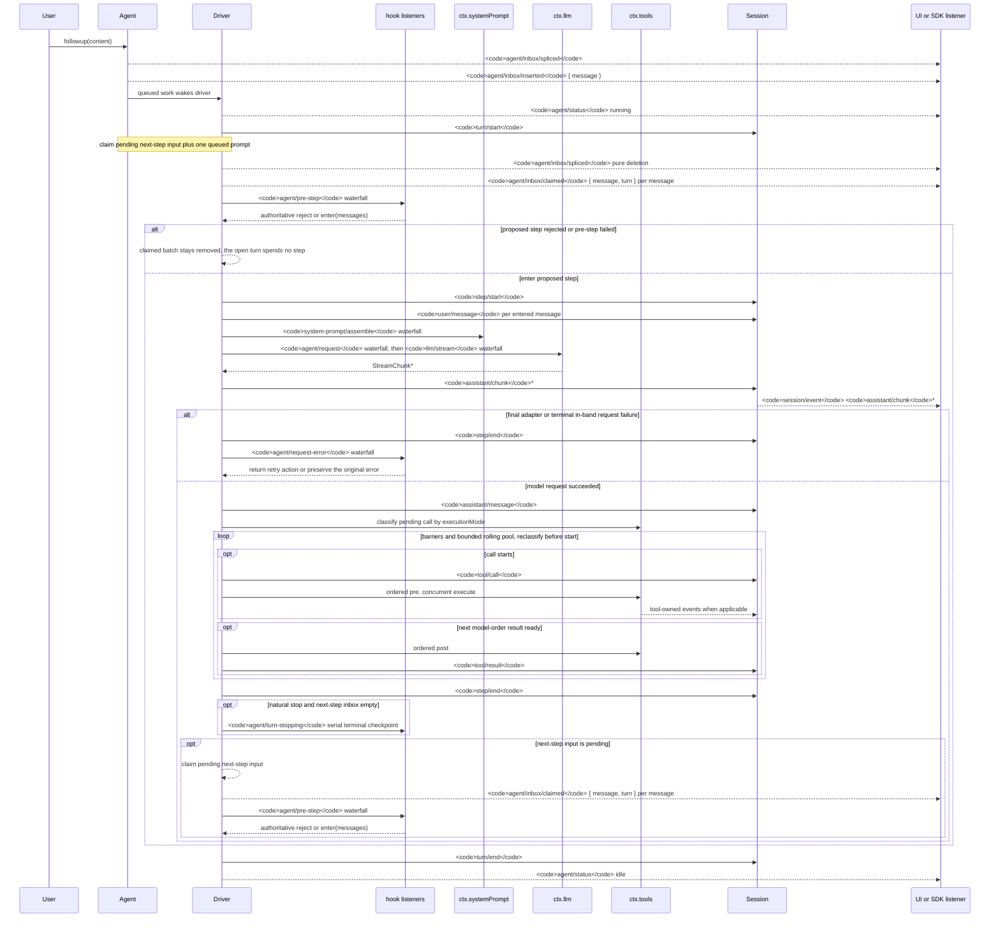

Source note: Apple Notes 2026-08-16: plugin-based open coding-agent harness; inspect AGENTS.md, plugin runtime, swappable model/tool/session/agent-loop architecture.
Extraction method: github-api-readme-docs
Extraction attempts: repo-api:200; readme-api:200; llms.txt:miss; docs/llms.txt:miss; docs/LLMS.txt:miss; docs/README.md:miss; docs/readme.md:miss; docs/index.md:miss; docs/overview.md:miss; docs/user/guide/index.md:hit; CONTRIBUTING.md:hit; docs/development.md:hit; docs/architecture.md:hit; docs/AGENTS.md:hit; docs/agent-lifecycle.md:hit; docs/agent-lifecycle.zh.md:hit; docs/api-gateway.md:hit

# GitHub Repository: deepseek-ai/deepseek-harness

Source: https://github.com/deepseek-ai/deepseek-harness
Description: DeepSeek Harness: Everything is a Plugin.
Default branch: master
Stars: 162540
Forks: 17139
License: MIT


# README

# DeepSeek Harness

English | [中文](README.zh.md)

DeepSeek Harness (`dsh`) is an open-source agent harness developed by [DeepSeek AI](https://deepseek.com).

It uses an architecture where **everything is a plugin**, and is powered by [Cordis](https://github.com/cordiverse/cordis), whose design is described in [_A Programming Paradigm for Spatiotemporal Composability_](https://github.com/cordiverse/paper).

## Developer preview

DeepSeek Harness is currently in _developer preview_ and is iterating rapidly. **THERE WILL BE COMPATIBILITY-BREAKING CHANGES.**

## Run

### Run from `npm`

Install `Node.js`, then run:

```sh
npx @deepseek-ai/dsh web
```

The command starts the Web UI, served at `http://127.0.0.1:3080` by default. See [Web UI guide](docs/user/guide/index.md).

### Run from source

To run from a repository checkout:

```sh
git clone https://github.com/deepseek-ai/deepseek-harness.git
cd deepseek-harness
pnpm install
pnpm run build
pnpm dsh web
```

## Community and support

- Feel free to submit feedback or bug reports through [GitHub Discussions](https://github.com/deepseek-ai/deepseek-harness/discussions).
- Add the [`dsh-plugin`](https://github.com/topics/dsh-plugin) topic to your plugin repository for discoverability.
- Join <a href="https://discord.gg/Ycq5dCaS4">DeepSeek Harness Discord community</a>.

## Contributing

See [CONTRIBUTING.md](CONTRIBUTING.md).

## Development

Start with the [development guide](docs/development.md) and [architecture documentation](docs/architecture.md).

For agents, follow [AGENTS.md](AGENTS.md).

## License

[MIT](LICENSE)

Third-party dependencies and their licenses are disclosed in [THIRD_PARTY_NOTICES.md](THIRD_PARTY_NOTICES.md).

# docs/user/guide/index.md

# Use the Web UI

English | [中文](index.zh.md)

Start the Web UI through the [root README](../../../README.md#run); the command prints its URL. This guide begins after that server is running. The `dsh` process uses its invoking directory as the default filesystem location, but a fresh Web UI has no selected workspace until you add one.

## Configure a model

Open **Settings → Models**, enter a [DeepSeek API key](https://platform.deepseek.com/), and save it. The model route becomes usable immediately without restarting the server.

The [model configuration guide](./providers.md) covers other providers and custom OpenAI-compatible endpoints.

## Choose a workspace

Click **Choose workspace**, add the project directory where you started `dsh`, and select it. The session composer remains unavailable until a workspace is selected.

## Run a task

Start a session and send:

> Summarize this repository and identify its main packages.

The agent can read and edit workspace files, run commands, delegate work, and maintain a plan. The Web UI asks before operations that require approval under the active permission policy.

## Continue

- [Configure models](./providers.md)
- [Use the Python SDK](./python-sdk.md)
- [Use other CLI modes](../../../apps/cli/README.md)
- [Develop a plugin](../develop/basic/)

# CONTRIBUTING.md

# Contributing

English | [中文](CONTRIBUTING.zh.md)

Thank you for your interest in contributing to DeepSeek Harness!

We deeply believe in the power of open source communities, and that belief has shaped this project from the very beginning.

DeepSeek Harness is still at an early stage and under active development. We are sorry that we cannot accept external pull requests at the moment. However, contributing code to this repository is far from the only way to help. There are many other ways to get involved:

- Identify and report issues or bugs in GitHub Discussions:
  - Upvote discussions that you would like to bring to the team's attention. We are a very small team and may not be able to reply to every post, but we monitor them and consider them when allocating resources.
- Contribute to the ecosystem:
  - Create a plugin that excites you and share it with others:
    - Associate your GitHub project with the `dsh-plugin` topic to help others discover your plugin.
  - Write blog posts and how-to guides about DeepSeek Harness.
  - Answer questions and help other members of the community.

DeepSeek Harness is designed to be deeply customizable. We do not believe that packages in the official repository are inherently more important than packages created by the community. You may consider this repository an idea, an official showcase, and a source of inspiration, but not a mandate from us.

We have already seen exciting projects emerge from the community, and we hope to see the ecosystem continue to grow in its own directions.

Into the unknown.

# docs/development.md

# Development guide

English | [中文](development.zh.md)

The setup tutorial takes a new contributor from prerequisites to a checked checkout. The contributor reference that follows covers repository layout, daily workflow, and CI organization. Design rationale and implementation details belong to the linked Agent Notes and scripts.

## Setup tutorial

### Prerequisites

- Node.js supports 22.19+ and 24+. CI covers 22.19, 24, and 26; see the [Node engine floor Agent Note](../.agents/notes/implemented/process/2026-07-06-node-engine-floor.md).
- Corepack-enabled pnpm. The repo pins `pnpm@11.7.0` in `package.json`; run `corepack enable` if `pnpm --version` does not resolve through Corepack.
- Git 2.26 or newer; hook setup enables Git's worktree-specific configuration extension.
- Optional: a DeepSeek API key for the Web, headless, and ACP automation demos and real-API e2e tests.

### First-time setup

Install dependencies from the repo root:

```sh
pnpm install
```

The install also configures worktree-local Lefthook hooks and the `dsh-translation-pairing` Git merge driver through `scripts/install-lefthook.mjs`. The [worktree-local hooks Agent Note](../.agents/notes/implemented/process/2026-07-27-worktree-local-lefthook.md) owns the hook-path safety contract; the [automatic pairing merges Agent Note](../.agents/notes/implemented/process/2026-08-08-automatic-translation-pairing-merges.md) owns the merge driver.

If either integration is missing because dependencies were restored from cache or `postinstall` was skipped, install them manually:

```sh
node scripts/install-lefthook.mjs
```

If the wrapper rejects existing Git configuration or reports a stale lock, follow its diagnostic and the linked Agent Note rather than editing worktree metadata speculatively. After moving a checkout, rerun the wrapper to regenerate the owned path.

Run typecheck once after a fresh clone:

```sh
pnpm run typecheck
```

Setup is complete when `pnpm run typecheck` exits successfully.

## Contributor reference

### TypeScript project layout

The repository uses isolated Host and Client aggregates. An ordinary package is registered in exactly one aggregate: Host packages in `tsconfig.host.json` and Client packages in `tsconfig.client.json`.

| File | Role | Forms a program? |
|---|---|---|
| `tsconfig.json` | Solution root: `extends` base, `files: []`, and references to the two aggregates. It is the tsserver discovery entry and the entry for explicitly running the complete Project Reference graph; through the inherited `paths`, it is also the resolution config for tsx running `examples/` and `scripts/`. | No |
| `tsconfig.host.json` | Host aggregate: Host packages, examples, tests, scripts, website, and the exceptional Host project of `api/remotes`. | Yes |
| `tsconfig.client.json` | Client aggregate: `packages/client/*` packages and their tests, `apps/web`, and the exceptional Client project of `api/remotes`. | Yes |
| `tsconfig.base.json` | Shared compilerOptions and the source `paths` map. Also the resolution facade the vitest configs point vite-tsconfig-paths at: it has no `include`, so its `paths` apply to every importer. | No |
| `tsconfig.base.client.json` | Browser compiler settings (`jsx`, DOM libs, `types: []`) extended by the Client aggregate and every `packages/client/*` package. | No |

Host and Client stay two aggregate programs because both sides declaration-merge the cordis `Context` interface under the same keys with different services; one program seeing both merges reports a collision. The collision exists only inside a `ts.Program` — module resolution never triggers it — which is why the solution may reference both aggregates and one paths facade may span both sides. Three disciplines follow:

- `tsconfig.base.json` never gains `include` or `files`: they would leak into every extending package project and narrow the facade's match-all scope.
- A script that builds a repo-wide `ts.Program` seeds `tsconfig.host.json` or `tsconfig.client.json` explicitly — never the root solution, because flattening both aggregates into one program collides the `Context` merges.
- A new package is registered in exactly one aggregate. Having both a Node loader entry and a browser entry is not a reason to split a package; an ordinary Client plugin produces both runtime artifacts during the Client build phase.

`api/remotes` is the repository's only package with split Host and Client tsconfigs. Its Host entry must participate in the Host Typert graph, while its Client entry imports `/remote` declarations that Host tsdown must generate first. The package-root `tsconfig.json` is therefore only a solution, and the two aggregates and direct consumers reference `tsconfig.host.json` or `tsconfig.client.json` respectively. The workspace `constraints` gate walks the reachable Project Reference graph and checks each referencing project's own compiler face: a single-config target remains valid from either face, while a split target must name the matching leaf rather than its solution root or opposite leaf; it discovers split packages from the presence of both leaf configs, so a new split joins the gate automatically. Do not copy this structure to other packages; the [`api-remotes` README](../packages/api/remotes/README.md) explains the Host/Client split and build order.

The root build follows the generated dependency order:

```sh
tsc -b tsconfig.host.json
tsdown --env.DSH_BUILD_FACE host
tsc -b tsconfig.client.json
tsdown --env.DSH_BUILD_FACE client
pnpm run build:web
```

Both tsdown passes use the same complete workspace match. They neither scan build artifacts to discover Client packages nor maintain a Host/Client package filter list. Package-local tsdown configs select entries for the current phase through `DSH_BUILD_FACE`: an ordinary Client plugin produces both its Node loader and browser bundle during the Client phase; `api-remotes` uses `hostPhase: true` to produce its Host entry early and only its browser bundle during the Client phase. Tsdown consumes only the JavaScript emitted to `lib/types` by the preceding tsc phase.

Typert runs only during Host tsdown, seeded by `tsconfig.host.json`. It analyzes Host types and generates both Host reflection artifacts and the Host-for-Client Remote projection; Client tsdown does not start Typert. Consequently, `pnpm run typecheck` runs the complete Host lib phase before Client tsc, while `pnpm run build` continues through Client tsdown and the Web build. The [API Remotes generated-contract build note](../.agents/notes/implemented/process/2026-08-08-api-remotes-generated-contract-build.md) records this ordering decision.

Static analysis and tests resolve workspace imports through the base `paths` map to `src` and must pass on a clean tree; gates that consume built `lib/` output declare that dependency explicitly. Generated Host-for-Client Remote declarations are the deliberate exception: the public `typecheck`, `lint`, and `doc-typecheck` commands generate them first, while internal `*:contracts-ready` scripts assume that an invoking public command or scheduler gate already depends on the Typert contract-generation pass or the complete build. See the [solution-root note](../.agents/notes/implemented/process/2026-07-22-tsconfig-solution-root-two-aggregates.md) for the two-aggregate setup, the [ts-build-config note](../.agents/notes/implemented/process/2026-06-17-ts-build-config.md) for tsc-first emit ownership, and the [Typert Remote note](../.agents/notes/implemented/architecture/2026-08-02-typert-remote-method-calls.md) for the gate-preparation contract.

Business services declare callable methods on the Host with `@Remote` or `@RemoteScope`; the Host build generates Host-for-Client types and runtime contributions, and the Client's `api-remotes` composition loads those contributions under `ctx.remote` and scoped `agentCtx.remote` namespaces. See [API Gateway](api-gateway.md) for the generated artifacts on both sides, their assembly relationships, the SRC development fallback, and the Web build order.

If a relevant local check consumes built package output, build once first:

```sh
pnpm run build
```

`pnpm run hygiene` includes `publint`, which validates package entrypoints against the built `lib/*.js` files, and `verify-node-next-types`, which validates built declarations against a temporary NodeNext consumer. A fresh worktree has no bundled JS or declarations until `pnpm run build` runs; ordinary commits and pushes do not require that build unless their selected checks consume it.

### Environment variables

The real DeepSeek adapter and key-backed agent demos read credentials from the environment or from a gitignored `.env` at the repo root:

```sh
DEEPSEEK_API_KEY=sk-...
DEEPSEEK_BASE_URL=https://... # optional
```

`DEEPSEEK_BASE_URL` is optional and defaults to the public API. Never commit real credentials. The real-API e2e suites self-skip when `DEEPSEEK_API_KEY` is not set.

### Git integrations

The pairing merge driver derives a conflicted `.i18n.yaml` record from the confirmed ancestor, current, and other owner blobs when both language files use Git's default text strategy and merge cleanly. It fails closed on owner conflicts, non-text merge configuration, or invalid records; after an already-stopped merge, run `pnpm run resolve-translation-pairing-conflicts`, which stages every safe pairing record and exits unsuccessfully if other pairing conflicts still need manual work. See the [bilingual documentation contract](i18n/README.md#the-pairing-contract) for the exact files and states the driver accepts.

The installer probes the exact Node/tsx driver entrypoint before publishing its worktree configuration. If that runtime later becomes unavailable, the Node-independent launcher writes Git's ordinary text result, leaves the sidecar unresolved, and prints the recovery path; restore dependencies and run `pnpm run resolve-translation-pairing-conflicts`, or run `git merge --abort`. If `pre-merge-commit` rejects an otherwise clean merge, Git leaves the complete result staged without a commit; repair the failure and run `git commit`, or abort. The [automatic pairing merges Agent Note](../.agents/notes/implemented/process/2026-08-08-automatic-translation-pairing-merges.md#failure-contract) owns the exact index and `MERGE_HEAD` states.

lefthook is configured in `lefthook.yml` as a fast local checkpoint:

- `pre-commit` verifies staged pairing records against the staged owner blobs, validates staged files with the project-free `.oxlintrc.staged.json` profile and applies Oxlint fixes with one bounded retry, regenerates `THIRD_PARTY_NOTICES.md` when a staged file is one of its inputs, checks the staged diff for whitespace errors, and runs the vendor manifest guard.
- `pre-merge-commit` performs the same index-backed pairing check before Git creates an automatic merge commit.
- `pre-push` runs `pnpm run typecheck`, which completes the Host lib phase, including generated Typert contracts, before the Client TypeScript check.

The vendor manifest guard checks that changes under `vendor/*/src` are staged with the matching `vendor/README.md` manifest update. See `vendor/README.md` before editing vendored code.

Apart from the scoped staged-record verification, the hooks intentionally do not run tests, snapshots, documentation checks, builds, or hygiene. Contributors run the [checks relevant to the changed behavior](../AGENTS.md#run-relevant-checks-locally) once; CI owns exhaustive coverage, built-artifact smokes, and the Node 22.19, 24, and 26 compatibility matrix.

Contributors can opt into the comprehensive local gate set with `pnpm run check:all`. The command is independent of the Git hooks and is not an agent instruction.

### CI gates

The keyless [CI workflow](../.github/workflows/ci.yml) groups independent gates into broad lanes and runs a smaller compatibility signal across supported Node versions. Artifact consumers wait for one build within their lane. The separate real-API workflow runs `pnpm run test:e2e` with its configured worker bound. See [scripts/run-gates.ts](../scripts/run-gates.ts) and the workflow files for the current gate and job inventory.

### Daily commands

The root [contributor instructions](../AGENTS.md#commands) summarize common commands, while [`package.json`](../package.json) and [scripts/run-gates.ts](../scripts/run-gates.ts) own the current script and gate inventories. Select the smallest checks that cover the changed surface. Documentation changes use `pnpm run doc-sync`; package-public behavior changes also update the owning README or JSDoc, and built-artifact checks require `pnpm run build` first.

### Demos

Run the repository build separately before using these source-checkout demos:

```sh
pnpm run build
```

The one-shot Headless coding agent needs `DEEPSEEK_API_KEY` in the environment or repo-root `.env`:

```sh
pnpm dsh --profile headless "summarize this workspace"
```

The self-referential cordis demo can inspect and modify its live plugin runtime and needs the same credentials (`web` by default, or `acp`):

```sh
pnpm run demo:cordis
```

The ACP automation server exposes fresh agent sessions over JSON-RPC stdio and also needs `DEEPSEEK_API_KEY`:

```sh
pnpm run demo:acp
```

### TODO markers

Use one of three comment tags to flag known issues in the code, ordered by urgency:

- `FIXME` — an issue that should block a new release. A release should not ship with an open `FIXME` unless reviewers explicitly agree the change can be merged anyway.
- `TODO` — an issue that should be fixed soon, once we have the resources.
- `XXX` — an issue that we may fix someday; lowest priority, no commitment.

Pick the tag that matches the urgency so anyone scanning the code can tell a release blocker from a someday-maybe.

### Documenting types verbatim (`ts type-equiv`)

The [subsystems](subsystems/README.md) pages paste source-equivalent declarations together with their original JSDoc so a reader sees the exact type definition and source contract. To keep a paste from drifting when source changes, fence it as ` ```ts type-equiv ` (instead of ` ```ts `) and register it in `scripts/type-equiv.manifest.json` with the source file and symbol it mirrors:

```json
{ "doc": "docs/subsystems/session.md", "symbol": "SessionEvent", "source": "packages/core/session/src/types.ts" }
```

`pnpm run verify-type-equiv` (part of `doc-sync`) then extracts that symbol's declaration and attached JSDoc from source via the TypeScript parser and asserts the block matches both. For a class whose implementation bodies do not belong in the catalog, use ` ```ts public-api ` and set `"projection": "public-api"`; the checked projection retains the public fields, constructor, accessors, methods, and original class/member JSDoc while omitting bodies and private or protected members. Comparison ignores whitespace and non-JSDoc comments but requires every original JSDoc comment, including member documentation, so readers see the source contract beside the exact type definition. The gate enforces a 1:1 correspondence by document, symbol, and projection between primary blocks and manifest entries; a paired `.zh.md` block reuses its unsuffixed sibling's entry only when the whole tracked fence sequence is byte-identical and ordered identically. `doc-typecheck` applies the same derivative rule to compilable fences, while skipping both source-equivalence fence kinds from compilation and its opt-out ratio. When you change a documented declaration or its JSDoc, the gate fails until you update the paste; when you add or remove a primary block, update the manifest in the same change.

# docs/architecture.md

# DeepSeek Harness Architecture

English | [中文](architecture.zh.md)

Read this before changing anything under `packages/`. It assumes you know Cordis; if you do not, start with the [primer](cordis-primer.md) or the [tutorial](cordis-tutorial/index.md).

We recommend using an agent to explore the codebase and understand its architecture.

## Cordis

[Cordis](cordis-primer.md) is the framework under dsh: plugins contribute services, typed events, and reversible effects to a shared context. Every part of the product is a plugin, including the model adapter, the tool registry, the session log, and the agent loop itself, so every part is replaceable from configuration.

There is no privileged core to patch: you extend dsh by mounting a plugin beside the others, and registrations are effects that unwind when their plugin unloads.

## Profiles and bundles

A running `dsh` is a plugin tree composed at boot from ordered layers.

A **profile** is a named composition stored in the Harness home. It lists the bundles it stacks, holds any out-of-tree plugins it installs, and keeps the user's own `cordis.patch.yml`. `web` and `headless` ship as templates.

A **bundle** is a distribution format for Cordis config rows and the code they mount, so whatever it inserts stays patchable by the layers above it.

Each declares itself in its own `package.json` under a `dsh` field: `dsh.profile` lists a profile's bundles, and `dsh.bundle` points at a bundle's patch file.

[`dsh-base`](../packages/bundle/base/README.md) is the first layer of every profile: model adapters, tools, persistence, sandbox and approval policy, settings, credentials, telemetry. [`dsh-web-app`](../packages/bundle/web-app/README.md) adds the browser application; [`dsh-headless`](../packages/bundle/headless/README.md) adds a one-shot runner with no server at all.

Layers apply to an empty entry list in this order: each bundle in the profile's listed order, then the profile's `cordis.patch.yml`, then the home-level one, then any `--patch` overlay. A patch targets a row by id and replaces its whole config, or inserts new rows.

To see the tree your machine actually boots:

```sh
dsh --profile web --dump-config
```

Any row it prints can be replaced by a patch of your own.

Composition mechanics are in [app-boot](../packages/boot/app-boot/README.md#profiles); config fields are in the generated [config catalog](config-catalog.md).

## Core packages

Here are some core packages that contribute to the Cordis tree.

| Package | Owns | `ctx` key |
|---|---|---|
| [`core/session`](subsystems/session.md) | The append-only `SessionEvent` log and in-memory store | `ctx.sessions` |
| [`core/system-prompt`](subsystems/system-prompt.md) | Prompt-section and tool-schema assembly | `ctx.systemPrompt` |
| [`core/tools`](subsystems/tools.md) | The scoped tool registry and guarded execution pipeline | `ctx.tools` |
| [`core/agent`](subsystems/core.md) | The `Agent` interface, live registry, and `agent/*` events | `ctx.agents` |
| [`core/agent-loop`](subsystems/core.md) | The default driver implementing that interface | `ctx.agentLoop` |
| [`core/scope`](subsystems/scope.md) | The per-agent scoped-registration primitive | library, no key |
| [`llm/llm`](subsystems/llm-streaming.md) | Message and stream vocabulary plus the adapter seam | `ctx.llm` |

## Events

Events are the extension points, and picking the right domain is the first decision in most changes.

- **Session events** are durable facts appended to the log and broadcast through `session/event`. Use one when the fact must survive a reload.
- **Agent events** (`agent/*`) carry a live `Agent`: inbox, step, status, request, validation, continuation. Use one to observe or intercept work in flight.
- **Capability events** attach policy and adapters to a seam (`fs/*`, `tools/*`, `telemetry/*`) without importing the loop.

The [event map](event-producer-consumer.md) lists every event's producers and consumers.

## Turn flow

A **step** is one model request plus the tools it calls. A **turn** is zero or more steps: it opens before its first input is claimed and closes once nothing is owed.

```text
turn/start
  claim next-step input plus one queued message
  assemble prompt sections + tool schemas
  -> agent/pre-step                   reject | enter(messages)
     reject, or a first enter rewritten empty -> close the turn with no step
     step/start
     append entered messages as user/message
     derive model history from the log
     agent/request -> llm/stream -> assistant/chunk* -> assistant/message
     tool/call* -> tools/pre-execute -> tools/execute -> tools/post-execute -> tool/result*
     step/end
     tools owe another request, or next-step input arrived -> claim -> next step
  -> agent/turn-stopping
turn/end
```

`turn/*`, `step/*`, `user/message`, `assistant/*`, and `tool/*` are durable session events; the rest are live extension points across three domains. `agent/pre-step`, `agent/request`, `llm/stream`, and the three `tools/*` events are waterfalls, whose listeners must call `next()` to delegate; `agent/turn-stopping` is serial and has no `next()`.

Input reaches the driver through one inbox. Some messages wake it immediately; injected context waits in the inbox until another message does.

`agent/pre-step` decides what the model sees. Listeners may rewrite the claimed messages or reject them outright; a rejected or empty first claim still closes a durable turn that spent no step, so the log records the attempt. Each step reads the prompt sections and tool schemas that plugins registered.

Details: the [sequence diagram](agent-lifecycle.md), the [tool pipeline](tool-execution-pipeline.md), and [cancellation and error recovery](subsystems/core.md#the-agent-handle).

## Session log

The session log is the source of the context the model sees. `deriveMessages()` projects model history from it, and raw `assistant/chunk` events preserve replay and UI fidelity. Fork, resume, transcripts, telemetry, and persistence all derive from this stream.

**Model-visible means logged.** Anything that reaches a model request must be reconstructable from the log, and a runtime invariant asserts it. This is why a new model-visible input requires a new session event: extend `SessionEventMap` and render from the log.

## Capability seams

A **seam** is a swappable capability with three roles: a **Service Definition** declaring the interface, a **Service Provider** implementing it, and a **Consumer** using it, commonly a model-facing tool. A package may combine roles, but one role alone is not a seam; adding a capability means designing all three ([capability graph](capability-seams.md)).

Seams are why one provider swap changes the whole product. Filesystem and subprocess providers share one execution world, so pointing them at a remote sandbox moves Bash, PTY, and LSP with them, with no provider forks. [Subagent providers](subsystems/subagent.md) vary just as widely behind one interface, from a fresh child agent to a delegated turn in another product.

## Where new behavior goes

New behavior attaches to a documented extension point. Changing the loop itself updates this map.

| Goal | Mechanism |
|---|---|
| Add a model provider | register its adapter on `ctx.llm` |
| Add a model-facing capability | register on `ctx.tools`; its schema joins prompt assembly |
| Give one session a different capability set | compose an agent preset; a service row there needs an `isolate` realm |
| Add shell execution | register a `ctx.shell` backend; the local one spawns through `ctx.subprocess` |
| Add persistent terminal execution | register a `ctx.terminals` backend plus `dsh-tool-terminal` |
| Add a human command | register on `ctx.commands`; it dispatches without a model turn |
| Add background work | register on `ctx.jobs`; `job_*` tools collect or stop it |
| Add filesystem access or policy | register a `ctx.fs` provider or listen to `fs/*` events |
| Confine spawned processes | use a `ctx.sandbox` backend; consumers wrap argv before spawning |
| Intercept a request, tool, or turn | use its `agent/*` or `tools/*` event; `agent/turn-stopping` stops a turn |
| Add model-facing context | call `agent.inject()`; it lands in the next admitted request |
| Add UI or editor integration | drive `ctx.agents` and render from `session/event` |
| Add a Web Client Chat node | register a `ConversationNodeDefinition` + keyed renderer |
| Add durable session state | extend `SessionEventMap`; render and replay from the log |
| Generate session titles | register the sole `ctx.sessionTitle` provider |
| Manage a same-session objective | use `ctx.goals`; continue through `agent/*` |
| Fork a live session | `ctx.sessions.fork(source, boundary?, childSessionId?)` |
| Scope a registration to one agent | use that agent's `agent.ctx` |

The [extension cookbook](cookbook/extension-cookbook.md) maps features to capabilities and indexes the step-by-step guides for [packages](cookbook/adding-a-package.md), [tools](cookbook/adding-a-tool.md), [LLM adapters](cookbook/adding-an-llm-adapter.md), [Chat nodes](cookbook/adding-a-conversation-node.md), and [settings cards](cookbook/adding-a-settings-card.md).

# docs/AGENTS.md

# AGENTS.md — The documentation standard

This file defines document structure, Markdown tiers, writing rules, and `verify-doc-budgets` ceilings. Use [dsh-doc-standards](../.agents/skills/dsh-doc-standards/SKILL.md) for placement and validation, and [dsh-prose-standard](../.agents/skills/dsh-prose-standard/SKILL.md) for required coverage and editorial judgment; the [doc-tiers Agent Note](../.agents/notes/implemented/process/2026-07-04-doc-tiers-and-budgets.md) owns rationale.

## Document structure

These rules apply to human-facing documentation; [Agent Notes](../.agents/notes/README.md) remain outside their scope. A [postmortem](postmortem/README.md) is an incident-scoped reference; chronology records evidence, not a teaching sequence. A document's subject and tree position fix its scope: describe its own subject at appropriate detail and direct children only by purpose, responsibility, and high-level behavior; link to the owning descendant for lower-level detail. Document type does not widen that scope. A reference may be exhaustive only about its own subject. Testing mechanisms, fixtures, and harnesses belong at the lowest owning level; higher documents link there.

Classify every in-scope document as a tutorial or reference. Tutorials follow an ordered path to an outcome and introduce only what each step needs. References define a lookup scope and current behavior without a teaching sequence. Separate substantial tutorial and reference content; label a section when either part is small.

Before writing a tutorial, privately classify the reader's starting knowledge and each concept as beginner, intermediate, or advanced. Establish prerequisites before dependent concepts, increase difficulty gradually, and move unnecessary advanced material to a later tutorial or reference.

Author in this order: locate the document in the tree; set its permitted detail; choose tutorial or reference; for a tutorial, order concepts by prerequisite and difficulty; relocate descendant-owned detail; replace lower-level explanations with links to their owners.

## The tier taxonomy: one home per fact

Each fact has one home: the tier whose job it is; elsewhere, link there.

| Tier | Job | Does NOT belong there |
|---|---|---|
| Root `AGENTS.md` | Standing orders: rules an agent needs in context in every session, one to three lines each, linking its home | Stories, worked examples, situational procedures, anything restated from a linked home |
| Subtree `AGENTS.md` (`packages/`, `examples/`, `docs/`, `.agents/notes/`) | Orders specific to that subtree | Repo-wide rules the root file already carries |
| [architecture.md](architecture.md) | Ordered map: composition, core packages, loop, seams, extension points; read before changing `packages/` | Type definitions (→ subsystems), per-package detail (→ package READMEs), decision rationale (→ Agent Notes), implementation-status annotations |
| [subsystems/](subsystems/README.md) | One reference page per subsystem: type definitions, semantics, and the generated Cordis API | Behavior narration (→ architecture.md) |
| [Agent Notes](../.agents/notes/README.md) | Active decision records: the why, what-was-given-up, and required verification; `implemented/` notes describe shipped reality in present tense | Migration plans, acceptance-task checklists, fixture walkthroughs, and spec-speak ("should…") once the decision has shipped; archived notes are frozen history, never current authority |
| [postmortem/](postmortem/README.md) | Incident stories — the only tier where war-story narrative belongs | — |
| [cookbook/](cookbook/adding-a-package.md) | Step-by-step how-tos with numbered verify steps | Design rationale (→ the Agent Note each guide links) |
| [user/](user/index.md) | Product-facing guides published by the documentation website | Generated reference tables, contributor procedures, decision history |
| Package README | The per-package contract: config, semantics, limitations, extension points, and [Model Experience](cookbook/adding-a-package.md#4-write-the-package-readme) | JSDoc restatement, generated-catalog restatement (event/tool tables), other packages' concerns |
| [development.md](development.md) | Contributor setup, daily workflow, and a summary of CI; a bilingual pair under the [i18n contract](i18n/README.md) | Runtime/version rationale (→ Agent Notes), check-by-check lists that drift from `package.json` scripts |
| Generated reference: the per-page `cordis-surface` regions in [subsystems/](subsystems/README.md), the [Cordis core API + inherited tier](cordis-api/context.md), [tool-catalog](tool-catalog.md), [config-catalog](config-catalog.md), [persistence-catalog](persistence-catalog.md), [module-graph.md](module-graph.md) | Exhaustive English sources regenerated from source and freshness-gated; reviewed Chinese counterparts follow the [pairing workflow](i18n/README.md#scope-and-exclusions) | Hand edits to generated English sources or regions; Chinese counterparts update through pairing only |
| Skills (`.agents/skills/`) | Reusable workflows and specialized decision standards | Product and runtime contracts (→ docs or source) |

Placement: bugs → postmortems; rationale → Agent Notes; procedures → cookbooks; type definitions → subsystems; package contracts → READMEs; standing orders → root `AGENTS.md` with a rationale link.

## Writing rules

- **Document current state, not change history.** Avoid "previously/now/no longer", PRs, commits, and stack positions in durable prose; name the live mechanism. Put change stories in commits, PRs, Agent Notes, or postmortems; the latter two may cite merged PRs and issues as evidence.
- **Every non-trivial change includes at least one Agent Note in the same PR.** Update the owning note or add one; only mechanical/local edits are exempt ([scope](../.agents/notes/README.md#when-to-write-one)).
- **One physical line per paragraph** (`verify-md-wrap`): use editor soft-wrap. Code blocks, tables, and list structure keep their formatting; code comments stay under the linter's column limit.
- **Fenced `ts` blocks must compile** (`doc-typecheck`); a pasted type declaration and its original JSDoc use ` ```ts type-equiv `, while a body-stripped public class declaration uses ` ```ts public-api `; register either in the manifest so neither can drift ([mechanics](development.md#documenting-types-verbatim-ts-type-equiv)).
- **The owning [subsystems page](subsystems/README.md) updates in the same change** that reshapes a documented type. `verify-type-equiv` catches drifted pastes, not never-documented new types; a type is documented on its declaring package group's page ([page scoping](../.agents/notes/implemented/process/2026-08-03-package-anchored-subsystem-pages.md)).
- **Pairs update together**: [Terminology-guided](i18n/terminology.md), single-pass active-agent work repositions first-use annotations, preserves untouched prose, and re-records; `dsh-translate-docs` remains user-invoked ([contract](i18n/README.md)).
- **Comments and JSDoc state complete contracts, not reasoning transcripts.** Preserve behavior, failure, timing, ownership, modality, exceptions, consequences, and non-obvious orientation; delete narration, test walkthroughs, review analysis, and code restatement. Keep the local contract and link its rationale. Use [dsh-prose-standard](../.agents/skills/dsh-prose-standard/SKILL.md) for details.
- Write directly: name actors and facts ([decision](../.agents/notes/implemented/process/2026-08-09-concrete-prose-names-actors-and-recorded-facts.md)). Reserve `seam` for the defined capability. Name the exact check, type, API, operation, or behavior instead of metaphorical "gate", "vocabulary", or "surface".

## Wordcount Budgets

[scripts/doc-budgets.manifest.json](../scripts/doc-budgets.manifest.json) sets standing-doc ceilings; `pnpm run verify-doc-budgets` rejects excess or missing files.

When the gate goes red:

1. **Relocate** content that belongs in another tier; leave a one-line link if needed.
2. **Condense** content that belongs here but can be shorter.
3. **Raise** the ceiling only when the words need the space; justify the manifest diff in the PR. A too-low ceiling is a budget bug.

Ceilings are guardrails, not reduction targets. At or below target, retain at least 5% headroom; above target, freeze the ceiling until relocation or condensation brings the document under target. Lower a ceiling only when the document still has room, and raise it when content would otherwise be deleted. Targets: root `AGENTS.md` ≤ 1,600 words; `architecture.md` ≤ 1,800; subtree `AGENTS.md` ≤ 600, except `packages/AGENTS.md` ≤ 650 and this file ≤ 1,250; `packages/README.md` ≤ 600. Review governs unbudgeted tiers.

## The slop checklist

Hunt these in any doc; [dsh-doc-standards](../.agents/skills/dsh-doc-standards/SKILL.md) runs this list as an audit:

- The same rule stated in more than one home. Grep a distinctive phrase; keep one home and link the rest.
- Narrated history or war stories: "previously", "now", "no longer", "used to", "renamed", "was moved", PRs, or commits. State the current fact; link an Agent Note or postmortem when needed.
- Implementation-status annotations in prose or diagrams ("implemented!", "future: …"). Status rots; the repo layout and package manifests carry it.
- Hand-restated catalogs, JSDoc, or inventories of tests, packages, and status when source or a generator is authoritative.
- Reasoning transcripts: step-by-step implementation narration, proof of obvious branches, test walkthroughs, or rejected local alternatives. Keep the resulting contract or durable rationale; delete the path used to derive it.
- Rationale repeated beside sibling methods instead of once at the owning capability or helper.
- Paragraph walls: one paragraph carrying several rules and parenthetical asides. Split it or demote the detail to its home.
- Emphasis inflation: bold, CAPS, or "critically" everywhere means nothing stands out. Reserve emphasis for the clause that changes behavior.
- Spec-speak in `implemented/` Agent Notes: "should", migration plans, acceptance checklists. An implemented Agent Note describes what is, per the [implemented-note instructions](../.agents/notes/implemented/AGENTS.md).

## Cross-reference with machine-checkable links, never free prose

Link repository references with relative Markdown paths, never bare filenames or Agent Note numbers. `verify-md-links` rejects missing targets and dead `#fragment` anchors ([rationale](../.agents/notes/implemented/process/2026-06-18-markdown-cross-link-lint.md)).

# docs/agent-lifecycle.md

<!-- Generated by scripts/gen-doc-graphs.ts - do not edit by hand.
     Run `pnpm run gen-doc-graphs` to regenerate. -->

# Agent Turn And Step Lifecycle

This sequence is the visual companion to [architecture.md](architecture.md#turn-flow). It keeps durable replay facts on `session/event` and live control/status on `agent/*`.



The `assistant/message` event records every successful provider call, including content-less and `max-tokens` finishes. Empty content stays out of derived history, while the durable event keeps usage and `sourceEventSeqs` listing the exact `assistant/chunk` events, including an explicit empty list.

`dsh-compaction-basic` uses `agent/pre-step` for pressure before request derivation and `agent/request-error` only for canonical context overflow. Once either trigger qualifies, optional tool-result pruning runs before summary selection. Recovery works between the closed failed step and failed turn close, and opens a fresh retry turn only when pruning or summarization advances the surface replacement generation; otherwise the original request error remains authoritative.

The returned `agent/pre-step` decision is authoritative; listeners wrapping `next()` preserve downstream messages unless replacement is intentional. Steering and injected context pass through the same waterfall after a later claim operation takes their next-step batch.

SDK users that need replayable transcript data should consume `session/event`; `agent/*` is the live coordination API for queue/status, prompt interception, request construction, steering, continuation, and errors.

Maintenance mode: curated Mermaid sequence; exact event signatures live in the generated Cordis catalog.

# docs/agent-lifecycle.zh.md

<!-- 英文源文件由 scripts/gen-doc-graphs.ts 生成；本中文文件是通过双语配对维护的经评审对侧。
     更新时先运行 `pnpm run gen-doc-graphs` 更新英文，再更新本文件并运行 `pnpm run verify-translation-pairing --write docs/agent-lifecycle.md` 重新记录配对。 -->

# Agent 轮次与步骤生命周期

[English](agent-lifecycle.md) | 中文

此时序图是 [architecture.md](architecture.md#turn-flow) 的配套图示。持久的回放事实保存在 `session/event` 中，实时控制与状态则保存在 `agent/*` 中。


`assistant/message` 事件会记录每次成功的提供方调用，包括返回空内容或以 `max-tokens` 结束的调用。空内容不会进入派生历史，但该持久事件仍会保留用量，并通过 `sourceEventSeqs` 精确列出对应的 `assistant/chunk` 事件，包括显式空列表。

`dsh-compaction-basic` 在派生请求之前通过 `agent/pre-step` 处理压力，而 `agent/request-error` 仅用于规范的上下文溢出。任一触发条件满足后，系统都会先执行可选的工具结果剪枝，再选择摘要。恢复发生在失败步骤结束之后、失败轮次结束之前；只有当剪枝或摘要生成推进了 surface replacement generation 时，系统才会开启一个全新的重试轮次，否则仍以原始请求错误为准。

以返回的 `agent/pre-step` 决策为准；通过包装 `next()` 的监听器会保留下游消息，除非有意替换这些消息。steering（中途引导）和注入的上下文在后续的认领操作取得其下一步骤批次后，会经过同一 waterfall（瀑布式事件）。

需要可回放 transcript（文本记录）数据的 SDK 用户应当消费 `session/event`；`agent/*` 是用于队列与状态、提示词拦截、请求构造、steering、继续执行和错误处理的实时协调接口。

维护模式：英文源文件包含人工维护的 Mermaid 时序图，并由生成器写出；本中文文件作为经评审对侧通过双语配对维护。确切的事件签名位于生成的 Cordis 目录中。

# docs/api-gateway.md

# API Gateway

English | [中文](api-gateway.zh.md)

This is the current-state reference for the Typert API Gateway. It describes how business services declare unary Remote methods, how the build generates Host and Client contracts, and how calls reuse the Connection RPC and `/api` route. Session events, incremental data, and other streaming protocols are outside this document's scope; they may use the same Connection but do not use Remote method descriptors.

## Programming model

Business services use `@Remote` or `@RemoteScope` to select the methods exposed to the Client. Unmarked methods do not enter the generated Client types or runtime contributions and cannot be called through `ctx.remote`.

`@Remote` denotes calling a Cordis service registered on the root Host Context. Complex Host objects cannot cross the wire directly; the business package must declare their association with a wire identity through `TypertLookupMap` and register a default resolution provider with `ctx.typert.lookups` at runtime. For example, an `Agent` parameter named `agent` in the Host signature produces an `agentId` wire field, and the Gateway resolves that id to a Host object before invoking the business method. Host composition can use `ctx.typert.lookups.configure()` to override the resolution policy for a lookup key without changing the parameter name, wire field, or canonical type symbol owned by the business package.

`@RemoteScope(key)` first resolves an identity to a scoped Context through `ctx.typert.contexts`, then obtains the service from that Context and invokes the method. It applies when the method itself depends on scoped composition and does not need to receive objects such as `Agent` explicitly.

Services normally extend `TypertRemoteService` so the constructor explicitly binds the Cordis service key and default Remote namespace. A service that already has another base class can instead declare `readonly typertRemote = bindTypertRemote(this, serviceKey)`; both forms leave an inspectable public binding and do not depend on the compiler injecting a symbol into the constructor.

```ts
import type { Agent } from '@deepseek-ai/dsh-agent'
import { TypertRemoteService, Remote, RemoteScope } from '@deepseek-ai/dsh-typert-protocol'
import type { Context } from '@deepseek-ai/cordis'

export interface CreateGoalRequest {
  objective: string
}

export interface CreateGoalResult {
  accepted: boolean
}

export class GoalService extends TypertRemoteService {
  constructor(ctx: Context) {
    super(ctx, 'goals')
  }

  @Remote('create')
  createForClient(
    agent: Agent,
    request: CreateGoalRequest,
    signal: AbortSignal,
  ): CreateGoalResult {
    signal.throwIfAborted()
    return this.create(agent, request)
  }

  @RemoteScope('agent', 'current')
  currentForClient(): CreateGoalResult {
    return { accepted: true }
  }

  private create(_agent: Agent, request: CreateGoalRequest): CreateGoalResult {
    return { accepted: request.objective.length > 0 }
  }
}
```

Remote methods may return a value synchronously or return a Promise. For cooperative cancellation, the final parameter in the Host signature must be `signal: AbortSignal` using the global type; it is recorded in the descriptor instead of entering `args`, while the generated Client method accepts an optional final `AbortSignal`.

The Client uses concrete functions on ordinary objects, not a JavaScript Proxy. Direct and scoped calls appear under `ctx.remote.<namespace>` and `agentCtx.remote.<namespace>`. Each namespace is a traced Cordis child Service registered as `remote.<namespace>`; the Client assembly mounts contributions through `ctx.remote.$mount()`, and the namespace unloads after its last method is withdrawn. Dependency declarations belong to the actual caller: only a business package that reads `ctx.remote.<namespace>` or `agentCtx.remote.<namespace>` declares both `remote` and `remote.<namespace>` in its own `inject`; assemblies that only mount contributions and higher-level runtimes that do not call that namespace do not declare the namespace dependency on the business package's behalf. When an `@Remote` method has exactly one lookup parameter and a same-named `TypertContextMap` uses the same wire identity, the generated scoped signature omits that identity parameter. `@RemoteScope` generates only the scoped invocation interface.

```ts ignore-check
import type { SessionId } from '@deepseek-ai/dsh-session/types'
import type { AgentContext } from '@deepseek-ai/dsh-client-runtime/client'
import type { Context } from '@deepseek-ai/cordis'
import type {} from '@deepseek-ai/dsh-api-remotes/client'

export const inject = ['remote', 'remote.goals']

declare const ctx: Context
declare const agentCtx: AgentContext
declare const agentId: SessionId

await ctx.remote.goals.create(agentId, { objective: 'ship it' })
await agentCtx.remote.goals.create({ objective: 'ship it' })
```

Client applications assemble only `@deepseek-ai/dsh-api-remotes`. That package imports the `/remote` subpaths of selected business packages as runtime values, mounts their contributions through `ctx.remote.$mount()`, and re-exports the declaration merges from the same files. Adding a Host Remote package is an explicit choice by the Client composition owner; business components do not need to load the Typert Gateway or the business package's Remote JS separately.

The `api-remotes` assembly and the `ctx.remote` contract are React-independent; the Host methods visible to any Client assembly are limited to the Remote methods selected at generation time.

## Component responsibilities

| Location | Package or entry | Responsibility |
|---|---|---|
| Shared | `@deepseek-ai/dsh-typert-protocol` | Declares decorators, Gateway bindings, merge-extensible protocol maps, invocation descriptors, and provider types; starts no TypeScript analysis and registers no Cordis services |
| Build | `@deepseek-ai/dsh-typert-generator` | Strictly analyzes Remote signatures, the type graph, lookups, Contexts, and source locations from the Host `ts.Program`, then generates Host and Host-for-Client artifacts |
| Host | `@deepseek-ai/dsh-typert-registry` and Loader | Places generated Host descriptors, schemas, and business-package registrations in `ctx.typert`, and holds lookup and Context providers |
| Host | `@deepseek-ai/dsh-api-remotes` | Owns the application Agent/Session identity policy and configures the corresponding Typert lookups |
| Host | `@deepseek-ai/dsh-api-gateway` | Provides `ctx.typertGateway`, claims Remote endpoints, resolves objects or Contexts, invokes live Cordis services, and validates request and return values |
| Client | `@deepseek-ai/dsh-api-gateway/client` | Provides `ctx.remote` and `remote.<namespace>` child Services, mounts generated descriptors as concrete methods, and initiates, validates, and cancels calls through the Connection |
| Client | `@deepseek-ai/dsh-api-remotes/client` | Explicitly selects and mounts the `/remote` contributions allowed by the application and brings the corresponding declaration merges into business code |
| Both | `@deepseek-ai/dsh-client-connection` | Provides the RPC carrier, request correlation, trust boundary, cancellation, response envelope, and the `/api` HTTP bridge |

The API Gateway package owns the Host dispatcher and Client Remote endpoint as peer entries, but the two builds never enter the same `ts.Program`. The Host entry does not import the Client Cordis `Context` merge, and the Client entry does not import the Host Gateway service.

## Strict generation pipeline

The root build runs `build:lib:host`, `build:lib:client`, and `build:web` in order. The Host lib phase first runs `tsc -b tsconfig.host.json`, then `tsdown --env.DSH_BUILD_FACE host`; the normal Host Project Reference graph compiles the Typert generator, which runs during this tsdown pass with the Host aggregate as its only `ts.Program` seed. The Client lib phase then runs `tsc -b tsconfig.client.json` and `tsdown --env.DSH_BUILD_FACE client`, consuming the newly generated Remote Client declarations and runtime contributions without starting Typert again.

Both tsdown passes receive the complete workspace and bundle only JavaScript emitted to `lib/types` by the corresponding tsc phase. The root config does not scan Client artifacts, classify package names, or pass a maintained filter to tsdown; package-local configs return entries for the current phase based on `DSH_BUILD_FACE`. An ordinary Client plugin produces both its Node loader entry and browser bundle during the Client phase.

`api-remotes` is the only package with split TypeScript faces. Its Host project owns the Agent/Session lookup policy, while its Client project depends on `/remote` declarations generated for business packages during Host tsdown; root aggregates and direct consumers must reference `api/remotes/tsconfig.host.json` or `api/remotes/tsconfig.client.json` respectively. The package's `clientBundle(..., { hostPhase: true })` produces its Host entry during Host tsdown and leaves only the browser entry for Client tsdown. Every other package remains registered in one aggregate.

Each contributing business package writes generated files to its own `lib/` directory, not to its source directory:

| File | Consumer | Contents |
|---|---|---|
| `typert.host.js` | Host Loader | Runtime reflection for the Host face, strict invocation descriptors, and schema registration values |
| `typert.host.d.ts` | Host type system | Generated declarations for the Host face |
| `typert.remote-client.js` | `api-remotes` | A mountable `TypertRemoteContribution` containing strict descriptors and runtime codecs |
| `typert.remote-client.d.ts` | Client type system | Declaration merges for `TypertRemoteNamespaceMap` and `TypertRemoteScopeMap`, plus Client-safe type references |
| `typert.remote-client.d.ts.map` | Editor | Maps generated method properties back to Remote method declarations in the Host package |

Business packages expose the Host Loader entry through `./typert` and the Host-for-Client entry through `./remote`. The generator also validates these package exports and published-file lists; it generates artifacts only for explicit contribution packages that provide the corresponding entry.

Parameter names in Remote Client declarations come from wire fields, while parameter and return types reference Client-safe types exported by the original business package. The declaration map resolves the generated property behind `ctx.remote.goals.create` back to the Host source method marked with `@Remote`, so editors that support declaration maps can navigate from a Client call to the real implementation instead of stopping at the generated `.d.ts`.

Strict analysis requires a Remote to be a public, non-static instance method with a concrete implementation. The method cannot be generic; parameters must be required, named simple identifiers and cannot use destructuring, default values, rest parameters, or optional parameters. Typert generates strict schemas for ordinary JSON-representable types; complex objects such as workspace classes must have a unique `TypertLookupMap` declaration. Lookup and Context packages are responsible for both static declaration merges and runtime provider registration; if either side is missing, the build fails or the first call that needs the provider fails.

## Runtime invocation

Remote and API Proxy share the Connection's `/api` route. The Client Remote calls `connection.rpc.call('/api', '<namespace>/<method>', { args }, signal)`; the HTTP carrier maps this to `POST /api/<namespace>/<method>`, with a payload containing only a named `args` object.

The Connection performs the unified trust check for `/api` before the HTTP bridge, then dispatches inside the shared FetchHandler in interceptor order. The Typert Gateway claims only two-segment endpoints that have a strict descriptor or active SRC marker; unclaimed requests fall back to the existing API Proxy. The Connection owns transport, RPC ids, response envelopes, and request cancellation, while the Gateway owns only the Remote data protocol and business dispatch. Replacing the Connection carrier in the future does not require changes to Remote descriptors or the Client programming interface.

For every call, the Gateway resolves the descriptor and live service from the current registries instead of caching business objects. It requires the fields in `args` to match the descriptor exactly, validates wire values with codecs, resolves objects or receivers through registered lookup or Context providers, invokes the service method targeted by the binding, and validates the return value. A missing provider, unknown identity, binding mismatch, missing or extra argument, schema failure, or missing method fails before entering or after leaving business code.

The lookup provider's `register()` supplies both the stable declaration and the default resolver; `configure()` supplies a resolver owned by Host composition that may execute asynchronously and is scoped to an effect lifetime. Configuration may precede provider mounting; without a provider, invocation still fails with `lookup-unavailable`, and unloading the configuration restores the provider's default policy. API Remotes owns the standard `agentFor()` semantics for `agent` and `session`: it reuses a live Agent, automatically resumes ordinary cold sessions, deduplicates concurrent resumes, and rejects identities owned by subagent routing; the `session` lookup returns that Agent's Session. The Web API Proxy supplies its Agent defaults and scope setup, then consumes the same resolver for legacy methods. Resume failures and ownership fences pass through unchanged as existing RPC errors rather than being collapsed into the Gateway's `internal` error.

Unloading a Client contribution removes its descriptors and concrete methods together, aborts its in-flight calls, and makes stale method handles retained by external code reject further calls. A strict endpoint withdrawn on the Host also does not degrade to SRC inference, preventing a hot unload from silently weakening validation.

## SRC development fallback

When the Host starts from source through `node --import tsx/esm`, it does not execute the Typert compiler plugin. Standard decorator initializers still record the method name and invocation mode in a module-private `WeakMap`, while `TypertRemoteService` or `bindTypertRemote()` supplies the explicit service binding; the Gateway can therefore construct a weaker temporary descriptor without starting a `ts.Program`.

The SRC fallback parses simple parameter names from the live function. When a parameter name matches the `parameter` of a registered lookup, such as `agent` or `session`, it uses the lookup's `agentId` or `sessionId` wire field and resolves the object on the Host; other parameters are checked only for cycle-free, JSON-safe data with no special prototype. `@RemoteScope` directly uses the wire field of a registered Host Context provider. SRC does not read TypeScript types, generate Zod schemas, infer optional parameters, or support destructuring, default values, rest parameters, or duplicate parameter names.

SRC solves only dispatch for a Host process running from source. The Client does not discover decorators from the running Host, and the Client Remote refuses to mount SRC descriptors that lack strict codecs; its types, codecs, and Remote registration values always come from the most recently generated `lib/typert.remote-client.*` artifacts.

## Development mode

Web development prepares current Host, Client, and Web artifacts with `pnpm run build`, then runs the source Host and the Client plugin watcher in separate terminals:

```sh
pnpm dsh web
pnpm run dev:web
```

`dsh` starts the Host source through tsx, so the Host can use the SRC fallback; `dev:web` watches only Client plugins with a `dsh.client` declaration and rewrites their `lib/client.js`. It does not analyze Host decorators or generate Remote Client DTS.

Changing only a Remote method's implementation body without changing its contract does not require regenerating the Typert files. After adding or removing a decorator or changing an export name, namespace, parameter, return value, lookup, Context, or cancellation signature, rerun the ordered lib build so the Host generates the strict contract before the Client compiles and bundles the new contribution:

```sh
pnpm run build:lib
```

The running Client watcher consumes these generated files when it rebundles. If `pnpm run build:lib:host` has already refreshed the Host contract, `pnpm run build:lib:client` can complete the Client side; a clean worktree cannot skip the Host phase. Recompiling only the frontend source cannot infer new types from Host decorators. `pnpm run typecheck` runs the Host lib phase before Client tsc, and CI and release builds use the same order.

## Boundaries

Remote handles only unary method calls with one request and one result. Session event streams, pagination, incremental reduce, projection, and entity substreams require a separate data protocol and registration model; even when they reuse the Connection, they must not masquerade as Remote methods or enter invocation descriptors.

The API layers are organized as `remotes → gateway → connection → webserver`. The BFF and Typert RPC layers live under `packages/api`; Connection and WebServer live at `packages/client/connection` and `packages/host/webserver`. The API Proxy at `packages/host/apiproxy` handles endpoints without Remote descriptors.

Lookup policy is configured per key, so all `agent` or `session` parameters share the cold-resume behavior. Accepting live objects only would require an explicit per-parameter or per-endpoint policy, which does not exist; the business method must not guess whether the object came from restoration.
