# Source Capture: Untrivial-ai/agent-orchestrator

- Source URL: https://github.com/Untrivial-ai/agent-orchestrator
- Source note: Apple Notes 2026-08-08: parallel coding-agent IDE/orchestrator; mine isolated workspace, CI/review/merge-conflict feedback-loop, and AO-only worker delegation patterns for MissionControl/Hermes.
- Extraction method: GitHub API + raw.githubusercontent.com README/docs capture; no clone, no execution

---
## GitHub repository metadata

{
  "id": 1156994049,
  "node_id": "R_kgDORPZUAQ",
  "name": "agent-orchestrator",
  "full_name": "Untrivial-ai/agent-orchestrator",
  "private": false,
  "owner": {
    "login": "Untrivial-ai",
    "id": 310302959,
    "node_id": "O_kgDOEn7Y7w",
    "avatar_url": "https://avatars.githubusercontent.com/u/310302959?v=4",
    "gravatar_id": "",
    "url": "https://api.github.com/users/Untrivial-ai",
    "html_url": "https://github.com/Untrivial-ai",
    "followers_url": "https://api.github.com/users/Untrivial-ai/followers",
    "following_url": "https://api.github.com/users/Untrivial-ai/following{/other_user}",
    "gists_url": "https://api.github.com/users/Untrivial-ai/gists{/gist_id}",
    "starred_url": "https://api.github.com/users/Untrivial-ai/starred{/owner}{/repo}",
    "subscriptions_url": "https://api.github.com/users/Untrivial-ai/subscriptions",
    "organizations_url": "https://api.github.com/users/Untrivial-ai/orgs",
    "repos_url": "https://api.github.com/users/Untrivial-ai/repos",
    "events_url": "https://api.github.com/users/Untrivial-ai/events{/privacy}",
    "received_events_url": "https://api.github.com/users/Untrivial-ai/received_events",
    "type": "Organization",
    "user_view_type": "public",
    "site_admin": false
  },
  "html_url": "https://github.com/Untrivial-ai/agent-orchestrator",
  "description": "Agent IDE that enables you to manage fleets of coding agents. It comes with an agentic orchestrator that plans tasks, spawns agents, and autonomously handles CI fixes, merge conflicts, and code reviews.",
  "fork": false,
  "url": "https://api.github.com/repos/Untrivial-ai/agent-orchestrator",
  "forks_url": "https://api.github.com/repos/Untrivial-ai/agent-orchestrator/forks",
  "keys_url": "https://api.github.com/repos/Untrivial-ai/agent-orchestrator/keys{/key_id}",
  "collaborators_url": "https://api.github.com/repos/Untrivial-ai/agent-orchestrator/collaborators{/collaborator}",
  "teams_url": "https://api.github.com/repos/Untrivial-ai/agent-orchestrator/teams",
  "hooks_url": "https://api.github.com/repos/Untrivial-ai/agent-orchestrator/hooks",
  "issue_events_url": "https://api.github.com/repos/Untrivial-ai/agent-orchestrator/issues/events{/number}",
  "events_url": "https://api.github.com/repos/Untrivial-ai/agent-orchestrator/events",
  "assignees_url": "https://api.github.com/repos/Untrivial-ai/agent-orchestrator/assignees{/user}",
  "branches_url": "https://api.github.com/repos/Untrivial-ai/agent-orchestrator/branches{/branch}",
  "tags_url": "https://api.github.com/repos/Untrivial-ai/agent-orchestrator/tags",
  "blobs_url": "https://api.github.com/repos/Untrivial-ai/agent-orchestrator/git/blobs{/sha}",
  "git_tags_url": "https://api.github.com/repos/Untrivial-ai/agent-orchestrator/git/tags{/sha}",
  "git_refs_url": "https://api.github.com/repos/Untrivial-ai/agent-orchestrator/git/refs{/sha}",
  "trees_url": "https://api.github.com/repos/Untrivial-ai/agent-orchestrator/git/trees{/sha}",
  "statuses_url": "https://api.github.com/repos/Untrivial-ai/agent-orchestrator/statuses/{sha}",
  "languages_url": "https://api.github.com/repos/Untrivial-ai/agent-orchestrator/languages",
  "stargazers_url": "https://api.github.com/repos/Untrivial-ai/agent-orchestrator/stargazers",
  "contributors_url": "https://api.github.com/repos/Untrivial-ai/agent-orchestrator/contributors",
  "subscribers_url": "https://api.github.com/repos/Untrivial-ai/agent-orchestrator/subscribers",
  "subscription_url": "https://api.github.com/repos/Untrivial-ai/agent-orchestrator/subscription",
  "commits_url": "https://api.github.com/repos/Untrivial-ai/agent-orchestrator/commits{/sha}",
  "git_commits_url": "https://api.github.com/repos/Untrivial-ai/agent-orchestrator/git/commits{/sha}",
  "comments_url": "https://api.github.com/repos/Untrivial-ai/agent-orchestrator/comments{/number}",
  "issue_comment_url": "https://api.github.com/repos/Untrivial-ai/agent-orchestrator/issues/comments{/number}",
  "contents_url": "https://api.github.com/repos/Untrivial-ai/agent-orchestrator/contents/{+path}",
  "compare_url": "https://api.github.com/repos/Untrivial-ai/agent-orchestrator/compare/{base}...{head}",
  "merges_url": "https://api.github.com/repos/Untrivial-ai/agent-orchestrator/merges",
  "archive_url": "https://api.github.com/repos/Untrivial-ai/agent-orchestrator/{archive_format}{/ref}",
  "downloads_url": "https://api.github.com/repos/Untrivial-ai/agent-orchestrator/downloads",
  "issues_url": "https://api.github.com/repos/Untrivial-ai/agent-orchestrator/issues{/number}",
  "pulls_url": "https://api.github.com/repos/Untrivial-ai/agent-orchestrator/pulls{/number}",
  "milestones_url": "https://api.github.com/repos/Untrivial-ai/agent-orchestrator/milestones{/number}",
  "notifications_url": "https://api.github.com/repos/Untrivial-ai/agent-orchestrator/notifications{?since,all,participating}",
  "labels_url": "https://api.github.com/repos/Untrivial-ai/agent-orchestrator/labels{/name}",
  "releases_url": "https://api.github.com/repos/Untrivial-ai/agent-orchestrator/releases{/id}",
  "deployments_url": "https://api.github.com/repos/Untrivial-ai/agent-orchestrator/deployments",
  "created_at": "2026-02-13T09:52:36Z",
  "updated_at": "2026-08-16T05:53:21Z",
  "pushed_at": "2026-08-16T06:08:19Z",
  "git_url": "git://github.com/Untrivial-ai/agent-orchestrator.git",
  "ssh_url": "git@github.com:Untrivial-ai/agent-orchestrator.git",
  "clone_url": "https://github.com/Untrivial-ai/agent-orchestrator.git",
  "svn_url": "https://github.com/Untrivial-ai/agent-orchestrator",
  "homepage": "http://aoagents.dev/",
  "size": 167661,
  "stargazers_count": 9543,
  "watchers_count": 9543,
  "language": "Go",
  "has_issues": true,
  "has_projects": true,
  "has_downloads": false,
  "has_wiki": true,
  "has_pages": true,
  "has_discussions": true,
  "forks_count": 1360,
  "mirror_url": null,
  "archived": false,
  "disabled": false,
  "open_issues_count": 702,
  "license": {
    "key": "apache-2.0",
    "name": "Apache License 2.0",
    "spdx_id": "Apache-2.0",
    "url": "https://api.github.com/licenses/apache-2.0",
    "node_id": "MDc6TGljZW5zZTI="
  },
  "allow_forking": true,
  "is_template": false,
  "web_commit_signoff_required": false,
  "has_pull_requests": true,
  "pull_request_creation_policy": "all",
  "topics": [
    "agent-fleet",
    "agent-swarm",
    "claude-code",
    "codex-cli",
    "git-worktrees",
    "multi-agent",
    "orchestration",
    "orchestrator",
    "parallel-agents",
    "parallel-coding",
    "skills",
    "tmux"
  ],
  "visibility": "public",
  "forks": 1360,
  "open_issues": 702,
  "watchers": 9543,
  "default_branch": "main",
  "temp_clone_token": null,
  "custom_properties": {},
  "organization": {
    "login": "Untrivial-ai",
    "id": 310302959,
    "node_id": "O_kgDOEn7Y7w",
    "avatar_url": "https://avatars.githubusercontent.com/u/310302959?v=4",
    "gravatar_id": "",
    "url": "https://api.github.com/users/Untrivial-ai",
    "html_url": "https://github.com/Untrivial-ai",
    "followers_url": "https://api.github.com/users/Untrivial-ai/followers",
    "following_url": "https://api.github.com/users/Untrivial-ai/following{/other_user}",
    "gists_url": "https://api.github.com/users/Untrivial-ai/gists{/gist_id}",
    "starred_url": "https://api.github.com/users/Untrivial-ai/starred{/owner}{/repo}",
    "subscriptions_url": "https://api.github.com/users/Untrivial-ai/subscriptions",
    "organizations_url": "https://api.github.com/users/Untrivial-ai/orgs",
    "repos_url": "https://api.github.com/users/Untrivial-ai/repos",
    "events_url": "https://api.github.com/users/Untrivial-ai/events{/privacy}",
    "received_events_url": "https://api.github.com/users/Untrivial-ai/received_events",
    "type": "Organization",
    "user_view_type": "public",
    "site_admin": false
  },
  "network_count": 1360,
  "subscribers_count": 34
}


## Repository file: README.md

Source: https://raw.githubusercontent.com/Untrivial-ai/agent-orchestrator/main/README.md


<div align="center">
  

  <br />

  <a href="https://www.producthunt.com/products/agent-orchestrator?embed=true&amp;utm_source=badge-featured&amp;utm_medium=badge&amp;utm_campaign=badge-agent-orchestrator" target="_blank" rel="noopener noreferrer">
    
  </a>

  AO is live on Product Hunt today. If it is useful to you, an upvote or a short piece of feedback would mean a lot.

### Agent Orchestrator

#### Plan, run, and supervise coding agents from one place.

[](https://github.com/Untrivial-ai/agent-orchestrator/stargazers)

[](https://github.com/Untrivial-ai/agent-orchestrator/releases/latest)
[](https://github.com/Untrivial-ai/agent-orchestrator/releases)
[](LICENSE)
[](https://x.com/aoagents)
[](https://discord.com/invite/UZv7JjxbwG)

Give every coding task its own agent, workspace, and feedback loop.<br />
Plan and delegate larger outcomes with a project-aware orchestrator.<br />
Follow every worker, pull request, CI run, and review in a live Kanban.

[**Download AO**](#install) &nbsp;&bull;&nbsp; [Documentation](https://aoagents.dev/docs) &nbsp;&bull;&nbsp; [Releases](https://github.com/Untrivial-ai/agent-orchestrator/releases) &nbsp;&bull;&nbsp; [Contributing](CONTRIBUTING.md) &nbsp;&bull;&nbsp; [Discord](https://discord.com/invite/UZv7JjxbwG)

**English** · [简体中文](translations/README.zh-CN.md) · [日本語](translations/README.ja.md) · [한국어](translations/README.ko.md) · [Español](translations/README.es.md) · [Français](translations/README.fr.md) · [Deutsch](translations/README.de.md) · [Português (Brasil)](translations/README.pt-BR.md)

<br />


</div>

## A workspace for agent-driven development

One coding agent can handle a task. Running several across a project creates a different job: deciding what matters, splitting work cleanly, giving each agent the right context, preventing branch collisions, and following every change through review and merge.

AO is a local desktop workspace built for that job. Add a repository and create a worker session with the coding agent, model, and interface that fit the task. For Git-backed work, AO gives the worker its own branch and worktree. The task, conversation, terminal, changed files, browser preview, pull request, CI, and review state stay attached to that session from start to finish.

Behind the desktop app, AO's local daemon watches agent activity and source-control state. The result is a shared, live view of the project instead of a collection of disconnected terminals, branches, and browser tabs.


## Workers execute focused tasks

A worker is AO's unit of execution: one task, one coding agent, and one isolated workspace. Use **New task** when the work is already clear. Describe the outcome, choose an agent and model, attach relevant files, and work with the agent in structured Chat or its native terminal UI.

Open a worker at any time to continue the conversation, attach to its terminal, inspect its changes, use its isolated browser, review its pull request, or send CI and review feedback back to the same agent. This makes each task independently understandable and keeps parallel work from collapsing into one shared context.


## The orchestrator plans across the project

The project orchestrator is AO's persistent planning and coordination agent. It works at the level above individual tasks: the product direction, technical strategy, priorities, and sequence of work across the repository.

Use the orchestrator to explore an idea before implementation, brainstorm product and technical approaches, reason through tradeoffs, identify high-impact work, and turn an ambiguous outcome into a concrete plan. Its project-scoped conversation preserves goals, decisions, constraints, and earlier reasoning. It combines that planning history with repository context and live AO state, including active workers, ownership, pull requests, CI, and reviews. This keeps planning grounded in both the project and the work already underway.

When a plan becomes actionable, the orchestrator can break it into focused tasks, spawn or redirect workers, pass each worker the relevant context, follow their progress, and coordinate follow-up work. The orchestrator owns planning and delegation; workers own implementation, tests, commits, and pull requests.


## The Kanban keeps the system legible

Every worker appears on the same live board, whether you started it from **New task** or the orchestrator delegated it. AO derives each card's position from session, pull request, CI, and review facts, turning the Kanban into an operational view of the project:

- **Working:** workers that are actively implementing or ready for another instruction
- **Needs you:** blocked sessions, missing input, failed CI, requested changes, or lost signals
- **In review:** open and draft pull requests waiting on checks or review
- **Ready to merge:** approved or mergeable work, with merged sessions kept visible until they are archived

Each card keeps the task, agent, branch, activity, pull request, and status together. Open it to inspect the conversation or terminal, changed files, PR summary, reviews, and preview. The board shows what is moving, what is blocked, and where your attention will have the most impact.


## One workflow, from idea to merge

1. **Start at the right level.** Give a clear task directly to a worker, or develop a larger outcome with the project orchestrator and let it shape the plan.
2. **Delegate focused work.** Start workers yourself or have the orchestrator create them with the context and ownership they need.
3. **Build in isolation.** Every Git-backed worker gets its own branch and worktree; Scratch workers get AO-managed branchless directories.
4. **Supervise live state.** AO follows agent activity, pull requests, CI, review feedback, and merge conflicts, then reflects those facts on the Kanban.
5. **Close the feedback loop.** Inspect any worker directly, make project-level decisions with the orchestrator, and return actionable failures or review comments to the agent that owns the work.

AO works with the coding agents and source-control workflow you already use. Agents keep their native strengths; AO supplies the project context, isolated execution, coordination, and operational view that make them work as a system.

## Product highlights

<table>
  <tr>
    <td width="36%" valign="middle">
      <h3>Pull requests and agent reviews</h3>
      <p>Keep CI, mergeability, reviewer state, and interactive agent reviews beside the worker, then return requested changes to the same owner.</p>
    </td>
    <td width="64%">
      
    </td>
  </tr>
  <tr>
    <td width="36%" valign="middle">
      <h3>Agent-controllable browser</h3>
      <p>Preview and inspect a worker's local app beside its interface. Browser profiles are isolated per worker so parallel UI tasks do not share state.</p>
    </td>
    <td width="64%">
      
    </td>
  </tr>
  <tr>
    <td width="36%" valign="middle">
      <h3>Native interfaces, one supervisor</h3>
      <p>Use structured Chat or the agent's native terminal UI while AO keeps task context, workspace state, and feedback in one place.</p>
    </td>
    <td width="64%">
      
    </td>
  </tr>
</table>

## Supported agents

**26 coding agents supported** through one supervised workflow.

<table>
  <tr valign="middle">
    <td width="33%" valign="middle" nowrap> &nbsp; <b>Claude Code</b></td>
    <td width="33%" valign="middle" nowrap> &nbsp; <b>Codex</b></td>
    <td width="33%" valign="middle" nowrap> &nbsp; <b>Cursor</b></td>
  </tr>
  <tr valign="middle">
    <td valign="middle" nowrap> &nbsp; <b>opencode</b></td>
    <td valign="middle" nowrap> &nbsp; <b>Aider</b></td>
    <td valign="middle" nowrap> &nbsp; <b>GitHub Copilot</b></td>
  </tr>
  <tr valign="middle">
    <td valign="middle" nowrap> &nbsp; <b>Grok</b></td>
    <td valign="middle" nowrap> &nbsp; <b>Kimi</b></td>
    <td valign="middle" nowrap> &nbsp; <b>Pi</b></td>
  </tr>
  <tr valign="middle">
    <td valign="middle" nowrap> &nbsp; <b>Amp</b></td>
    <td valign="middle" nowrap> &nbsp; <b>Auggie</b></td>
    <td valign="middle" nowrap> &nbsp; <b>Droid</b></td>
  </tr>
  <tr valign="middle">
    <td valign="middle" nowrap> &nbsp; <b>Crush</b></td>
    <td valign="middle" nowrap> &nbsp; <b>Cline</b></td>
    <td valign="middle" nowrap> &nbsp; <b>Goose</b></td>
  </tr>
  <tr valign="middle">
    <td valign="middle" nowrap> &nbsp; <b>Qwen</b></td>
    <td valign="middle" nowrap> &nbsp; <b>Continue</b></td>
    <td valign="middle" nowrap> &nbsp; <b>Devin</b></td>
  </tr>
  <tr valign="middle">
    <td valign="middle" nowrap> &nbsp; <b>Kiro</b></td>
    <td valign="middle" nowrap> &nbsp; <b>Kilo Code</b></td>
    <td valign="middle" nowrap> &nbsp; <b>Vibe</b></td>
  </tr>
  <tr valign="middle">
    <td valign="middle" nowrap> &nbsp; <b>Muse</b></td>
    <td valign="middle" nowrap> &nbsp; <b>Agy</b></td>
    <td valign="middle" nowrap><picture><source media="(prefers-color-scheme: dark)" srcset="docs/assets/readme/agents/autohand-stacked-dark.png" /></picture> <b>Autohand</b></td>
  </tr>
  <tr valign="middle">
    <td valign="middle" nowrap> &nbsp; <b>Kimchi</b></td>
    <td valign="middle" nowrap> &nbsp; <b>Prime Agent</b></td>
    <td valign="middle" nowrap></td>
  </tr>
</table>

[Browse agent setup guides →](https://aoagents.dev/docs/plugins/agents)

**Use the interface that fits the moment: structured Chat or the agent's native terminal UI.**

## Install

Download the latest AO desktop app for your platform. AO checks for updates automatically.

| Platform              | Download                                                                                                                      |
| --------------------- | ----------------------------------------------------------------------------------------------------------------------------- |
| macOS (Apple silicon) | [Download](https://github.com/Untrivial-ai/agent-orchestrator/releases/latest/download/agent-orchestrator-darwin-arm64.dmg)   |
| macOS (Intel)         | [Download](https://github.com/Untrivial-ai/agent-orchestrator/releases/latest/download/agent-orchestrator-darwin-x64.dmg)     |
| Windows               | [Download](https://github.com/Untrivial-ai/agent-orchestrator/releases/latest/download/agent-orchestrator-win32-x64.exe)      |
| Linux (AppImage)      | [Download](https://github.com/Untrivial-ai/agent-orchestrator/releases/latest/download/agent-orchestrator-linux-x64.AppImage) |
| Linux (Debian/Ubuntu) | [Download](https://github.com/Untrivial-ai/agent-orchestrator/releases/latest/download/agent-orchestrator-linux-x64.deb)      |
| Linux (Fedora/RHEL)   | [Download](https://github.com/Untrivial-ai/agent-orchestrator/releases/latest/download/agent-orchestrator-linux-x64.rpm)      |

Open Agent Orchestrator and point it at the repository you want AO to manage. The desktop app runs the daemon for you, so no CLI is required. See the [installation guide](https://aoagents.dev/docs/installation) for agent CLI setup and troubleshooting.

## Report a bug

The recommended way to report a bug is to ask your coding agent to follow the repository's [bug-triage skill](https://github.com/Untrivial-ai/agent-orchestrator/blob/main/.agents/skills/bug-triage/SKILL.md). It guides the agent through reproducing the problem on current code, gathering diagnostics, tracing the relevant code path, checking for duplicates, and filing or updating a detailed GitHub issue.

Whether you ask a local coding agent or AO Bot on Discord, attach screenshots and share as much relevant context as possible. Include what happened, where and when it happened, steps to reproduce it, your OS and AO version, and whether the problem is consistent or intermittent. This gives the agent the best chance of reproducing the bug and filing an actionable report.

```text
Read and follow https://github.com/Untrivial-ai/agent-orchestrator/blob/main/.agents/skills/bug-triage/SKILL.md. Please reproduce and triage this bug, then file or update the GitHub issue. Context: <what happened, where, when, reproduction steps, OS, AO version, and frequency>. Screenshots: <attach any screenshots>.
```

You can also report a bug in the [bug-triaging channel on Discord](https://discord.com/channels/1476302178913357958/1491735678156013588). Tag `@AO Bot#8425`, describe what happened, and ask it to use the bug-triage skill.

```text
@AO Bot#8425 Please reproduce and triage this bug using the bug-triage skill, then file or update the GitHub issue. Context: <what happened, where, when, reproduction steps, OS, AO version, and frequency>. Screenshots: <attach any screenshots>.
```

## Develop and contribute

Contributions are welcome across code, docs, triage, examples, and tests.

```bash
git clone https://github.com/Untrivial-ai/agent-orchestrator.git
cd agent-orchestrator
```

Start with the [development guide](docs/development.md) for prerequisites, local setup, and test commands. Read [CONTRIBUTING.md](CONTRIBUTING.md) before opening a pull request, and use [GitHub Issues](https://github.com/Untrivial-ai/agent-orchestrator/issues) for bugs and feature requests.

## Documentation

| Document                                                         | Start here when you need                                                                     |
| ---------------------------------------------------------------- | -------------------------------------------------------------------------------------------- |
| [Product documentation](https://aoagents.dev/docs)               | Installation, agent setup, and day-to-day product usage.                                     |
| [docs/architecture.md](docs/architecture.md)                     | Backend mental model, lifecycle, persistence, CDC, status derivation, and daemon boundaries. |
| [docs/backend-code-structure.md](docs/backend-code-structure.md) | Package ownership and where each backend concern belongs.                                    |
| [docs/cli/README.md](docs/cli/README.md)                         | CLI behavior and daemon route mapping.                                                       |
| [docs/development.md](docs/development.md)                       | Prerequisites, build steps, running tests, and troubleshooting for local development.        |
| [docs/STATUS.md](docs/STATUS.md)                                 | What currently ships on `main` and what remains in flight.                                   |

## Follow the journey

<table>
  <tr>
    <td width="50%" align="center">
      <a href="https://x.com/agent_wrapper/status/2026329204405723180">
        
      </a>
    </td>
    <td width="50%" align="center">
      <a href="https://x.com/agent_wrapper/status/2025986105485733945">
        
      </a>
    </td>
  </tr>
</table>

## Community

Join [Discord](https://discord.com/invite/UZv7JjxbwG) for help and contributor discussion, follow [@aoagents](https://x.com/aoagents) for updates, or start a conversation in [GitHub Issues](https://github.com/Untrivial-ai/agent-orchestrator/issues).

## Anonymous telemetry

AO uses privacy-preserving product usage and reliability metrics designed to exclude PII and project content. These metrics help us understand adoption and improve the product. [Learn more about telemetry and privacy](docs/telemetry.md).

## License

Agent Orchestrator is available under the [Apache License 2.0](LICENSE).


## Clearly linked docs / llms.txt capture


### Repository file: docs/README.md

Source: https://raw.githubusercontent.com/Untrivial-ai/agent-orchestrator/main/docs/README.md


# agent-orchestrator rewrite docs

The agent-orchestrator is being rebuilt as a long-running Go backend daemon
(`backend/`) plus an Electron + TypeScript frontend (`frontend/`). The backend
supervises coding-agent sessions and exposes daemon control, project/session
state, terminal streaming, and CDC/event infrastructure.

Start with [architecture.md](architecture.md) for the current backend model and
[cli/README.md](cli/README.md) for the CLI surface.

## Reference docs

| Doc                                                    | What it covers                                                                                                        |
| ------------------------------------------------------ | --------------------------------------------------------------------------------------------------------------------- |
| [architecture.md](architecture.md)                     | Current backend model, package layout, status derivation, persistence/CDC, and load-bearing rules.                    |
| [backend-code-structure.md](backend-code-structure.md) | Package ownership rules for the Go backend: domain, services, ports, adapters, storage, HTTP, CLI, and daemon wiring. |
| [cli/README.md](cli/README.md)                         | CLI commands and daemon control surface.                                                                              |
| [cloud-development.md](cloud-development.md)           | Optional private checkout workflow, current Cloud foundation, remaining implementation, and recommended build order. |
| [cloud-refactor.md](cloud-refactor.md)                 | Public contracts, generated Cloud schema types, typed client, reusable product UI, and private implementation boundaries. |
| [development.md](development.md)                       | Prerequisites, build steps, running tests, and troubleshooting for local development.                                 |
| [STATUS.md](STATUS.md)                                 | What is shipped on `main` today and what is still in flight.                                                          |
| [stack.md](stack.md)                                   | Accepted library/runtime choices, pending stack decisions, and dependencies explicitly avoided for V1.                |
| [telemetry.md](telemetry.md)                           | Telemetry collection, privacy safeguards, and configuration.                                                           |
| [posthog-cost-controls.md](posthog-cost-controls.md)   | PostHog event-name migration, ingestion drop rules, and dashboard queries for reducing telemetry spend.              |

## Mental model

Persist durable facts, derive display status:

- session table: `activity_state`, `is_terminated`, identity, metadata
- PR tables: PR/CI/review facts
- derived read model: `service.Session` computes display status from session + PR facts


### Repository file: docs/STATUS.md

Source: https://raw.githubusercontent.com/Untrivial-ai/agent-orchestrator/main/docs/STATUS.md


# agent-orchestrator status

Current `main` ships a working single-user local loop: the Go daemon and the
Electron/React frontend both drive a live daemon over HTTP/SSE/WebSocket. The
core GitHub flow works end-to-end: add project → spawn session/orchestrator →
attach terminal → observe PR → merge.

This file tracks progress. For what the product _is_ and how to run it, see the
top-level [`README.md`](../README.md); for the backend mental model see
[`architecture.md`](architecture.md).

## Build & test

The local gate is the backend Go build and race-enabled test suite:

```bash
cd backend && go build ./... && go test -race ./...
```

`npm run lint` (from the repo root) runs `go test ./...` plus golangci-lint.
Frontend checks live under `frontend/` (`npm run typecheck`, `npm run build`).
See [`AGENTS.md`](../AGENTS.md) for the regen workflow when touching the API
surface (`npm run sqlc`, `npm run api`).

## Shipped

### Backend (Go daemon)

- Loopback-only HTTP daemon (chi router, CORS, per-request timeout,
  `/healthz` / `/readyz` / `/shutdown`).
- SQLite store with goose migrations and sqlc-generated queries; DB
  trigger-based change-data-capture into `change_log`.
- CDC poller + broadcaster feeding in-process subscribers and the SSE stream
  at `GET /api/v1/events` (with `Last-Event-ID` replay).
- Full session lifecycle over HTTP: list, get, spawn, kill, restore, rename,
  rollback, cleanup, send, activity, PR claim/list. Orchestrator routes
  (list/spawn/get) are wired too.
- One daemon-committed interface per session. TUI sessions retain the established
  tmux/conpty agent runtime; Chat sessions use runtime-less native controllers,
  persist provider conversation identity, and dispatch lifecycle reactions
  through the same mode-aware session manager. A durable, capability-gated
  drain/interrupt handoff can move the same Claude Code or Codex native
  conversation between TUI and Chat without changing the AO session/worktree;
  rollback, restart recovery, controller-generation fencing, and a transition
  message outbox preserve the one-controller invariant.
- Durable Chat conversations with project-scoped orchestrator continuity,
  session-scoped worker history, bounded history pages, transactional raw-event
  archive/projection, controller-generation fencing, turns, messages,
  activities, approvals, structured input, usage, compaction, and rollback.
- Chat drivers for the user's installed Codex (native app-server), Claude Code
  (claude-agent-acp), OpenCode, and Droid. AO reuses each harness's existing
  binary/auth resolution and does not bundle provider CLIs.
- Project CRUD plus per-project config (`PUT /projects/{id}/config`).
- PR action engine wired into the API: `POST /prs/{id}/merge` and
  `/prs/{id}/resolve-comments`.
- Review routes registered: `GET /reviews`, `POST /reviews/execute`,
  `POST /reviews/{id}/send`.
- Interactive reviewer panes for Aider, Agy, Amp, Auggie, Autohand,
  Claude Code, Cline, Codex, Continue, GitHub Copilot, Crush, Cursor, Devin,
  Droid, Goose, Grok, Kilo Code, Kimchi, Kiro, Kimi, OpenCode, Pi, Qwen, and Vibe. Pi uses an AO-data-owned extension with built-in/project
  resources disabled, structured read-only inspection/reporting tools, and
  Escape-based turn cancellation. Kiro also uses its native Escape
  cancellation. Continue, Qwen, and Vibe also use Escape cancellation. Agy,
  Continue, Devin, Droid, Goose, Kimchi, Kimi, Qwen, and Vibe are explicitly experimental and host-trusted. Grok, Crush, Auggie, Cline, and Autohand are experimental user-approved reviewers that retain their native approval prompts instead of receiving broad unattended flags:
  native modes, autonomous settings, and prompts are not OS or network containment.
- The provider-neutral interactive-reviewer capability gateway and neutral
  AO-owned working-directory contract are available. The experimental
  host-trusted adapters remain candidates for future contained execution once
  their documented sandbox, environment-replacement, broker, and gateway
  prerequisites are implemented.
- Durable dashboard notifications for `needs_input`, `ready_to_merge`,
  `pr_merged`, and `pr_closed_unmerged`: backend enrichment/persistence,
  cursor-paginated read/unread history, live notification stream, and read
  acknowledgement API.
- SCM observer (`internal/observe/scm`) wired into the daemon: GitHub provider,
  lazy/non-blocking auth, per-PR polling with ETag guards and semantic diffing,
  feeding PR facts into lifecycle, which sends agent nudges for CI failures,
  review feedback, and merge conflicts
  ([#75](https://github.com/aoagents/agent-orchestrator/issues/75),
  [#108](https://github.com/aoagents/agent-orchestrator/issues/108),
  [#109](https://github.com/aoagents/agent-orchestrator/issues/109)).
- Terminal mux over WebSocket (`/mux`): per-client `tmux attach` PTY on
  Darwin/Linux; conpty loopback pty-host on Windows.
- Lifecycle reducer plus reaper (`internal/observe/reaper`).
- Agent adapter platform under `internal/adapters/agent/` (25 adapters) with a
  registry and `ao hooks` activity dispatch.
- OpenAPI spec generated from Go DTOs; frontend TS types generated from it and
  drift-checked in CI.

### Frontend (Electron + React)

- Electron + React 19 + TanStack Router/Query + Tailwind + shadcn primitives.
- Target-isolated per-session browser-control spike: a dedicated local
  daemon↔Electron bridge drives only the selected session's `WebContentsView`
  through Electron's bound debugger transport. `ao browser` supports open,
  compact accessibility snapshots and refs, click/fill/type, keyboard input,
  hover and non-mutating element highlighting, scrolling, selection and checked
  state, property reads, stable logical tabs and captured popups, a compact
  user-facing tab selector for switching/closing tabs and popup notices, waits,
  including load/disappearance/DOM-stability conditions, screenshots, console
  messages, page errors, and explicit temporary network-metadata capture while
  the Browser panel is hidden. Network capture is off by default, tab-scoped,
  bounded, automatically expires, and omits bodies and sensitive values. Tabs
  within one worker share an ephemeral Electron profile; different workers
  have isolated cookies and web storage. The browser tab menu is only a tab
  navigation control: it does not render a global activity pill or a
  tab-specific agent marker. Annotation progress is separate and its
  successful-delivery confirmation clears automatically.
- Chromium's official DevTools frontend is available from the direct Browser
  toolbar button, `Ctrl+Shift+I` (Cmd+Option+I on macOS), the titlebar View menu,
  and `ao browser devtools`. It opens in a detached desktop window with normal
  OS close controls and is attached through the same worker-scoped CDP
  multiplexer as the agent, so Elements, Console, Network, Sources, and other
  DevTools panels can remain open while agent automation continues. The
  user-facing DevTools connection is unrestricted; agent CDP commands remain
  policy-limited.
- Preview targets are explicit: `ao preview`, `ao preview <target>`, or
  `ao preview start` selects what the panel shows. The desktop poller no longer
  auto-discovers a static entry point merely because a fresh worker exists.
- Real daemon wiring via the generated `openapi-fetch` typed client
  (`src/api/schema.ts`); mock data only in `VITE_NO_ELECTRON` web-preview mode.
- Electron main handles daemon discovery, launch, and status reporting.
- Shell: sidebar (projects + sessions, add/remove project), sessions board,
  session view + inspector, project settings, pull-requests page,
  spawn-orchestrator flow.
- SessionView renders from the session's persisted mode: the existing terminal
  surface for TUI, or the durable Chat timeline/composer for Chat. Chat retains
  access to session-scoped worktree shells without creating an agent tmux pane.
- Compatible Claude Code and Codex sessions expose an in-session “Open Chat” /
  “Open Terminal UI” action. Chat→TUI is the recovery path and always fences
  queued work before interrupting the active turn; a busy TUI→Chat switch offers
  the explicit finish-and-drain or stop-and-interrupt choice. Both directions
  show durable progress/recovery state.
- Desktop status and SCM summary V1: session status comes from
  `GET /api/v1/sessions`; visible/active PR context comes from
  `GET /api/v1/sessions/{sessionId}/pr`; `GET /api/v1/events` is kept open as
  an invalidation stream rather than a full PR payload stream.
- Concise PR summaries include PR identity, CI state with failing check names
  and links, human reviewer IDs/counts/links for unresolved review comments,
  and mergeability reasons. Raw CI logs and review comment bodies are
  intentionally not part of the desktop V1 API/UI.
- Terminal pane (xterm) over the mux WebSocket, with a live SSE events
  connection and port-rebind on daemon restart.
- Chat history uses bounded pages and targeted CDC/SSE invalidation rather than
  polling and transferring the full lifetime of a conversation.
- In-app notification center with click access, Unread/All filters, paginated
  REST catch-up, live notification stream updates, separate PR/session target
  actions, persistent read history, mark-read controls, and Electron app toasts
  while the app is running.

### Mobile (Expo + React Native)

- Connect Mobile pairs with the daemon's opt-in authenticated LAN listener; the
  loopback listener and its security model remain unchanged.
- New mobile workers and orchestrators request Chat mode by default. Worker
  creation filters to the daemon-advertised Chat harnesses, while Terminal UI
  remains an explicit compatibility choice and typed Chat preflight failures
  offer that fallback.
- Session routing uses the same daemon-committed mode as desktop. TUI keeps
  the existing authenticated mux/xterm surface; Chat uses the same durable,
  paged conversation projection and CDC/SSE invalidation stream as desktop.
- Mobile exposes the same capability-gated TUI↔Chat handoff, busy-turn policy,
  cancellation window, progress overlay, and automatic renderer swap after the
  daemon commits the new controller.
- Native Chat includes prose/Markdown, provider activity, commands, plans,
  changed files, approvals, structured input, model/effort/provider controls,
  compaction, rollback, MCP recovery, skills and file references, staged/native
  image delivery, embedded text resources, voice dictation, retryable delivery,
  persisted drafts, and a session-scoped worktree shell through the existing
  terminal mux.

## In flight / not yet a runtime feature

- **Browser automation acceptance**: the runtime implementation is complete.
  AO packages one
  checksum-pinned Vercel `agent-browser` Rust binary and routes a deliberately
  limited semantic command set through an authenticated, worker-scoped CDP
  bridge to the existing AO Preview. The binary is prepared automatically for
  desktop development and releases and is the single engine behind ordinary
  `ao browser` inspection and interaction commands. AO retains only its
  sanitized network observer and temporary highlight cleanup as safety/UI
  plumbing. Focused checks and a fresh Windows x64 package pass; macOS/Linux
  packaging and manual lifecycle acceptance remain release verification work.
- **Cross-interface visual history import**: provider-native context continues
  across a compatible handoff, and Chat history already recorded by AO remains
  durable. A first TUI→Chat switch does not reconstruct terminal screen output
  as structured AO messages/tool cards; doing so requires a provider history
  import contract with stable identities and deduplication.
- **In-flight tool portability**: drain can finish accepted work and interrupt
  can cancel it, but no common provider protocol serializes a currently executing
  tool call or detached background process for adoption by another controller.

- **Tracker lane**: GitHub tracker adapter exists, but there is no daemon
  observer loop or agent-lifecycle→issue mirroring yet, so the tracker does
  nothing at runtime ([#112](https://github.com/aoagents/agent-orchestrator/issues/112)).
- **Full raw PR/tracker fact surfacing**: the SCM observer writes facts and the
  desktop consumes concise PR summaries, but exposing the full raw `pr_*` /
  `tracker_*` CDC events to live consumers
  ([#110](https://github.com/aoagents/agent-orchestrator/issues/110)) and in
  `ao session get` ([#111](https://github.com/aoagents/agent-orchestrator/issues/111))
  is still open.

Tracking milestone:
[`rewrite`](https://github.com/aoagents/agent-orchestrator/milestone/1).


### Repository file: docs/adr/0001-lan-listener-for-mobile.md

Source: https://raw.githubusercontent.com/Untrivial-ai/agent-orchestrator/main/docs/adr/0001-lan-listener-for-mobile.md


# 1. A second, authenticated, plaintext LAN listener for mobile access

Date: 2026-07-07
Status: Accepted

## Context

The daemon binds `127.0.0.1` only. AGENTS.md carries a hard rule: _"The daemon is
a loopback-only sidecar. Do not make the bind host configurable or expose it beyond
`127.0.0.1`."_ That rule keeps the Loopback Listener safe **without authentication**
— the OS guarantees nothing off-box can reach it.

We want a physical phone to use the app over the local network. The only prior
mechanism was a standalone Node proxy (`ao-phone-proxy.js`) run by hand, with
IP trust-on-first-connect and no password. The user rejected the proxy approach and
asked for an in-app "Connect Mobile" feature.

Two forces collide: exposing anything to the LAN removes the loopback safety
guarantee, and the target mobile app is **Expo/React Native**, where trusting a
self-signed TLS cert (fingerprint pinning) requires native modules across three
transports (`fetch`, the `/mux` WebSocket, and the xterm WebView) — a large, risky
effort at odds with the desired scope.

## Decision

Add a **second HTTP listener inside the daemon**, bound to the LAN, gated by auth.
The Loopback Listener is left byte-for-byte unchanged (desktop/CLI stay
unauthenticated). This **overrides the AGENTS.md loopback-only hard rule**, by
explicit user decision on 2026-07-07; AGENTS.md should be amended to scope that rule
to the Loopback Listener.

Security posture:

- **On-demand.** The LAN Listener does not exist until Connect Mobile is enabled;
  disabling closes the socket. Default off — zero standing LAN surface.
- **Single rotating Connection Password**, 8-char alphanumeric, stored only as a
  hash, compared constant-time. Sent as `Authorization: Bearer <password>` on both
  REST and the RN WebSocket (RN's WebSocket header option). Rotating drops the
  current phone.
- **Per-source Lockout** after 5 failed attempts (not global — a hostile device
  must not be able to lock out the real phone).
- **App API only** on the LAN Listener; daemon-control routes keep their existing
  loopback-only guard (`localControlRequest`) with no change.
- **Plaintext transport (HTTP), accepted.** No TLS. The feature is
  **home-network-only** and the UI says so. The Pairing QR therefore carries only
  host+port (non-secret); the Connection Password is delivered out-of-band (read off
  the desktop screen, typed into the phone), so a captured QR alone cannot connect.
- State persists to `~/.ao/mobile/config.json` (atomic write), honoring the
  "all state under `~/.ao`" rule. The listener re-binds on the default port with an
  ephemeral fallback; the QR always reflects the actually-bound port.

## Consequences

- The daemon gains a network-facing, authenticated attack surface whenever Connect
  Mobile is on. Loopback behaviour is unaffected, so desktop/CLI carry no regression
  risk.
- On untrusted networks the Connection Password and all traffic are exposed to
  sniffers. This is an accepted, stated limitation, not an oversight.
- TLS is deliberately deferred. A future upgrade (TLS listener + a `fingerprint`
  field in the Pairing QR + RN cert pinning) is additive: it does not require
  reworking the auth, lifecycle, or persistence chosen here.
- AGENTS.md must be updated so the loopback-only rule reads as scoped to the
  Loopback Listener, or future agents will (correctly) flag this code as a violation.


### Repository file: docs/adr/0002-secure-interactive-reviewer-gateway.md

Source: https://raw.githubusercontent.com/Untrivial-ai/agent-orchestrator/main/docs/adr/0002-secure-interactive-reviewer-gateway.md


# 2. Capability gateway foundation for interactive TUI reviewers

Date: 2026-08-01
Status: Accepted (gateway); platform isolation required before adapter rollout

## Context

Some reviewer CLIs are useful only as visible interactive TUIs. Agy, Continue,
Devin, Droid, Goose, Kimi, Qwen Code, and Vibe also expose shell escapes or
other general-purpose tools which cannot be made genuinely read-only by prompt
text or launch flags. Running one in a worker checkout can execute project
startup resources, edit files, use Git hooks and filters, commit, push, or read
unrelated host state.

Headless, JSON, RPC, print, and one-shot modes are not acceptable substitutes for
AO's reviewer terminal. A reusable boundary must preserve the real TUI while
granting only the capabilities needed for review.

## Decision

`backend/internal/reviewgateway` is the provider-neutral capability boundary for
future interactive reviewer adapters.

- Each reviewer receives a private neutral working directory, configuration,
  state, cache and temporary roots, an empty Git-hooks directory, and a
  content-addressed task manifest below
  `AO_DATA_DIR/reviewer-runtime/<reviewer-id>`. The project checkout is never its
  working directory.
- The immutable manifest binds a reviewer and worker session to exact review-run
  ids, GitHub PR URLs, target/base object ids, and AO-owned hidden prompt files.
- Source access is structured: list pinned-tree paths, read a pinned blob, bounded
  literal search, pinned diff, and pinned commit inspection. Git argv is constructed
  by AO, with no shell, caller refs, hooks, external diff, textconv, pager, system
  configuration, or optional locks.
- Side effects are structured: post a review only to the manifest PR/commit and
  submit only manifest run ids for the manifest worker. AO selects absolute `git`,
  `gh`, and `ao` binaries; payloads use stdin and fixed argv. The TUI never receives
  an arbitrary-command primitive.
- Prompt reads resolve symlinks and remain inside the AO prompt root. Repository
  paths reject absolute paths, traversal, option injection, NUL, and newlines.
- The gateway uses the existing loopback `ao review submit` flow and does not alter
  listener behavior, database schema, or HTTP APIs.

This is an enforceable capability API when invoked, but it is not by itself a
process sandbox. Agy, Continue, Devin, Droid, Goose, Kimi, Qwen, and Vibe may be
explicitly selected only as experimental host-trusted reviewers. Their native
modes and reviewer-specific autonomous settings do not contain terminal-user
shell escapes, profiles, project plugins, external editors, approval-mode
changes, or network access.

## Required isolation provider

Before any experimental host-trusted adapter is described or shipped as
contained/read-only, the runtime must consume a fail-closed reviewer isolation
profile while preserving the visible TUI:

- macOS/Linux tmux: launch the TUI through an AO-owned sandbox process, mount the
  neutral root read/write and required executable/runtime files read-only, and do
  not mount the checkout. Source access is exposed only through structured gateway
  IPC. Network egress allows only the selected model provider, GitHub review API,
  and AO loopback submission endpoint.
- Windows ConPTY: apply the equivalent boundary with an AppContainer/restricted
  token, job object, explicit filesystem ACL/capability grants, and outbound network
  policy. ConPTY remains the terminal transport, not the security boundary.
- On every platform, the sandbox starts fixed TUI argv directly, supplies only the
  neutral HOME/config/state roots, blocks project MCP/plugins/extensions/hooks/
  startup files, and terminates when the TUI exits. It never falls through to a
  user shell.

The runtime must reject an isolation request when the platform provider is absent
or cannot prove its policy. Hiding the checkout, same-user permissions, or prompt
command filtering is insufficient.

## Acceptance tests for adapter rollout

1. The actual provider interactive TUI renders and accepts subsequent pane-injected
   review messages in tmux and ConPTY; cancellation uses the real TUI key.
2. TUI shell escapes and arbitrary commands cannot read the checkout or home, write
   outside the neutral root, start project commands, commit, push, or connect to an
   unapproved destination.
3. Symlink, traversal, leading-option, ref, submodule, hook, pager, external-diff,
   textconv, environment, plugin/MCP, and executable-replacement attacks fail.
4. Reads/search/diffs return only manifest-pinned objects; mismatched run, PR,
   commit, worker, or prompt requests fail closed.
5. GitHub posting and AO submission work through fixed operations and cannot be
   redirected to another task.
6. Killing, cancelling, restoring, detaching, and TUI exit leave no host shell and
   no writable checkout, including after daemon or desktop restart.

## Consequences

Future reviewer adapters share one capability surface instead of embedding
provider-specific command allowlists. Unit tests cover host-side authorization and
command construction. Platform sandbox implementations and escape/network tests
remain a prerequisite for describing these experimental reviewers as
contained/read-only. Until then, each must retain its host-trust warning.


### Repository file: docs/ao-start-bootstrapper-and-npm-deprecation.md

Source: https://raw.githubusercontent.com/Untrivial-ai/agent-orchestrator/main/docs/ao-start-bootstrapper-and-npm-deprecation.md


# `ao start` Bootstrapper + npm Deprecation: Implementation Spec

> **Status:** ready for build (Track A). Grounded against the real codebase on
> branch `feat/ao-start-bootstrapper` (= `upstream/main` + PR #2185) on 2026-06-26.
> Every "current state" claim carries a `file:line` reference.
>
> **This is NOT a new JS launcher package.** The `ao` binary that npm ships is the
> existing Go cobra CLI (`backend/cmd/ao`). This effort rewrites one subcommand,
> `ao start`, to fetch and open the desktop app. Everything else in the CLI is
> already wired and rides along.

---

## 0. Goal

npm `ao` is the **legacy on-ramp** for users who already have `ao` on their PATH.
We are deprecating npm as an app-distribution path:

- `npm update` swaps in our **new Go `ao` binary** (the whole CLI), replacing the
  old one in place. No fresh-install story; the audience is existing users.
- The **`ao start`** subcommand is rewritten: instead of starting a daemon, it
  **fetches the desktop app from GitHub Releases and opens it**.
- The **desktop app owns the daemon**, auto-update, relocation, and all state. The
  CLI becomes a thin client of the app-owned daemon.

`ao start` is the one-time bridge that moves a CLI user onto the canonical,
auto-updating desktop build. It is dumb about versions: its only job is "is the
app present? if not, fetch it; then open it."

---

## 1. Ground truth (what the code actually is today)

### 1.1 App identity and release target

| Fact                         | Value                                                                  | Source                          |
| ---------------------------- | ---------------------------------------------------------------------- | ------------------------------- |
| Product / bundle name        | **`Agent Orchestrator.app`** (spaced)                                  | `frontend/forge.config.ts:9,50` |
| Bundle id                    | `dev.agent-orchestrator.desktop`                                       | `frontend/forge.config.ts:8`    |
| Executable name              | `agent-orchestrator`                                                   | `frontend/forge.config.ts`      |
| **Release repo (canonical)** | **`AgentWrapper/agent-orchestrator`**                                  | per release owner               |
| Forge publisher repo (TODAY) | `aoagents/agent-orchestrator` — **stale, must change to AgentWrapper** | `frontend/forge.config.ts:86`   |
| GitHub release mode          | **`draft: true`**, `prerelease: false`                                 | `frontend/forge.config.ts`      |

> `aoagents/agent-orchestrator` was the **temporary** home during the rewrite; the
> code is now ported and releases land on **`AgentWrapper/agent-orchestrator`**.
> The forge publisher still points at `aoagents` and must be corrected (task T3).
> The Go **module path** is also `github.com/aoagents/agent-orchestrator`; renaming
> the module is a large, separate change and is **out of scope** here (it does not
> affect the release/download URL).

### 1.2 Release / build pipeline

- Workflow: `.github/workflows/frontend-release.yml`. Triggers: tag `desktop-v*`,
  `workflow_dispatch`. Build: `npm run publish` → `build:daemon` +
  `electron-forge publish`.
- **Matrix: `[macos-latest, windows-latest]` only** (`:28`) — no Linux; deb/rpm
  makers configured but never run (upstream issue AgentWrapper/agent-orchestrator#2191).
- Maker outputs (today): macOS `@electron-forge/maker-zip` → versioned `.zip`
  under `out/make/zip/darwin/<arch>/`; Windows `MakerNSIS` → `Agent Orchestrator
Setup.exe` (per-user installer); Linux `maker-deb`/`maker-rpm` →
  `agent-orchestrator-<version>.{deb,rpm}`.
- **No asset-rename step** and **`draft: true`** → a constant
  `releases/latest/download/<stable-name>` URL cannot resolve until both are fixed.

### 1.3 Versioning

- Frontend `frontend/package.json` `version: "0.0.0"`; daemon
  `backend/internal/cli/version.go:12` `Version = "dev"`; `build-daemon.mjs` runs
  `go build ./cmd/ao` with **no `-ldflags`**. No real semver anywhere.

### 1.4 Signing / notarization / auto-update

- `osxSign`/`osxNotarize` are gated on secrets (`forge.config.ts:24-40`) that are
  **not set in CI**; the workflow header (`frontend-release.yml:13-15`) says builds
  are **UNSIGNED**.
- **Auto-update is already wired**: `frontend/src/main.ts:14` imports
  `updateElectronApp` from `update-electron-app`; `initAutoUpdates()`
  (`main.ts:817`) runs it when `app.isPackaged`. Inert today because builds are
  unsigned and version is `0.0.0` (its own comment, `main.ts:813-816`).

### 1.5 `~/.ao` state and app lifecycle

- Canonical home `~/.ao` (`backend/internal/config/config.go:296`,
  `frontend/src/shared/daemon-discovery.ts:107`); overrides `AO_DATA_DIR`/`AO_RUN_FILE`.
- `userData` pinned to `~/.ao/electron` (`main.ts:64`, before `whenReady`; CLAUDE.md
  hard rule).
- `~/.ao/running.json` is written by the **daemon** (`backend/internal/runfile/runfile.go`
  `Write`, atomic temp+rename), read by the app (`daemon-discovery.ts parseRunFile`).
  Only `running.json` exists in `~/.ao` today; **`app-state.json` does not exist yet**.
- App startup (`main.ts:822` `whenReady`): `registerRendererProtocol()` →
  `createWindow()` → `void startDaemon()` → `initAutoUpdates()`. The app already
  **spawns and owns the daemon** (`startDaemon`, spawns the bundled `ao daemon`).
- `app.moveToApplicationsFolder()` is **not used** anywhere (macOS-only).
- Login-shell env resolved at startup via `zsh -ilc '… env -0'`
  (`frontend/src/shared/shell-env.ts:27`).

### 1.6 npm delivery of the Go binary (the packaging gap)

- The `ao` binary is `backend/cmd/ao` (`cmd/ao/main.go` → `cli.Execute()`); the
  same binary serves as both the CLI and `ao daemon`. `build-daemon.mjs` builds it
  to `frontend/daemon/ao` and bundles it into the desktop app.
- **This repo has no npm-registry publish path for the `ao` binary** (only
  electron-forge → GitHub Releases; no `NPM_TOKEN`, no publish workflow — research
  confirmed). The old AO npm package shipped `ao` via npm; that delivery mechanism
  must be **ported/rebuilt here** (task T2). To honor "zero install scripts"
  (npm v12, est. July 2026, blocks unapproved install scripts), the Go binary
  should ship via **per-platform `optionalDependencies` packages** (the
  esbuild/turbo model: a tiny JS `bin` shim execs the right prebuilt binary), not
  via a `postinstall` download.

### 1.7 The Go `ao` CLI surface (already wired)

`backend/cmd/ao/main.go` → `backend/internal/cli`. Cobra root (`root.go:154-202`)
registers **all** of: `daemon` (hidden), **`start`**, `stop`, `status`, `doctor`,
`spawn`, `send`, `preview`, `hooks`, `launch`, `ptyhost`, `import`, `project`,
`session`, `orchestrator`, `review`, `completion`, `version`. These are real
(`doctor.go` is 20KB of health checks; `import.go` imports a legacy AO install).
The CLI is a thin client: commands "discover the local daemon, call its loopback
HTTP API, and format output" (`root.go:1-3`).

**Current `ao start` (`start.go:54-119`):** starts the daemon (spawns `ao daemon`,
waits for ready) and runs a first-boot legacy import (`maybeFirstBootImport`,
`start.go:84`). **This entire behavior is being replaced** (§6).

---

## 2. Decisions locked

1. **Releases land on `AgentWrapper/agent-orchestrator`.** Fix the forge publisher
   to match; the download URL uses it.
2. **`ao start` = fetch + open the desktop app.** It no longer starts the daemon;
   the frontend owns the daemon. The current daemon-spawn logic in `start.go` is
   removed.
3. **npm ships the Go `ao` binary**; existing users update in place. No JS launcher
   package.
4. **Marker = `~/.ao/app-state.json`**, written only by the app, every launch.
5. **Scope = Track A only** (de-scope auto-update copy; Track B is separate).
6. **All three platforms; Windows installer is NSIS.**
7. **Two release targets, never conflated:**
   - **Production:** GitHub `AgentWrapper/agent-orchestrator`; npm = the real
     package name (legacy `ao`). Cutting a prod release is a deliberate, gated
     step, never part of the dev/test loop.
   - **Test/dev:** GitHub **`harshitsinghbhandari/agent-orchestrator`** (the fork);
     npm scope **`@theharshitsingh/ao`**. All `ao start` download/open testing runs
     against fork releases and the test npm scope.
     The download repo and npm scope are **build-time overridable** (§6.3, §8) so a
     test binary fetches from the fork and a prod binary from AgentWrapper, with no
     code edit between them.

---

## 3. Scope

**In scope (Track A):**

- Rewrite the Go **`ao start`** subcommand: `resolve → fetch → open` the desktop
  app, then print a deprecation notice. (`backend/internal/cli/start.go`.)
- Decide the fate of `ao start`'s current first-boot legacy import (§6.4).
- **App-side:** write `~/.ao/app-state.json` every launch (app is sole writer);
  own `moveToApplicationsFolder()` relocation (macOS).
- **Release wiring:** point forge publisher at `AgentWrapper/agent-orchestrator`,
  add stable version-free asset names, finalize the draft (or Releases-API
  fallback), add Linux to the matrix.
- **npm delivery** of the Go binary (port the old AO mechanism; zero install
  scripts via optionalDeps platform packages).
- macOS / Windows (NSIS) / Linux (deb/rpm or AppImage) fetch+open paths.

**Out of scope:**

- Track B: real version stamping, making the wired `update-electron-app` updater
  live, configuring signing/notarization CI secrets, any copy promising
  auto-update.
- Renaming the Go module path off `aoagents` (separate, large, not needed here).
- The other CLI subcommands (already wired; untouched).

---

## 4. Core invariants (load-bearing)

1. **The npm package runs zero install scripts.** No `preinstall`/`install`/
   `postinstall`, no `binding.gyp`. Ship the Go binary via per-platform
   `optionalDependencies` + a JS `bin` shim, not a `postinstall` download.
2. **Filesystem is the source of truth; `app-state.json` is a fast-path hint.**
   Never trust its recorded path without `stat`-ing it.
3. **The app is the sole writer of `app-state.json`.** `ao start` is read-only with
   respect to it. This is what makes the npm and website routes converge without an
   orphaned second copy.
4. **The app owns relocation** (`moveToApplicationsFolder()`), and rewrites the
   marker path afterward. `ao start` never moves the app.
5. **`ao start` is dumb about versions.** Decision is present-or-absent only; never
   compares versions. Updating an installed app is the app's own updater's job.
6. **Resolution order is fixed:** marker path → `stat` → known-location scan →
   fetch. Fetch only when both miss.
7. **Stable, version-free release asset names** so `ao start` uses a constant URL.

---

## 5. The marker contract: `~/.ao/app-state.json`

New file, **app-written**, mirroring the daemon's proven atomic write
(`backend/internal/runfile/runfile.go`: temp file in same dir → atomic rename).

```json
{
	"schemaVersion": 1,
	"appPath": "/Applications/Agent Orchestrator.app",
	"version": "0.0.0",
	"installedAt": "2026-06-26T10:00:00Z",
	"lastReconciledAt": "2026-06-26T10:05:00Z",
	"installSource": "npm-bootstrap"
}
```

| Field              | Writer | Meaning                                                                          |
| ------------------ | ------ | -------------------------------------------------------------------------------- |
| `schemaVersion`    | app    | Marker format version.                                                           |
| `appPath`          | app    | Bundle path as of the last launch.                                               |
| `version`          | app    | `app.getVersion()`. For the tour/migration, NOT for `ao start` update decisions. |
| `installedAt`      | app    | First marker write.                                                              |
| `lastReconciledAt` | app    | Last launch that touched the marker.                                             |
| `installSource`    | app    | `npm-bootstrap` / `website` / `github` / `unknown`; set only on first creation.  |

**Ownership:** only the app writes it, on **every launch**, self-healing a
stale/missing marker no matter how the app arrived. `ao start` only reads it, only
after `stat`-ing the path.

---

## 6. The `ao start` subcommand (Go) — the heart of this effort

Rewrite `backend/internal/cli/start.go`. Remove the daemon-spawn path
(`startDaemon`, `waitForReady`); the frontend owns the daemon now.

### 6.1 New algorithm

```
ao start:
  app = resolveApp()              # marker → stat → known-location scan
  if app == "":
      app = fetchApp()            # download latest for this platform, place it
  opened = openApp(app)           # launch; pass --installed-via=npm-bootstrap
  printDeprecationNotice()        # the app owns any rich first-run tour
  if !opened: printManualOpen(app)
  return nil                      # never blocks/supervises the app
```

All of this is Go, in the `cli` package, reusing existing deps
(`Deps.CommandOutput`, `Deps.LookPath`, `Deps.Executable`) and the `~/.ao`
resolution already in `backend/internal/config`.

### 6.2 `resolveApp()` (invariants 2, 5, 6)

1. Read `~/.ao/app-state.json`; if `appPath` `stat`s as a usable bundle, return it.
2. Else scan known locations per platform (covers website installs / stale marker):
   - macOS: `/Applications/Agent Orchestrator.app`, `~/Applications/…`
   - Windows: `%LOCALAPPDATA%\Programs\agent-orchestrator\…`, `C:\Program Files\Agent Orchestrator\…`
   - Linux: `/opt/Agent Orchestrator/…`, `~/.local/bin`, `/usr/bin`
3. Else return empty → caller fetches. Never compare versions.

### 6.3 `fetchApp()` + `openApp()` — platform asymmetry (real design point)

Constant URL: `https://github.com/<owner>/<repo>/releases/latest/download/<stable-asset>`
(302 → asset; requires non-draft release + stable names, §8). `<owner>/<repo>` is
**build-time overridable**, not hardcoded: default `AgentWrapper/agent-orchestrator`
(prod), overridden to `harshitsinghbhandari/agent-orchestrator` for test builds via
a `-ldflags -X …cli.releaseRepo=<owner>/<repo>` injection (mirrors how the daemon
version will be stamped). So the dev loop fetches from the fork; prod fetches from
AgentWrapper, with no source edit.

- **macOS:** download `.zip` → unpack with **`ditto -x -k`** (preserves the `.app`
  signature; plain unzip corrupts it) → `open <app> --args --installed-via=npm-bootstrap`.
  The app relocates itself to `/Applications` on first launch.
- **Windows:** the asset is an **NSIS installer `.exe`** (not a runnable bundle).
  `fetch` downloads it; `open` runs the installer (interactive, or `/S` silent),
  then `resolveApp()` finds the installed exe and launches it.
- **Linux:** `.deb`/`.rpm` need privileged install, or switch the Linux artifact to
  an **AppImage** (single executable, no install) — better fit for fetch-and-run
  (decide §11).

### 6.4 The legacy first-boot import

`ao start` currently runs `maybeFirstBootImport` (`start.go:84`, imports a legacy
AO install before the daemon starts). With the daemon-spawn removed, this must
move. Options (decide §11): (a) the **desktop app** runs the import when it first
boots its daemon; (b) drop it from `ao start` and rely on the standalone `ao
import` command (still wired). Recommended: (a), so the on-ramp still migrates
existing data.

### 6.5 Other subcommands / bare `ao`

Unchanged — they stay wired and talk to the app-owned daemon's loopback API. Add a
one-line deprecation hint to the root long-help noting that npm is now an on-ramp
and the app is the home. Do **not** alter `stop`/`status`/`spawn`/etc. behavior.

---

## 7. App-side responsibilities

### 7.1 Marker write + relocation (new)

Hook into `app.whenReady()` (`main.ts:822`), **before** `createWindow()`, ordered
**relocate → write marker** (the marker must record the post-relocation path):

```ts
app.whenReady().then(async () => {
	if (process.platform === "darwin" && app.isPackaged) {
		try {
			app.moveToApplicationsFolder();
		} catch {
			/* declined / not movable */
		}
		// success restarts the app, so code past here runs only if no move happened
	}
	await writeAppStateMarker(); // atomic temp+rename, mirror runfile.Write
	registerRendererProtocol();
	createWindow();
	void startDaemon();
	initAutoUpdates();
});
```

`writeAppStateMarker()` records `app.getAppPath()`/`app.getVersion()` into
`~/.ao/app-state.json`. On first creation, capture `installSource` from the
`--installed-via` arg `ao start` passes (else `website`/`github`/`unknown`).

### 7.2 Already done — rely on it

Daemon ownership (`main.ts startDaemon` + the #2185 supervisor link,
`main/supervisor-link.ts`), login-shell env (`shell-env.ts:27`), and the `userData`
pin (`main.ts:64`) are in place. Do not re-implement.

---

## 8. Release / build wiring

- **Publisher repo is overridable** (`forge.config.ts:86`): default prod
  `AgentWrapper/agent-orchestrator`, but read from an env var (e.g.
  `AO_RELEASE_REPO`) so a fork build publishes to
  `harshitsinghbhandari/agent-orchestrator`. The dev loop publishes a draft+finalize
  release **on the fork** and points the test binary's `cli.releaseRepo` at the same
  fork. Never publish to AgentWrapper from a test run.
- **Stable asset names:** add a release-workflow step renaming each maker output to
  space-free names (`agent-orchestrator-darwin-arm64.zip`,
  `agent-orchestrator-win32-x64.exe`, the Linux artifact per §11) before upload.
- **Finalize the draft:** flip `draft: false` or add a CI publish step; the constant
  URL only resolves for a published release.
- **`.zip` for macOS** unpacked with `ditto`; do not switch to `.tar.gz`.
- **Linux in the matrix:** add `ubuntu-latest` (#2191).
- **One tag drives versions** once Track B lands.

---

## 9. Track B prerequisites (NOT this effort; keeps v1 copy honest)

The `update-electron-app` updater is wired (§1.4) but inert until **both**: real
version stamping (bump `package.json`; inject daemon version via `-ldflags -X
…cli.Version=<tag>` in `build-daemon.mjs`) **and** signed+notarized macOS builds
(`CSC_LINK` + `APPLE_*` in CI). Until then, v1 copy must **not** promise
auto-update; users self-update by re-running `ao start` or downloading from the
website.

---

## 10. Acceptance criteria / test matrix

| #   | Scenario                                                  | Expected                                                                                                                                                    |
| --- | --------------------------------------------------------- | ----------------------------------------------------------------------------------------------------------------------------------------------------------- |
| 1   | `npm i -g @theharshitsingh/ao` (test scope)               | Zero `allow-scripts` warning; nothing listed by `npm approve-scripts --allow-scripts-pending`.                                                              |
| 2   | `npm i -g @theharshitsingh/ao --ignore-scripts` (v12 sim) | Install succeeds; `ao` runs; `ao start` works (binary delivered via optionalDeps, not a script).                                                            |
| 3   | Fresh macOS `ao start`                                    | Fetches `.zip`, `ditto`-unpacks, opens `Agent Orchestrator.app`; app relocates to `/Applications`; `~/.ao/app-state.json` records the `/Applications` path. |
| 4   | Website install first, then `ao start`                    | Known-location scan finds it; opens; no second copy fetched.                                                                                                |
| 5   | App trashed (marker stale), then `ao start`               | Marker `stat` misses → scan misses → re-fetch.                                                                                                              |
| 6   | App relocated by the app                                  | Marker path rewritten; next `ao start` opens the right path; no orphan.                                                                                     |
| 7   | Installed-but-old app, `ao start`                         | Opens it and exits; does NOT fetch a newer one.                                                                                                             |
| 8   | Windows `ao start`                                        | Downloads NSIS `.exe`, runs installer, resolves + opens installed exe.                                                                                      |
| 9   | Linux `ao start`                                          | Fetches chosen artifact and launches.                                                                                                                       |
| 10  | `ao stop`/`ao status`/`ao spawn` after `ao start`         | Work against the app-owned daemon (CLI is a client).                                                                                                        |
| 11  | Existing CLI user runs `npm update` then `ao start`       | New binary in place; `ao start` no longer starts a daemon, it opens the app; their `ao import` data migrates (per §6.4).                                    |

> `ao start` opens the app through the calling shell's enriched env, so a green
> `ao start` proves nothing about the Dock-launch path. Test the Dock path
> separately.

---

## 11. Open decisions (decide before the affected task)

1. **npm delivery mechanism** for the Go binary: per-platform `optionalDependencies`
   packages (recommended, zero-install-script) vs porting whatever the old AO
   package did. Test scope is **`@theharshitsingh/ao`**; the **prod package name**
   (the legacy `ao` users already have) still needs confirming, plus an `NPM_TOKEN`
   - publish workflow for each.
2. **Legacy first-boot import** (§6.4): move into the desktop app, or drop from
   `ao start` and rely on `ao import`?
3. **Linux artifact form:** `.deb`/`.rpm` (install) vs **AppImage** (fetch-and-run).
4. **Draft release finalization:** `draft: false` vs a CI publish step.
5. **Signing gate:** gate the launcher on signed+notarized builds, ship against
   unsigned (Gatekeeper/SmartScreen warnings), or treat signing as a parallel
   effort meeting at release?
6. **Download integrity:** SHA256 vs HTTPS-only vs `codesign --verify`.
7. **First-run tour + `installSource`:** in-app tour now (no auto-update promise),
   defer tour but keep `installSource`, or neither?
8. **Website URL** for the deprecation notice copy.
9. **Module-path rename** off `aoagents` — confirm out of scope for this effort.

---

## 12. Task breakdown (for AO execution, dependency-ordered)

**Batch 1 — wiring (parallel):**

- **T1. Rewrite `ao start` core (Go).** Replace `start.go` daemon-spawn with
  `resolveApp()` + the macOS fetch/open path + deprecation notice; remove
  `waitForReady`/daemon logic; decide §11.2. Check: on a mac with the app present,
  `ao start` opens it and writes nothing; with it absent, it fetches+opens.
- **T2. npm delivery of the Go binary.** Per §11.1: optionalDeps platform packages
  - JS `bin` shim, zero install scripts; publish workflow. **Publish to the
    `@theharshitsingh/ao` test scope**, not the prod package. Check: `npm i -g
@theharshitsingh/ao --ignore-scripts` yields a working `ao`.
- **T3. Release repo + asset wiring (override-driven).** Make the forge publisher
  repo + the `ao start` download repo build-time overridable (§6.3, §8); add the
  stable-asset rename step; finalize the draft (§11.4); add Linux to the matrix.
  Check: a `workflow_dispatch` **on the fork** produces a published
  `harshitsinghbhandari/agent-orchestrator` release whose
  `releases/latest/download/<stable-name>` 302-resolves. **No prod (AgentWrapper)
  release is cut during development.**

**Batch 2 — app-side + macOS end-to-end (after T1):**

- **T4. App-side marker + relocation** (`main.ts whenReady`, §7.1). Check: a
  packaged launch writes/updates `~/.ao/app-state.json` with the real bundle path.
- **T5. macOS `ao start` end-to-end against the FORK release** (needs T3): build the
  test `ao` with `cli.releaseRepo=harshitsinghbhandari/agent-orchestrator`, install
  it from `@theharshitsingh/ao`, run `ao start`. Check: acceptance #3–#7 on a mac,
  fetching from the fork.

**Batch 3 — cross-platform + integrity (after T1/T3):**

- **T6. Windows path** (NSIS fetch+install+resolve, §6.3).
- **T7. Linux path** (§11.3).
- **T8. Download integrity** (§11.6).

**Batch 4 — rollout:**

- **T9.** Deprecation notice / optional tour + `installSource` (§11.7); legacy
  import placement (§11.2) if not done in T1.

> Track B (version stamping, signing, making the updater live) is a separate
> effort. Any copy added above must not promise auto-update until it lands.


### Repository file: docs/architecture.md

Source: https://raw.githubusercontent.com/Untrivial-ai/agent-orchestrator/main/docs/architecture.md


# Agent Orchestrator Architecture

Agent Orchestrator is a long-running Go daemon that supervises multiple parallel AI coding agent sessions. Every session owns an isolated git worktree and one committed interface mode at a time. A TUI session runs its agent inside a tmux/conpty runtime; a Chat session runs a native protocol controller without an agent terminal runtime. A durable handoff may move a compatible native conversation between them, but both controllers are never live at once. The daemon coordinates both through the same session, lifecycle, workspace, storage, and observation boundaries.

## Table of Contents

- [Mental Model](#mental-model)
- [System Overview](#system-overview)
- [Core Architectural Principles](#core-architectural-principles)
- [Component Architecture](#component-architecture)
- [Data Flows](#data-flows)
- [Persistence and CDC](#persistence-and-cdc)
- [Status Derivation](#status-derivation)
- [Lifecycle Management](#lifecycle-management)
- [Observation Loops](#observation-loops)
- [HTTP Layer](#http-layer)
- [Terminal Multiplexing](#terminal-multiplexing)
- [Browser Runtime Bridge](#browser-runtime-bridge)

---

## Mental Model

The fundamental architecture follows a simple three-stage pipeline:

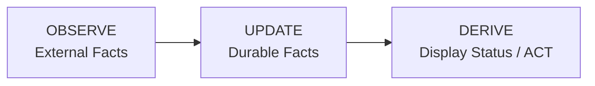

**Key insight:** Display status is never stored. It is computed at read time from durable facts.

### Durable Session Facts

The only persistent session state is:

- `activity_state` — What the agent last reported (`active`, `idle`, `waiting_input`, `blocked`, `exited`). `waiting_input` is an agent at an empty prompt awaiting its next instruction; `blocked` is an agent stopped on a pending permission/approval decision — automation must never inject input into a blocked session.
- `is_terminated` — Whether the session should be treated as over
- `session_mode` plus its runtime/provider handle and generation — The currently committed controller epoch
- `session_interface_transitions` — Durable checkpoints for an in-progress or completed TUI↔Chat handoff
- PR facts — `pr`, `pr_checks`, `pr_comment` tables

### What is NOT Durable

Display status like `working`, `needs_input`, `ci_failed`, `mergeable` are **computed at read time** by the service layer from the durable facts above.

---

## System Overview

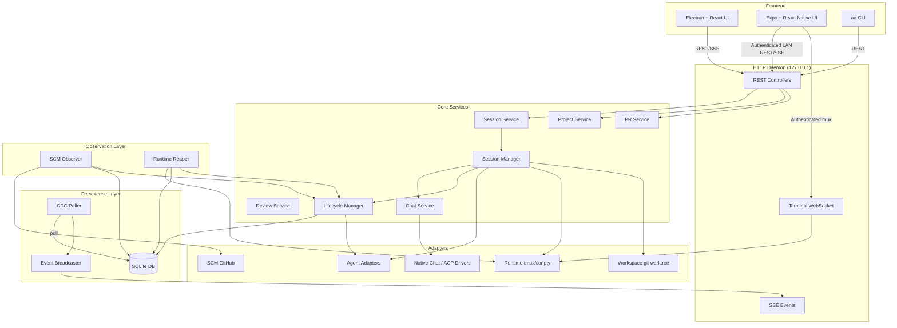

---

## Core Architectural Principles

### 1. Port-Based Design

Core code never depends on concrete implementations. All external systems are accessed through port interfaces defined in `backend/internal/ports/`:

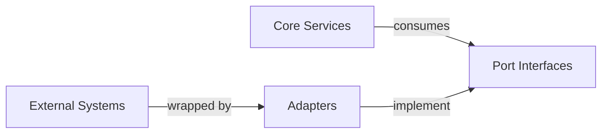

### 2. Durable Facts, Derived Status

Storage layer persists minimal facts. Service layer computes display status on-demand:

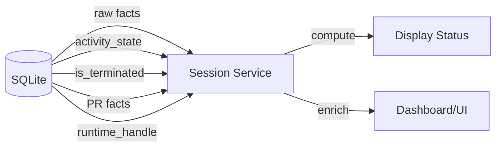

### 3. Observer Pattern

Observation is separated from action:

- **Observe layer** — SCM Observer, Runtime Reaper poll external state
- **Lifecycle layer** — Reduces observations into durable facts
- **Service layer** — Computes display status from facts

### 4. Change Data Capture

All durable changes flow through a CDC pipeline:

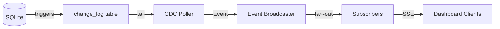

---

## Component Architecture

### Package Layout

```
backend/internal/
├── domain/              # Shared vocabulary and durable fact records
├── ports/               # Inbound/outbound interfaces
├── service/             # Controller-facing services
│   ├── project/         # Project CRUD
│   ├── session/         # Session read-model assembly
│   ├── chat/            # Runtime-less Chat controllers + durable projection
│   ├── pr/              # PR observation service
│   └── review/          # Code review service
├── session_manager/     # Internal session command engine
├── lifecycle/           # Durable session fact reducer
├── observe/             # Observation loops
│   ├── scm/             # SCM (GitHub) observer
│   └── reaper/          # Runtime liveness observer
├── storage/             # SQLite persistence
│   └── sqlite/          # DB, migrations, queries, stores
├── cdc/                 # Change-log poller and broadcaster
├── httpd/               # HTTP API, controllers, terminal mux
├── terminal/            # Terminal session protocol
├── adapters/            # Concrete adapter implementations
│   ├── agent/           # 23+ agent harnesses
│   ├── chatdriver/      # Native provider protocols and reusable ACP transport
│   ├── runtime/         # tmux/conpty runtimes
│   ├── workspace/       # git worktree
│   ├── scm/             # GitHub
│   └── tracker/         # GitHub tracker
├── daemon/              # Production wiring
└── config/              # Environment-based configuration
```

### Core Data Flow

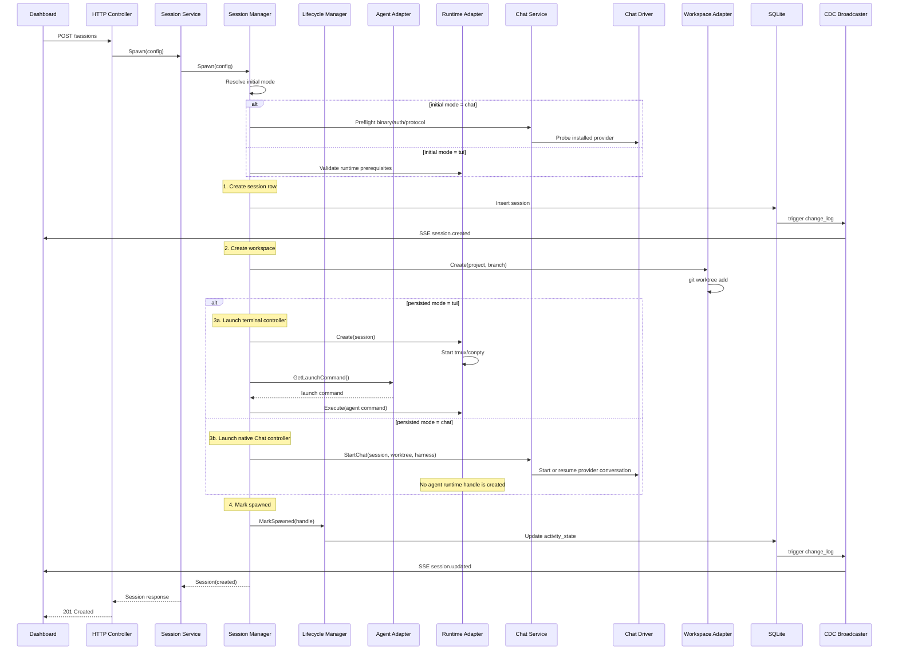

---

## Data Flows

### Session Spawn Flow

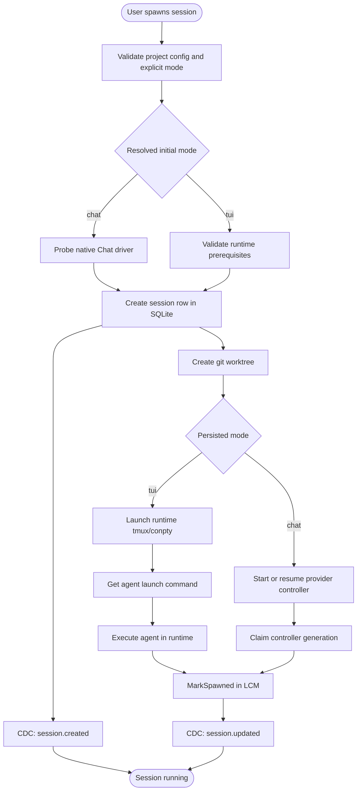

### Session Interface Handoff

An interface switch is a controller replacement inside the existing AO session,
not a new session. The session id, project, worktree, branch, lifecycle facts,
PR ownership, and provider-native conversation id stay the same. Only the
mode-owned controller changes.

The generic coordinator lives in `session_manager`; providers opt in through the
small `AgentInterfaceHandoff` capability only after their TUI resume id and Chat
protocol id are proven to name the same native conversation. Claude Code and
Codex currently satisfy that contract. Merely having a Chat/ACP driver is not
enough to enable switching for another harness.

```mermaid
sequenceDiagram
    participant Client
    participant Manager as Session Manager
    participant Lifecycle as Lifecycle Manager
    participant DB as SQLite
    participant Source as Current Controller
    participant Target as Target Controller

    Client->>Manager: POST interface-transition(target, policy)
    Manager->>DB: Claim one active transition
    alt source = Chat
        Manager->>Source: Arm handoff; close intake and queue dispatch
    else source = TUI
        Manager->>Source: Gate new terminal input
    end
    Manager->>Target: Preflight binary/auth/protocol
    alt policy = drain
        Manager->>Source: Finish accepted work
    else policy = interrupt
        Source->>DB: Cancel queued Chat turns
        Manager->>Source: Cancel active provider turn
    end
    Manager->>Source: Stop and wait for shutdown
    Manager->>Lifecycle: CommitControllerEpoch(source, target, native id)
    Lifecycle->>DB: CAS mode + clear old generation/handles + idle fact
    Manager->>Target: Native resume(same conversation id)
    Manager->>DB: Persist new handle/generation; complete transition
    DB-->>Client: session_updated CDC invalidation
```

The session row is the commit point. If target startup fails, the coordinator
CASes the row back and resumes the source. If the daemon dies mid-handoff, boot
reconciliation marks the interrupted transition for recovery and restores the
controller named by the last committed `session_mode`. Lifecycle/automation
messages received during the no-controller gap are held in a durable outbox and
delivered through whichever controller ultimately owns the session. Terminal
transition paths, transient delivery failures, and daemon restarts all retain
the message for retry; Chat retries carry a stable idempotency key. Old Chat
events are fenced by controller generation; old TUI hooks are fenced by runtime
launch id.

`drain` is loss-minimizing and may wait on an approval or user-input request;
`interrupt` synchronously closes source intake and queue dispatch at transition
acceptance. After target preflight succeeds, it settles queued Chat turns and
then sends the provider's active-turn cancellation, allows a short transcript
flush, and stops the source. The reversible first phase preserves queued work if
the target is unavailable; its dispatch fence prevents a completion callback
from promoting that work during preflight or provider cancellation. Files and
completed provider context survive.
There is no provider-neutral way to migrate a currently executing tool call or a
detached background process, and AO does not synthesize terminal screen output
into structured Chat history.

For TUI drains, AO gates new terminal input before checking quiescence. It accepts
either an idle fact newer than the last accepted input or an adapter-confirmed
idle terminal held across the settle window. A contradictory stale-idle fact has
a bounded proof window and fails without stopping the source; activity reported
as active work or a user-paced decision remains unbounded.

### Observation Flow

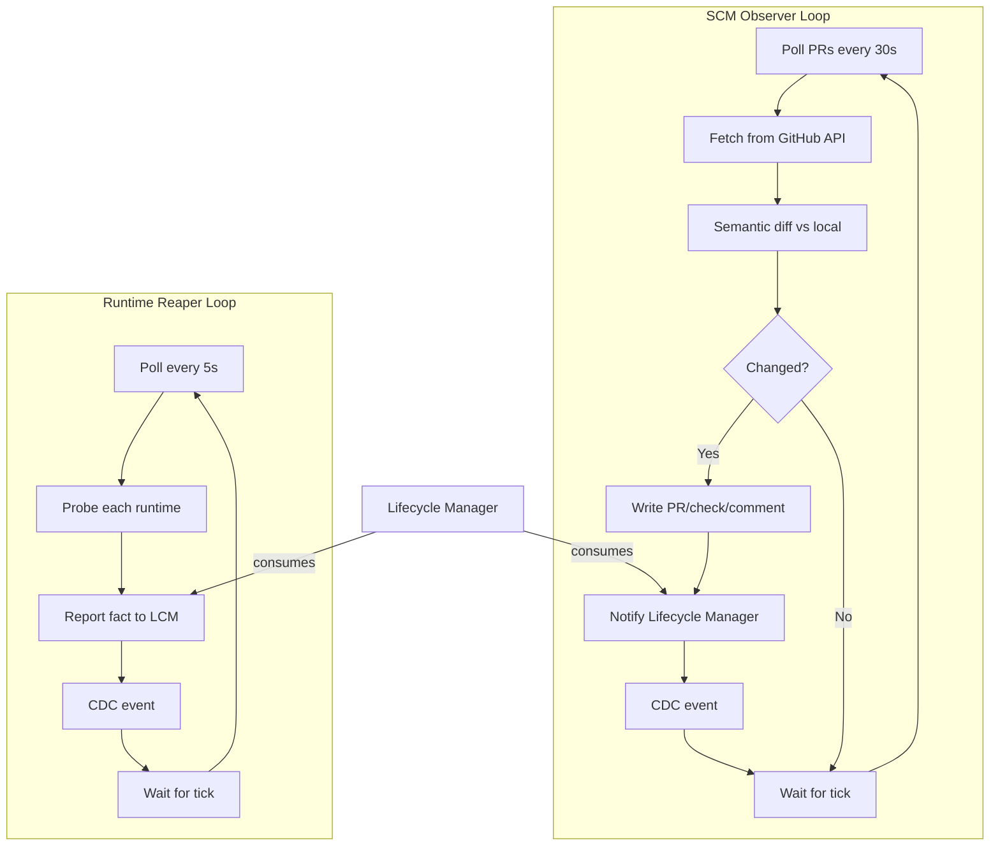

### Feedback Routing Flow

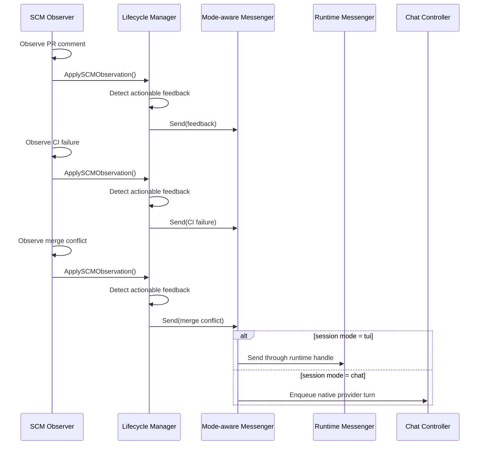

---

## Persistence and CDC

### SQLite Schema

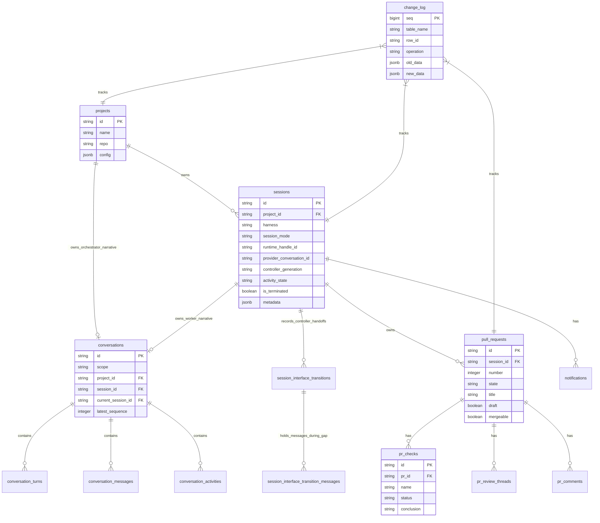

### CDC Pipeline

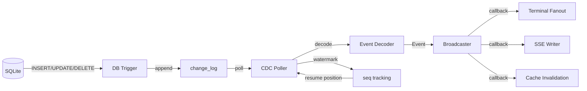

---

## Status Derivation

### Display Status Precedence

The `service.Session` computes display status from durable facts using this precedence (highest to lowest):

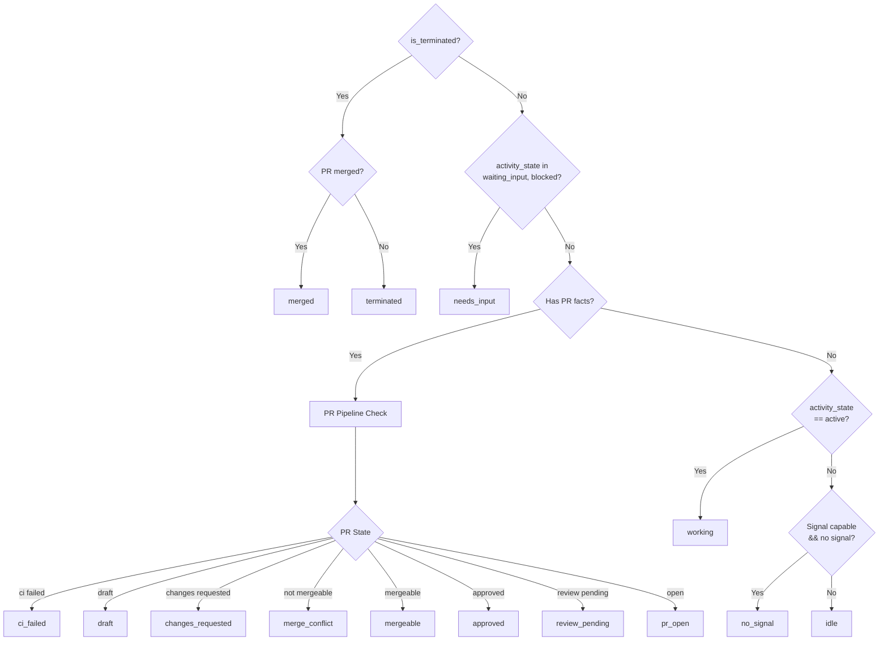

### PR Pipeline States

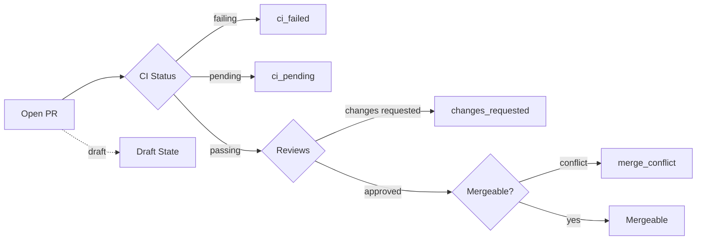

---

## Lifecycle Management

### Lifecycle Manager Responsibilities

The `lifecycle.Manager` is the **canonical write path** for all session lifecycle facts:

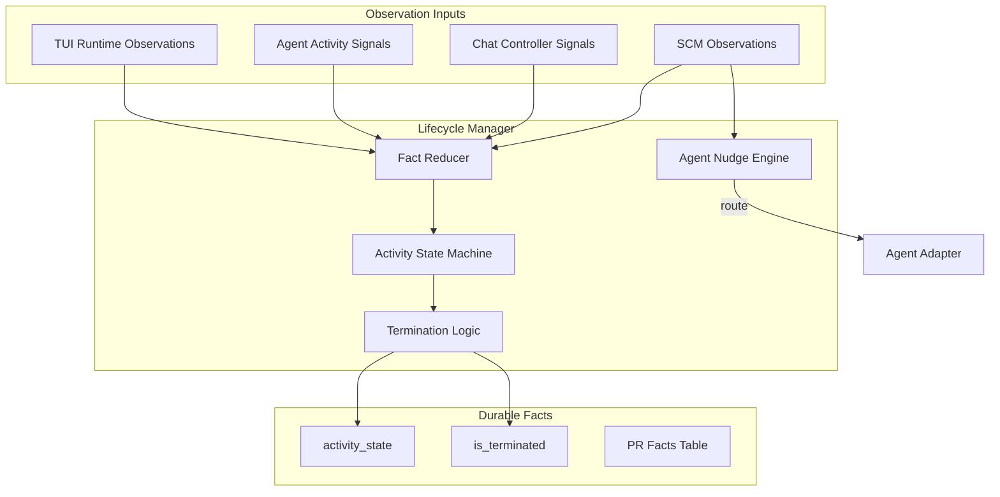

### Session State Machine

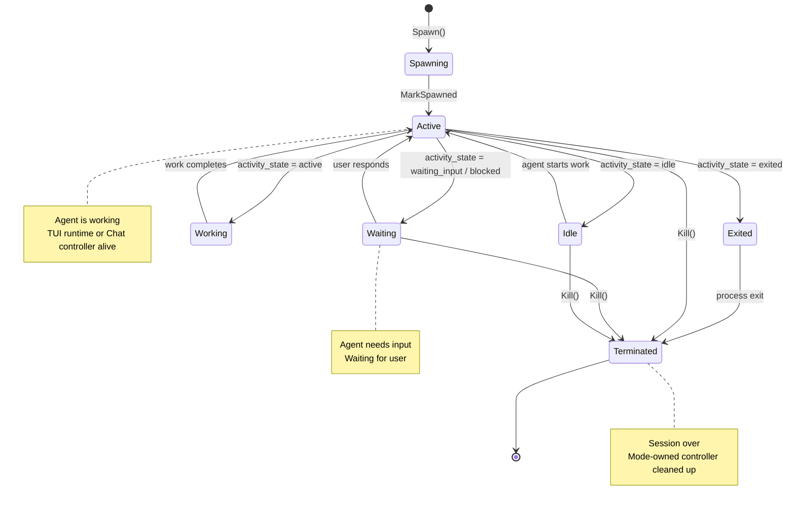

### Termination Guardrails

The lifecycle manager only terminates when **all** conditions are met:

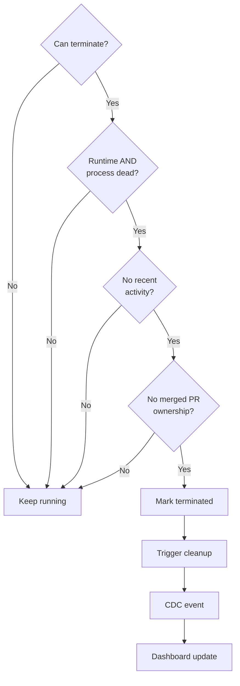

**Key principle:** Failed probes are NOT proof of death. A session is only terminated when the runtime and process are **both** clearly dead and recent activity doesn't contradict that.

---

## Observation Loops

### SCM Observer

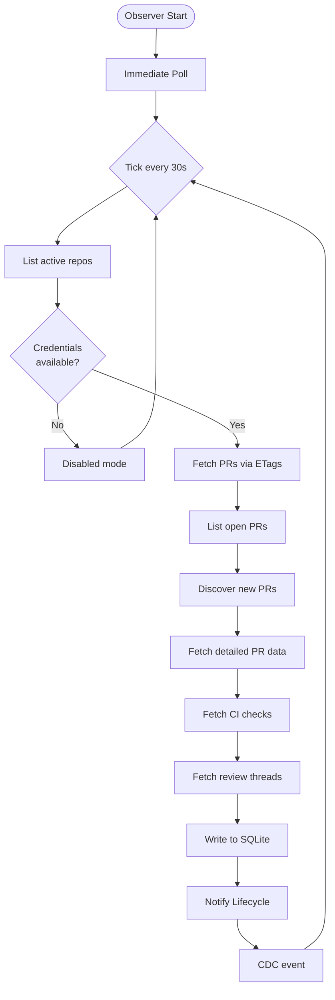

### Runtime Reaper

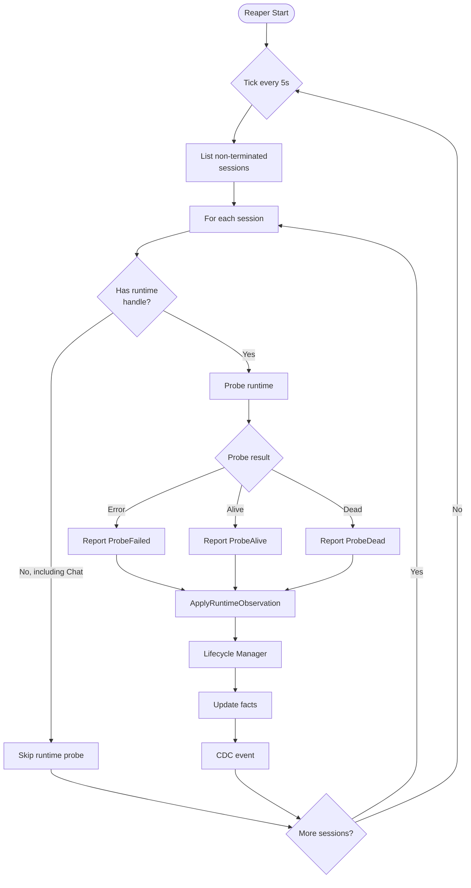

### Observation Integration

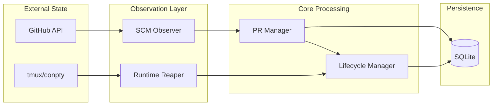

---

## HTTP Layer

### API Structure

```mermaid
flowchart TD
    subgraph HTTPD["HTTP Daemon"]
        Router[Router + Middleware]

        Router --> API[REST API]
        Router --> Events[SSE Events]
        Router --> Terminal[Terminal WebSocket]
    end

    subgraph Controllers["Controllers"]
        Sessions[Sessions Controller]
        Projects[Projects Controller]
        PRs[PRs Controller]
        Reviews[Reviews Controller]
    end

    subgraph Services["Services"]
        SessionSvc[Session Service]
        ProjectSvc[Project Service]
        PRSvc[PR Service]
        ReviewSvc[Review Service]
    end

    API --> Sessions
    API --> Projects
    API --> PRs
    API --> Reviews

    Sessions --> SessionSvc
    Projects --> ProjectSvc
    PRs --> PRSvc
    Reviews --> ReviewSvc

    Events -->|subscribe| CDC[CDC Broadcaster]
    Terminal --> TerminalMux[Terminal Manager]

```

### Multi-Listener Architecture (Loopback + LAN)

The daemon runs two independent HTTP listeners sharing the same chi router:

1. **Primary (Loopback) Listener** — binds `127.0.0.1:3001` with no authentication. All existing daemon operations (CLI, desktop app) use this listener.
2. **LAN Listener** (Connect Mobile) — an opt-in second listener that binds `0.0.0.0:3011` (or ephemeral fallback) **only when explicitly enabled** by the user through the desktop app's Settings. It wraps the shared router in bearer-password authentication middleware, serves app API routes to mobile clients, but never exposes loopback-gated control routes (`/shutdown`, telemetry, mobile control commands). All traffic is plaintext HTTP on a home network only, by deliberate security decision — see `docs/adr/0001-lan-listener-for-mobile.md` for rationale and threat model. Auth state (hashed password, per-source lockout) is persisted to `~/.ao/mobile/config.json` and restored on daemon boot.

The mobile app is a second thin renderer over those same session resources. It
branches on the session's persisted `mode`: TUI attaches the existing mux PTY,
while Chat reads the paged conversation projection and uses the durable CDC SSE
stream only for targeted invalidation/reconnect. Sends, approvals, input,
provider configuration, compaction, rollback, and shell creation remain daemon
commands; no provider or lifecycle policy is implemented in React Native.

For implementation details and security model, consult `docs/adr/0001-lan-listener-for-mobile.md` and the glossary in `CONTEXT.md`.

### Request Flow

```mermaid
sequenceDiagram
    participant Client
    participant Router
    participant Controller
    participant Service
    participant Manager
    participant Store
    participant DB

    Client->>Router: POST /api/v1/sessions
    Router->>Router: Middleware (auth, logging)
    Router->>Controller: handler(w, r)
    Controller->>Controller: decode JSON
    Controller->>Service: Spawn(config)
    Service->>Manager: Spawn(config)
    Manager->>Manager: Resolve mode and preflight its controller
    Manager->>Store: Create session
    Store->>DB: INSERT INTO sessions
    DB->>Store: session record
    Store->>Manager: session record
    Manager->>Manager: Create and provision workspace
    alt mode = tui
        Manager->>Manager: Launch terminal runtime/controller
    else mode = chat
        Manager->>Manager: Launch runtime-less Chat controller
    end
    Manager->>Service: Session response
    Service->>Controller: enriched session
    Controller->>Controller: encode JSON
    Controller->>Client: 201 Created + Session
```

---

## Terminal Multiplexing

The mux is the primary agent controller only for TUI-mode sessions. Chat-mode
sessions have no agent runtime handle and never attach their provider through
tmux. They may still open session-scoped shell terminals as a worktree escape
hatch; those shells are separate resources and do not become the agent
controller.

### Terminal Architecture

```mermaid
flowchart TD
    subgraph Frontend
        Browser[Browser Terminal]
    end

    subgraph HTTPD
        WS[WebSocket Handler]
    end

    subgraph Terminal
        Mux[Terminal Mux]
        Sessions[Session States]
    end

    subgraph Runtime
        TMux[tmux Runtime]
        ConPTY[conpty Runtime]
    end

    Browser -->|WebSocket| WS
    WS -->|attach| Mux
    Mux --> Sessions
    Sessions -->|create| TMux
    Sessions -->|create| ConPTY

    TMux -->|PTY attach| Mux
    ConPTY -->|loopback dial| Mux

    Mux -->|frame| WS
    WS -->|binary| Browser

```

### Attach Flow

```mermaid
sequenceDiagram
    participant Client as Browser
    participant WS as WebSocket Handler
    participant Mux as Terminal Mux
    participant Runtime as tmux/conpty

    Client->>WS: WebSocket upgrade
    WS->>Mux: Attach(session, rows, cols)
    Mux->>Runtime: Attach(handle, rows, cols)

    Runtime->>Runtime: Create PTY
    Runtime->>Runtime: Spawn tmux attach

    loop Data Loop
        Runtime->>Mux: PTY output
        Mux->>WS: Binary frame
        WS->>Client: WebSocket message

        Client->>WS: User input
        WS->>Mux: Input frame
        Mux->>Runtime: Write to PTY
    end

    Client->>WS: Close
    WS->>Mux: Detach
    Mux->>Runtime: Close PTY
```

## Browser Runtime Bridge

Browser automation uses a dedicated local socket (`browser.sock` on Unix,
`ao-browser[-dev]` named pipe on Windows) between the daemon and Electron. The
daemon owns command authorization/correlation; Electron owns the actual browser
targets. Commands never use the supervisor liveness socket and never enable an
unauthenticated remote-debugging port.

Electron attaches its debugger directly to the selected session's
`WebContentsView`, so the protocol transport cannot enumerate or attach to the
AO renderer or a different session. The loopback `/api/v1/browser` surface is
blocked entirely on the opt-in LAN listener.

Request observation is an explicit, temporary browser command rather than a
standing debugger feature. Capture is off by default, bound to the active tab
that starts it, limited to 200 in-memory metadata entries, and automatically
expires within at most five minutes. AO never requests or stores request or
response bodies; it allowlists safe headers and redacts URL credentials,
fragments, and query values. Closing the tab, ending the session, or shutting
down Electron disables and discards the capture.

---

## Load-Bearing Rules

These rules are **load-bearing** — changing them breaks fundamental architectural assumptions:

1. **Never store display status** — Status is derived from durable facts at read time
2. **Never treat failed probes as death** — A failed probe is a fact, not a termination signal
3. **Never force-delete dirty worktrees** — User data safety over cleanup convenience
4. **All app state under ~/.ao** — No OS-default app-data locations
5. **Daemon binds to 127.0.0.1 only** — No network exposure, ever
6. **CLI is thin** — All logic lives in the daemon, CLI is just an HTTP client
7. **CDC is source-truth for events** — DB triggers write to change_log, poller fans out
8. **Adapters are leaves** — Adapters never import core packages, only ports and domain
9. **Hooks are gitignored** — Every file an adapter writes must be in .gitignore
10. **Migrations never change** — Add new migrations, never modify existing ones

---

## Summary

Agent Orchestrator's architecture is designed around:

- **Separation of concerns** — Observation, persistence, and display are distinct layers
- **Port-based design** — Core code depends on interfaces, not implementations
- **Durable minimalism** — Store only facts, compute everything else
- **Event-driven updates** — CDC broadcasts changes to all subscribers
- **Isolation** — Each session owns a worktree and exactly one live mode-specific controller, including across handoffs
- **Safety** — Conservative termination, path validation, gitignored hooks

This architecture enables parallel AI agents to work safely while maintaining complete visibility and control.


### Repository file: docs/backend-code-structure.md

Source: https://raw.githubusercontent.com/Untrivial-ai/agent-orchestrator/main/docs/backend-code-structure.md


# Backend Code Structure

This document describes package ownership for the Go backend. It defines where code belongs, how packages interact, and the architectural boundaries that keep the system maintainable.

## Table of Contents

- [Overview](#overview)
- [Architecture Layers](#architecture-layers)
- [Package-by-Package Ownership](#package-by-package-ownership)
- [Interface Placement Rules](#interface-placement-rules)
- [Import Graph](#import-graph)
- [Adding New Code](#adding-new-code)
- [Examples](#examples)

---

## Overview

The backend is a **layered hybrid** architecture with clear separation between core business logic and external concerns:

```mermaid
graph TB
    subgraph CLI["CLI Layer"]
        CLI[internal/cli]
    end

    subgraph HTTP["HTTP Layer"]
        HTTPD[internal/httpd]
    end

    subgraph Services["Service Layer"]
        Project[internal/service/project]
        Session[internal/service/session]
        PR[internal/service/pr]
        Review[internal/service/review]
    end

    subgraph Core["Core Layer"]
        SessionMgr[internal/session_manager]
        Lifecycle[internal/lifecycle]
        Observe[internal/observe/*]
    end

    subgraph Data["Data Layer"]
        Domain[internal/domain]
        Ports[internal/ports]
        Storage[internal/storage/sqlite]
        CDC[internal/cdc]
    end

    subgraph Infra["Infrastructure Layer"]
        Terminal[internal/terminal]
        Adapters[internal/adapters/*]
        Daemon[internal/daemon]
        Config[internal/config]
    end

    CLI -->|calls| HTTPD
    HTTPD -->|calls| Services
    Services -->|calls| Core
    Services -->|uses| Data
    Core -->|uses| Data
    Core -->|uses| Infra
    HTTPD -->|uses| Data

```

### Key Architectural Principles

1. **Domain stays pure** — No infrastructure dependencies
2. **Ports define contracts** — Interfaces consumed by core, implemented by adapters
3. **Services orchestrate** — Controller-facing use cases over core and data
4. **Adapters are leaves** — Implement ports, don't import core
5. **CLI/HTTP stay thin** — Just protocol handling, all logic in daemon

---

## Architecture Layers

### Layer Interactions

```mermaid
flowchart LR
    Protocol[Protocol Layer<br/>CLI + HTTP] -->|uses| Services[Service Layer<br/>Use Cases]
    Services -->|commands| Core[Core Layer<br/>Session Manager + Lifecycle]
    Services -->|queries| Data[Data Layer<br/>Domain + Ports + Storage]
    Core -->|reads/writes| Data
    Core -->|invokes| Infra[Infrastructure<br/>Adapters + Terminal]
    Infra -->|implements| Ports

```

### Dependency Rules

```mermaid
graph TD
    Direction[Dependency Direction]
    Direction --> Down["Top-down only"]
    Direction --> No["No upward dependencies"]

    CLI[CLI] -->|OK| HTTP[HTTP]
    HTTP -->|OK| Services[Services]
    Services -->|OK| Core[Core]
    Services -->|OK| Storage[Storage]
    Core -->|OK| Adapters[Adapters]

    Bad1[Adapters] -.->|FORBIDDEN| Services
    Bad2[Storage] -.->|FORBIDDEN| HTTP
    Bad3[Core] -.->|FORBIDDEN| CLI

```

---

## Package-by-Package Ownership

### `internal/domain`

**Purpose:** Shared product vocabulary and durable fact records. The single source of truth for domain concepts.

```mermaid
graph TD
    Domain[internal/domain] --> Contains[Contains]
    Contains --> IDs[Shared IDs<br/>ProjectID, SessionID, IssueID]
    Contains --> Enums[Status Enums<br/>SessionStatus, ActivityState]
    Contains --> Records[Durable Records<br/>SessionRecord, PRRecord]
    Contains --> Vocab[Product Vocabulary<br/>PR, Project, Review concepts]

    DoesNot[Does NOT Contain] --> HTTP[HTTP DTOs]
    DoesNot --> CLI[CLI Output]
    DoesNot --> Generated[sqlc Generated Rows]
    DoesNot --> External[External Payloads<br/>GitHub, Claude, etc.]

```

**Belongs here:**

- Shared IDs: `ProjectID`, `SessionID`, `IssueID`
- Enums and status vocabulary
- Durable fact records used across packages
- PR, tracker, project, session vocabulary

**Does NOT belong here:**

- HTTP request/response DTOs
- CLI output shapes
- OpenAPI wrapper types
- sqlc generated rows
- External system payloads (GitHub, tmux, agent-specific)

**Rule of thumb:** If AO would still use the concept after replacing HTTP, CLI, SQLite, GitHub, tmux, and every agent adapter, it belongs in domain.

---

### `internal/ports`

**Purpose:** Narrow capability interfaces that connect core code to replaceable external systems.

```mermaid
graph LR
    Core[Core Code] -->|consumes| Ports[Ports Interfaces]
    Adapters[Adapters] -->|implement| Ports

    Ports --> Examples[Examples]
    Examples --> Runtime[Runtime<br/>Create, Destroy, IsAlive, Attach]
    Examples --> Workspace[Workspace<br/>Create, Destroy, ValidatePath]
    Examples --> Agent[Agent<br/>GetLaunchCommand, GetAgentHooks]
    Examples --> SCM[SCM<br/>ListPRs, FetchPR, FetchChecks]
    Examples --> PR[PR<br/>WriteSCMObservation]

```

**Belongs here:**

- Interfaces consumed by core packages, implemented by adapters
- Capability structs: `RuntimeConfig`, `WorkspaceConfig`, `SpawnConfig`
- Vocabulary at the boundary between core and adapters

**Does NOT belong here:**

- Resource read models (belongs in `service/*`)
- HTTP request/response DTOs (belongs in `httpd`)
- sqlc rows (belongs in `storage/sqlite`)
- One-off internal interfaces

**Key Port Interfaces:**

| Port             | Purpose                 | Implementations         |
| ---------------- | ----------------------- | ----------------------- |
| `Runtime`        | Process isolation       | `tmux`, `conpty`        |
| `Workspace`      | Git worktree management | `gitworktree`           |
| `Agent`          | Agent launching         | 23+ agent adapters      |
| `SCM`            | PR/CI observation       | `github`                |
| `Tracker`        | Issue tracking          | `github` (adapter only) |
| `AgentMessenger` | Agent communication     | Agent hooks             |
| `PRWriter`       | PR persistence          | `pr.Manager`            |

---

### `internal/service/*`

**Purpose:** Controller-facing application boundary. Owns product use cases and read-model assembly.

```mermaid
graph TD
    subgraph Services
        Project[project]
        Session[session]
        PR[pr]
        Review[review]
    end

    subgraph Responsibilities
        UseCases[Use Cases]
        ReadModels[Read Models]
        Validation[Validation]
        Errors[User-Facing Errors]
    end

    Project --> Responsibilities
    Session --> Responsibilities
    PR --> Responsibilities
    Review --> Responsibilities

    subgraph NotHere
        LowLevel[Low-level runtime control]
        RawSQL[Raw sqlc rows]
        HTTP[HTTP routing]
    end

```

**Current service packages:**

```mermaid
graph LR
    Controllers[HTTP Controllers] -->|call| Services

    Services --> Project[internal/service/project<br/>Project CRUD]
    Services --> Session[internal/service/session<br/>Session read-model assembly]
    Services --> PR[internal/service/pr<br/>PR observation/actions]
    Services --> Review[internal/service/review<br/>Code review]

    Services -->|delegate to| SessionMgr[session_manager]
    Services -->|query| Store[storage stores]

```

**Belongs here:**

- Resource use cases called by HTTP controllers and CLI
- Resource read models and command/result types
- Display-model assembly (e.g., session status derivation)
- Resource-specific validation and user-facing errors
- Small store interfaces consumed by the service

**Does NOT belong here:**

- Low-level runtime/workspace/agent process control
- Raw sqlc generated rows as public results
- HTTP routing, path parsing, status-code decisions
- Concrete external adapter details

**Example:** Project concepts live in `internal/service/project`, not in `domain` and not in `internal/project`.

---

### `internal/session_manager`

**Purpose:** Internal session command engine. Owns multi-step session mutations and resource orchestration.

```mermaid
graph TD
    Service[service/session] -->|commands| Mgr[session_manager]
    Mgr -->|orchestrates| Resources[Resources]

    Resources --> Workspace[Workspace Adapter]
    Resources --> Runtime[Runtime Adapter]
    Resources --> Agent[Agent Adapter]
    Resources --> Storage[Storage Store]
    Resources --> Lifecycle[Lifecycle Manager]
    Resources --> Messenger[Agent Messenger]

    Mgr -->|owns| Operations[Operations]
    Operations --> Spawn[Spawn<br/>Create all resources]
    Operations --> Kill[Kill<br/>Teardown all resources]
    Operations --> Restore[Restore<br/>Relaunch terminated session]
    Operations --> Send[Send<br/>Message to agent]

```

**Belongs here:**

- Multi-step session mutations with rollback
- Resource sequencing (workspace → runtime → agent)
- Resource teardown safety and cleanup
- Internal errors: not found, terminated, not restorable

**Does NOT belong here:**

- HTTP request decoding
- CLI formatting
- Controller-facing list/get read-model assembly
- Terminal WebSocket framing

**Intentional split:** `service/session` is the product/API boundary; `session_manager` is the internal command engine.

---

### `internal/lifecycle`

**Purpose:** Canonical write path for durable session lifecycle facts. Reduces observations into minimal persisted state.

```mermaid
graph LR
    subgraph Inputs
        RuntimeObs[Runtime Observations<br/>from Reaper]
        ActivitySignals[Activity Signals<br/>from Agent Hooks]
        SCMObs[SCM Observations<br/>from SCM Observer]
    end

    subgraph Lifecycle
        LCM[Lifecycle Manager]
        Reducer[Fact Reducer]
        StateMachine[State Machine]
        Nudge[Agent Nudge Engine]
    end

    subgraph Outputs
        ActivityState[activity_state]
        IsTerminated[is_terminated]
        PRFacts[PR Facts]
        Nudges[Agent Nudges]
    end

    RuntimeObs --> LCM
    ActivitySignals --> LCM
    SCMObs --> LCM

    LCM --> Reducer
    Reducer --> StateMachine
    StateMachine --> ActivityState
    StateMachine --> IsTerminated

    SCMObs --> Nudge
    Nudge --> Nudges

```

**Belongs here:**

- Updates to lifecycle-owned session facts
- Guardrails around runtime/activity observations
- Lifecycle-triggered agent nudges for actionable PR facts

**Does NOT belong here:**

- Display status persistence (use service layer instead)
- HTTP/CLI DTOs
- Direct adapter implementation details
- PR row persistence (use `pr.Manager`)

**Key invariant:** The UI status is derived at read time by service code. Do not store display status in lifecycle or SQLite.

---

### `internal/observe/*`

**Purpose:** Observation loops that poll external state and report facts to lifecycle.

```mermaid
graph TD
    subgraph Observe
        SCM[observe/scm<br/>SCM Observer]
        Reaper[observe/reaper<br/>Runtime Reaper]
    end

    subgraph External
        GitHub[GitHub API]
        Runtimes[tmux/conpty]
    end

    subgraph Internal
        LCM[Lifecycle Manager]
        Store[SQLite Store]
    end

    SCM -->|polls| GitHub
    SCM -->|writes| Store
    SCM -->|notifies| LCM

    Reaper -->|probes| Runtimes
    Reaper -->|reports to| LCM

```

**Current observation packages:**

- `internal/observe/scm` — SCM (GitHub) observer loop
- `internal/observe/reaper` — Runtime liveness observation loop

**Belongs here:**

- Polling loops and observation logic
- External state transformation into domain facts
- Observation error handling and retry logic

**Does NOT belong here:**

- Product workflow decisions (belongs in service layer)
- Direct storage writes (use lifecycle instead)

---

### `internal/storage/sqlite`

**Purpose:** SQLite setup, migrations, queries, and store implementations.

```mermaid
graph TD
    Storage[storage/sqlite] --> Components[Components]

    Components --> Setup[Connection Setup<br/>PRAGMAs]
    Components --> Migrations[Goose Migrations]
    Components --> SQLC[sqlc Queries + Generated Code]
    Components --> Stores[Table-specific Stores]
    Components --> Trans[Transactions + CDC]

    Components -->|NOT| HTTP[HTTP Response Types]
    Components -->|NOT| CLI[CLI Formatting]
    Components -->|NOT| Product[Product Display Status Rules]

```

**Belongs here:**

- Connection setup and PRAGMAs
- Goose migrations
- sqlc queries and generated code
- Table-specific store methods
- Transactions and CDC-triggered persistence behavior

**Does NOT belong here:**

- HTTP response types
- CLI output formatting
- Product display status rules
- External adapter logic

**Rule:** Generated sqlc types should stay behind store methods. Services should work with domain records or service read models, not generated rows.

---

### `internal/cdc`

**Purpose:** Change-log polling and event broadcasting.

```mermaid
graph LR
    SQLite[(SQLite)] -->|triggers| ChangeLog[change_log]
    ChangeLog -->|tail| Poller[CDC Poller]
    Poller -->|Event| Broadcaster[Broadcaster]
    Broadcaster -->|fan-out| Subs[Subscribers]

    Subs --> SSE[SSE Writer]
    Subs --> Term[Terminal Fanout]
    Subs --> Cache[Cache Invalidation]

```

**Belongs here:**

- Event type definitions for the CDC stream
- Poller and broadcaster logic
- Subscriber fan-out behavior

**Does NOT belong here:**

- Terminal byte streams (belongs in `internal/terminal`)
- Product workflow decisions (belongs in service layer)
- Database schema ownership (belongs in `storage/sqlite`)

---

### `internal/terminal`

**Purpose:** Terminal session protocol and PTY attach management used by the HTTP terminal mux.

```mermaid
graph TD
    HTTP[httpd] -->|WebSocket| Terminal[terminal]
    Terminal -->|creates| Attach[Attach Streams]
    Attach -->|wraps| PTY[PTY Sessions]

    PTY --> Unix[Unix: tmux attach<br/>via ptyexec]
    PTY --> Windows[Windows: conpty<br/>loopback dial]

    Terminal -->|manages| State[Session States]
    State --> Liveness[Liveness gating]
    State --> Backoff[Re-attach backoff]

```

**Belongs here:**

- Per-client attachment lifecycle
- Input/output framing independent of HTTP
- PTY-backed attach handling and terminal protocol tests

**Does NOT belong here:**

- HTTP-specific concerns (belongs in `httpd`)
- HTTP routing or WebSocket upgrade logic

**Note:** `httpd` adapts WebSocket connections to terminal interfaces. `terminal` should not import `httpd`.

---

### `internal/httpd`

**Purpose:** HTTP protocol adapter. Handles routing, middleware, and request/response encoding.

```mermaid
graph TD
    HTTPD[httpd] --> Components[Components]

    Components --> Routing[Routing + Middleware]
    Components --> Decode[Request Decoding]
    Components --> Encode[Response Encoding]
    Components --> Errors[API Error Envelopes]
    Components --> OpenAPI[OpenAPI Generation]
    Components --> WS[WebSocket for Terminal]

    Components -->|calls| Services[service/*]

    Services -->|NOT| Adapters[Direct Adapter Access]
    Services -->|NOT| Storage[Direct SQLite Access]

```

**Belongs here:**

- Routing and middleware
- HTTP request decoding and response encoding
- Path/query parameter handling
- Status-code mapping
- API error envelopes
- OpenAPI generation and serving
- WebSocket upgrade handling for terminal mux

**Does NOT belong here:**

- Direct adapter or SQLite store access
- Application read models shared with CLI (belongs in `service/*`)

**Rule:** Controllers call service managers and translate service results/errors into HTTP responses.

---

### `internal/cli`

**Purpose:** User-facing `ao` command. Thin client over the daemon HTTP API.

```mermaid
graph LR
    CLI[cli] --> Operations[Operations]

    Operations --> Discover[Discover Daemon]
    Operations --> Call[Call HTTP API]
    Operations --> Format[Format Output]
    Operations --> Control[Process Control<br/>start/stop/status/doctor]

    Operations -->|NOT| Direct[Direct Storage/DB Access]
    Operations -->|NOT| Runtime[Direct Runtime Control]
    Operations -->|NOT| Adapters[Direct Adapter Calls]

```

**Belongs here:**

- Daemon discovery
- HTTP API calls
- Command output formatting
- Process control: start/stop/status/doctor

**Does NOT belong here:**

- Duplicate daemon business logic (put in daemon service/API)
- Direct storage, runtime, or adapter access

**Rule:** If a command needs product behavior, put it in the daemon and have the CLI call that API path.

---

### `internal/adapters/*`

**Purpose:** Concrete implementations of ports interfaces. Wraps external systems.

```mermaid
graph TD
    Ports[Ports Interfaces] -->|implemented by| Adapters[Adapters]

    Adapters --> Agent[agent/*<br/>23+ harnesses]
    Adapters --> Runtime[runtime/*<br/>tmux, conpty]
    Adapters --> Workspace[workspace/*<br/>gitworktree]
    Adapters --> SCM[scm/*<br/>github]
    Adapters --> Tracker[tracker/*<br/>github]

    Agent --> Codex[codex]
    Agent --> Claude[claude-code]
    Agent --> Cursor[cursor]
    Agent --> Aider[aider]
    Agent -->|... 20+| More[more agents]

```

**Adapter principles:**

- Adapters are leaves in the import graph
- Adapters translate external behavior into AO ports/domain concepts
- Adapters should not own product workflows
- All adapter-written files must be gitignored

**Good dependencies:**

```
session_manager → ports.Runtime
adapters/runtime/tmux → ports + domain
adapters/workspace/gitworktree → ports + domain
daemon → adapters + services + storage
```

**Avoid:**

```
domain → adapters
service/session → adapters/runtime/tmux
httpd/controllers → storage/sqlite/store
adapters/* → httpd
```

---

### `internal/daemon`

**Purpose:** Production composition root. Wires all dependencies together.

```mermaid
graph TD
    Daemon[daemon] --> Responsibilities[Responsibilities]

    Responsibilities --> Wire[Dependency Construction]
    Responsibilities --> Register[Adapter Registration]
    Responsibilities --> Startup[Startup Sequencing]
    Responsibilities --> Shutdown[Shutdown Sequencing]
    Responsibilities --> Cross[Cross-component Wiring]

    Responsibilities -->|NOT| Business[Business Logic<br/>(put in service/lifecycle)]
    Responsibilities -->|NOT| Adapter[Adapter Implementation<br/>(put in adapters/*)]

```

**Belongs here:**

- Production dependency construction
- Adapter registration
- Startup/shutdown sequencing
- Cross-component wiring

**Does NOT belong here:**

- Business logic (belongs in service, lifecycle, or manager packages)
- Adapter implementation details (belongs in adapters/\*)

---

### `internal/config`

**Purpose:** Environment-based daemon configuration.

```mermaid
graph LR
    Config[config] --> Sources[Sources]

    Sources --> Env[Environment Variables]
    Sources --> Defaults[Built-in Defaults]
    Sources --> Validate[Validation]

    Config -->|provides| Settings[Settings]

    Settings --> Port[AO_PORT]
    Settings --> Timeout[AO_REQUEST_TIMEOUT]
    Settings --> DataDir[AO_DATA_DIR]
    Settings --> RunFile[AO_RUN_FILE]
    Settings --> Agent[AO_AGENT]

```

**Key environment variables:**

- `AO_PORT` — HTTP bind port (default: 3001)
- `AO_REQUEST_TIMEOUT` — Per-request timeout (default: 60s)
- `AO_SHUTDOWN_TIMEOUT` — Graceful shutdown cap (default: 10s)
- `AO_RUN_FILE` — PID/port handshake (default: ~/.ao/running.json)
- `AO_DATA_DIR` — SQLite data directory (default: ~/.ao/data)
- `AO_AGENT` — Compatibility agent adapter (default: claude-code)
- `GITHUB_TOKEN` — GitHub authentication

---

## Interface Placement Rules

```mermaid
graph TD
    Question{Where to define<br/>interface?}

    Question --> Single{Only one package<br/>consumes it?}
    Single -->|Yes| InPackage[Define in consuming<br/>package]
    Single -->|No| Multiple{Multiple core packages<br/>need it?}

    Multiple -->|Yes| Ports[Define in ports]
    Multiple -->|No| HTTP{HTTP controllers<br/>need it?}

    HTTP -->|Yes| Service[Define in service/*]
    HTTP -->|No| Concrete[Return concrete type<br/>from constructor]

```

**Rules:**

1. **Single consumer** → Define in the consuming package (smallest interface)
2. **Multiple core consumers** → Define in `ports` (shared capability)
3. **HTTP controllers need resource** → Use `service/*` manager interface
4. **Return from constructor** → Return concrete type unless genuinely needed

**Examples:**

```go
// Good: Interface near single consumer
type sessionGetter interface {
    GetSession(ctx context.Context, id SessionID) (SessionRecord, bool, error)
}

// Good: Shared capability in ports
type Runtime interface {
    Create(ctx context.Context, cfg RuntimeConfig) (RuntimeHandle, error)
    Destroy(ctx context.Context, handle RuntimeHandle) error
    IsAlive(ctx context.Context, handle RuntimeHandle) (bool, error)
}

// Good: Service interface for controllers
type Manager interface {
    List(ctx context.Context) ([]Project, error)
    Add(ctx context.Context, cfg Config) (Project, error)
    Remove(ctx context.Context, id string) error
}
```

---

## Import Graph

```mermaid
graph TD
    CLI[cli] --> HTTPD[httpd]
    HTTPD --> Services[service/*]
    HTTPD --> Terminal[terminal]

    Services --> SessionMgr[session_manager]
    Services --> Lifecycle[lifecycle]
    Services --> Storage[storage/sqlite]
    Services --> Domain[domain]
    Services --> Ports[ports]

    SessionMgr --> Ports
    SessionMgr --> Adapters[adapters/*]
    SessionMgr --> Lifecycle

    Lifecycle --> Ports
    Lifecycle --> Storage
    Lifecycle --> Domain

    Observe[observe/*] --> Ports
    Observe --> Storage
    Observe --> Lifecycle

    Storage --> Domain
    Storage --> Ports

    Adapters --> Ports
    Adapters --> Domain

    CDC[cdc] --> Storage
    Terminal --> Ports

    Daemon[daemon] --> All[All packages]

```

**Key patterns:**

- All arrows point downward (no cycles)
- Adapters and domain are leaves
- CLI and HTTPD don't touch storage directly
- Everything depends on ports and domain

---

## Adding New Code

### New HTTP Route

```mermaid
flowchart LR
    AddRoute[Add HTTP Route] --> Route[Register in httpd]
    Route --> Call[Call service/*]
    Call --> Update[Update OpenAPI]
    Update --> Test[Add tests]

```

**Steps:**

1. Add controller in `httpd/controllers/`
2. Call a `service/*` package
3. Update OpenAPI generation
4. Add spec tests

### New Product Resource

```mermaid
flowchart TD
    NewResource[New Resource] --> Domain[Add IDs/vocab to domain]
    Domain --> Service[Create service/resource]
    Service --> Storage[Add storage queries]
    Storage --> Ports[Add ports if needed]
    Ports --> Adapter[Implement adapter if needed]

```

**Steps:**

1. Add shared IDs/vocabulary to `domain`
2. Create use cases in `service/<resource>`
3. Add storage in `storage/sqlite`
4. Add ports if external system needed
5. Implement adapter in `adapters/<capability>/<impl>`
6. Wire in `daemon`

### New Adapter

```mermaid
flowchart LR
    NewAdapter[New Adapter] --> Port[Implement port interface]
    Port --> Hooks[Implement hooks if agent]
    Hooks --> Gitignore[Add .gitignore entries]
    Gitignore --> Wire[Wire in daemon]
    Wire --> Test[Add conformance tests]

```

**Steps:**

1. Implement a `ports` interface under `adapters/<capability>/<impl>`
2. For agents: implement hooks with gitignored files
3. Wire in `daemon`
4. Add conformance tests

---

## Examples

### Example: Adding a Session Command

```go
// In internal/service/session/service.go
func (s *Service) MyNewCommand(ctx context.Context, id SessionID) (Result, error) {
    // 1. Validate input
    // 2. Call session_manager
    // 3. Enrich result
    // 4. Return read model
}

// In internal/httpd/controllers/sessions.go
func (c *SessionsController) myNewCommand(w http.ResponseWriter, r *http.Request) {
    // 1. Decode request
    // 2. Call service
    // 3. Encode response
}
```

### Example: Adding a Port Interface

```go
// In internal/ports/myfeature.go
package ports

type MyFeature interface {
    DoSomething(ctx context.Context, cfg Config) (Result, error)
}

// In internal/adapters/myfeature/impl.go
package impl

import "github.com/aoagents/agent-orchestrator/backend/internal/ports"

type Impl struct { ... }

func (i *Impl) DoSomething(ctx context.Context, cfg ports.Config) (ports.Result, error) {
    // Implementation
}
```

### Example: Service Layer Pattern

```go
// In internal/service/myresource/service.go
package service

// Service is the controller-facing boundary
type Service struct {
    manager *manager.Manager  // Internal command engine
    store   Store             // Storage interface
}

// New constructs the service
func New(mgr *manager.Manager, store Store) *Service {
    return &Service{manager: mgr, store: store}
}

// List returns enriched read models
func (s *Service) List(ctx context.Context) ([]MyResource, error) {
    records, err := s.store.List(ctx)
    if err != nil {
        return nil, err
    }
    return s.enrich(records), nil
}

// Create performs a use case
func (s *Service) Create(ctx context.Context, cfg Config) (MyResource, error) {
    // Business logic
    result, err := s.manager.Create(ctx, cfg)
    if err != nil {
        return MyResource{}, err
    }
    return s.enrichOne(result), nil
}
```

---

## Summary

**Key takeaways:**

1. **Domain** stays pure — shared vocabulary only
2. **Ports** define contracts — interfaces for external systems
3. **Services** orchestrate — controller-facing use cases
4. **Adapters** are leaves — implement ports, no core imports
5. **CLI/HTTP** stay thin — protocol handling only
6. **Daemon** wires it all — composition root

**Always ask:**

- Does this belong in domain (shared concept)?
- Does this belong in ports (shared capability)?
- Does this belong in service (use case)?
- Does this belong in adapters (external system)?

**Never:**

- Put HTTP types in domain
- Put display status in storage
- Put business logic in CLI
- Import core from adapters
- Import adapters from services


### Repository file: docs/cli/README.md

Source: https://raw.githubusercontent.com/Untrivial-ai/agent-orchestrator/main/docs/cli/README.md


# AO CLI

The `ao` CLI is a thin Go/Cobra client for the local Agent Orchestrator daemon.
It starts, discovers, inspects, and stops the daemon through the loopback HTTP
surface and the `running.json` handshake. It must not open SQLite directly or
call runtime, workspace, tracker, or agent adapters in-process.

When using the CLI directly from a shell, make sure the daemon is running first
with `ao start` or by opening the desktop app. Product commands such as
`ao agent ls` and `ao spawn` call the loopback daemon and will fail with a
"daemon is not running" error if no `running.json` points at a live process. From
a source checkout, build and run the local binary explicitly, for example:

```bash
cd backend
go build -o ./bin/ao ./cmd/ao
./bin/ao agent ls
```

## Current commands

Every product command resolves to a daemon HTTP route. Run `ao <command>
--help` for the authoritative flag shape.

### Daemon control

| Command                       | Purpose                                                                                                                           |
| ----------------------------- | --------------------------------------------------------------------------------------------------------------------------------- |
| `ao start`                    | Start the daemon in the background and wait for `/readyz`.                                                                        |
| `ao stop`                     | Gracefully stop the daemon via loopback `POST /shutdown` after verifying daemon identity.                                         |
| `ao status` / `--json`        | Report daemon state from `running.json`, process liveness, `/healthz`, and `/readyz`.                                             |
| `ao doctor` / `--json`        | Check config, data directory, DB-file presence, daemon state, `git`, and (on Darwin/Linux) `tmux`; on Windows conpty is built in. |
| `ao completion <shell>`       | Generate completions for `bash`, `zsh`, `fish`, or `powershell`.                                                                  |
| `ao version` / `ao --version` | Print build metadata.                                                                                                             |
| `ao daemon`                   | Hidden internal daemon entrypoint used by `ao start`.                                                                             |

### Product commands

| Command                             | Daemon route                                   |
| ----------------------------------- | ---------------------------------------------- |
| `ao project add`                    | `POST /api/v1/projects`                        |
| `ao project ls`                     | `GET /api/v1/projects`                         |
| `ao project get <id>`               | `GET /api/v1/projects/{id}`                    |
| `ao project set-config <id>`        | `PUT /api/v1/projects/{id}/config`             |
| `ao project rm <id>`                | `DELETE /api/v1/projects/{id}`                 |
| `ao agent ls`                       | `GET /api/v1/agents`                           |
| `ao agent ls --refresh`             | `POST /api/v1/agents/refresh`                  |
| `ao spawn`                          | `POST /api/v1/sessions`                        |
| `ao session ls`                     | `GET /api/v1/sessions`                         |
| `ao session get <id>`               | `GET /api/v1/sessions/{id}`                    |
| `ao session kill <id>`              | `POST /api/v1/sessions/{id}/kill`              |
| `ao session restore <id>`           | `POST /api/v1/sessions/{id}/restore`           |
| `ao session switch-agent <id> <target-harness>` | `POST /api/v1/sessions/{id}/switch-agent` |
| `ao session agent-switch ls <session-id>` | `GET /api/v1/sessions/{id}/agent-switches` |
| `ao session handoff submit`         | `POST /api/v1/sessions/{id}/agent-switches/{switchId}/handoff` |
| `ao session rename <id> <name>`     | `PATCH /api/v1/sessions/{id}`                  |
| `ao session cleanup`                | `POST /api/v1/sessions/cleanup`                |
| `ao session claim-pr [<id>] <pr-ref>` | `POST /api/v1/sessions/{id}/pr/claim`        |
| `ao orchestrator ls`                | `GET /api/v1/orchestrators`                    |
| `ao send`                           | `POST /api/v1/sessions/{id}/send`              |
| `ao preview [url]`                  | `POST /api/v1/sessions/{id}/preview`           |
| `ao preview start/status/stop`      | `POST/GET/DELETE /api/v1/sessions/{id}/preview/server` |
| `ao browser ...`                    | `GET /api/v1/browser/status`, `POST /api/v1/browser/commands` |
| `ao hooks <agent> <event>`          | `POST /api/v1/sessions/{id}/activity` (hidden) |

`ao agent ls` prints the daemon-supported agent catalog with local install/auth
readiness. Use `--refresh` to rerun the bounded local probes and `--json` to
print the raw inventory response.

`ao spawn` resolves project context in this order: explicit `--project`,
`AO_PROJECT_ID`, `AO_SESSION_ID` (by fetching the current session from the
daemon), then the current working directory matched against registered project
paths. If `AO_SESSION_ID` is set but the session cannot be fetched, pass
`--project` explicitly.

Agent switching is initially available only for worker sessions whose source
and target harnesses are Claude Code or Codex. The main command
accepts an idempotency key:

```bash
ao session switch-agent ao-7 codex \
  --idempotency-key switch-ao-7-to-codex

ao session agent-switch ls ao-7 --json
```

`switch-agent` and `agent-switch ls` both support `--json`.
The `agent-switch` command also has the `agent-switches` alias, and `ls` has the
`list` alias.

`ao session handoff submit` is the internal source-agent path for optional
semantic enrichment, not a required human step in a normal switch. It requires
the switch ID, exact source launch generation, and a regular file containing
one JSON object no larger than 64 KiB. `--session` defaults to
`AO_SESSION_ID`:

```bash
AO_SESSION_ID=ao-7 ao session handoff submit \
  --switch switch-123 \
  --source-generation generation-456 \
  --file /tmp/ao-handoff.json \
  --json
```

Switching preserves the AO worker session and worktree. It does not translate,
clip, or rewrite provider transcript files; providers continue to own their
native history and compaction.

`ao session claim-pr <pr-ref>` attaches a PR to the current worker by reading
`AO_SESSION_ID`. From an orchestrator or external shell, pass the target
explicitly with `ao session claim-pr <session-id> <pr-ref>`. The explicit form
remains supported for backward compatibility and cross-session coordination.

If `--agent` / `--harness` is omitted, `ao spawn` uses the resolved project's
`worker.agent` config. Before spawning, the CLI refreshes the advisory agent
catalog and fails early when the selected agent is unsupported, not installed,
or unauthorized. It warns-but-continues when auth remains unknown because daemon
spawn remains the authoritative runtime validation point. Use
`--skip-agent-check` to bypass only this CLI-side preflight.

`ao preview` resolves its session from the `AO_SESSION_ID` environment variable
(it is meant to run inside a session), not a flag. With no argument it
autodetects an `index.html` in the session workspace; with a URL argument it
opens that URL verbatim (`file://`, `http`, `https`).

`ao preview start [configuration]` loads `.ao/launch.json` from the session
workspace, starts that exact command under a session-owned supervisor, selects
or records its loopback port, waits for readiness, and opens application
targets in the Browser panel. `status` reports bounded recent logs and `stop`
terminates the managed process tree. Multiple configurations must be selected
by name; AO does not assign confidence scores to arbitrary localhost servers.
This is an optional, reusable project configuration, not a prerequisite for
preview. Agents must not create it automatically. Static HTML and Markdown use
the direct file preview and must not cause package-manager scaffolding,
dependency installation, or a development server to be introduced.

When a browser-displayable file is the requested artifact, agents should call
`ao preview <workspace-path>` immediately after creating or materially updating
the primary output. Markdown, HTML, PDF, SVG, and common images can be served
directly. Supporting assets must not replace an active application preview.

`ao browser` also resolves its target from `AO_SESSION_ID`, but controls the
session-owned live Electron browser rather than only setting its preview URL.
The target-isolated command set includes `status`, `open`, `snapshot`, `click`,
`dblclick`, `focus`, `fill`, `type`, `press`, `hover`, `scroll`,
`scrollintoview`, `drag`, `select`, `check`, `uncheck`, `get`, `highlight`,
`unhighlight`, `tabs`, `tab new`, `tab select`, `tab close`, `frame`, `dialog`,
`wait`, `screenshot`, `network start/status/list/stop/clear`, `console`, and
`errors`. The native engine is bound internally; there is no second command or
connection setup. Logical tab IDs remain stable for the session, and allowed popups
become AO browser tabs rather than separate OS-browser windows. The AO desktop
app must be open because Electron owns the `WebContentsView`.
References from a snapshot are invalidated after navigation or DOM replacement;
they are also invalidated when changing tabs. Take another snapshot when a
command reports `STALE_REFERENCE`.
Browser waits cover load completion, text or selector appearance and
disappearance, URL matching, fixed delays, and a configurable DOM-stability
window for HMR-driven verification.
Browser tabs in the same worker share a memory-only Electron profile. Different
workers receive distinct partitions, so cookies, authentication, local storage,
and session storage do not leak between their browser runtimes.
Network capture is disabled by default and must be started explicitly. It is
scoped to the active tab at start time, expires after 60 seconds by default
(maximum 300), retains at most 200 in-memory entries, and is cleared with the
tab/session. Captured data is metadata-only: request and response bodies are
never read, sensitive headers are omitted, and URL credentials, fragments, and
query values are redacted.

`go run .` in `backend/` remains a compatibility wrapper around the daemon.

PR actions are available through `ao pr merge` and
`ao pr resolve-comments`. Review actions are available through `ao review ls`,
`ao review trigger` (also `execute` and `restart`), `ao review cancel` (also
`stop`), and `ao review submit`.

## Configuration

The CLI and daemon share the same environment-driven config:

| Var                   | Default              | Purpose                                                                                        |
| --------------------- | -------------------- | ---------------------------------------------------------------------------------------------- |
| `AO_PORT`             | `3001`               | Loopback daemon port.                                                                          |
| `AO_RUN_FILE`         | `~/.ao/running.json` | PID/port handshake.                                                                            |
| `AO_DATA_DIR`         | `~/.ao/data`         | SQLite data directory.                                                                         |
| `AO_REQUEST_TIMEOUT`  | `60s`                | REST request timeout.                                                                          |
| `AO_SHUTDOWN_TIMEOUT` | `10s`                | Graceful shutdown cap.                                                                         |
| `AO_KEEP_DAEMON`      | unset (off)          | Keep the desktop app's daemon running after the window closes; stop only via `ao stop`. (fork) |

The daemon always binds `127.0.0.1`.

## Manual smoke test

```bash
cd backend
go build -o /tmp/ao ./cmd/ao

tmp=$(mktemp -d)
export AO_RUN_FILE="$tmp/running.json"
export AO_DATA_DIR="$tmp/data"
export AO_PORT=3037

/tmp/ao status --json
/tmp/ao doctor
/tmp/ao start
/tmp/ao status --json
/tmp/ao stop
/tmp/ao status --json
rm -rf "$tmp"
```

## Adding new commands

Add a product command only when a daemon HTTP route owns the corresponding
mutation/read; the CLI must call that route rather than reimplementing daemon
behavior. Commands not yet exposed but with backend routes in place include
`ao events ...` (over the CDC/SSE endpoint) and CLI parity for PR/review
actions.

Do not port old in-process TypeScript CLI behavior that mixed command handling
with storage and runtime implementation details.


### Repository file: docs/cloud-development.md

Source: https://raw.githubusercontent.com/Untrivial-ai/agent-orchestrator/main/docs/cloud-development.md


# Cloud development

## TL;DR

AO stays a complete public local product. The private `ao-cloud` repository
implements the hosted control plane and can be checked out at
`private/ao-cloud` as an optional submodule for developers who have access.
Public builds, tests, and contributors must not depend on that checkout.

The public repository owns stable contracts, generated client types, reusable
product UI, and local desktop behavior. The private repository owns tenant data,
authorization, hosted execution, infrastructure, and secrets.

## Using the private checkout

After the optional submodule is added, an authorized developer initializes it
with:

```bash
gh auth setup-git
git -c submodule.private/ao-cloud.update=checkout \
  submodule update --init private/ao-cloud
```

Developers without access do nothing. A normal clone, build, and test of public
AO—including `git clone --recursive`—continues to work because the submodule is
configured with `update = none`. Only the explicit opt-in command above fails
without private repository permission.

The private web app consumes the public packages through the containing
workspace. Install the public workspace first, then the private app:

```bash
npm ci
npm --prefix private/ao-cloud ci
```

Do not copy those package sources into the private repository. The private
package links point to `packages/cloud-client` and `packages/product-ui`, while
its build scripts compile the public packages before building the Next.js app.

Work in the two repositories remains separate:

1. Commit and push private implementation changes from `private/ao-cloud`.
2. In the public repository, stage the `private/ao-cloud` path to record the
   known-compatible private commit.
3. Review the private code and the public submodule-pointer update in separate
   pull requests.

Never put credentials in `.gitmodules`. Public and fork CI must not initialize
the private submodule. A future integration job should use a scoped GitHub App
token with read access to `ao-cloud`.

## Foundation implemented in public AO

- Stable Go facts and pure rules for agents, sessions, status, PRs, reviews, and
  stack position.
- Shared Claude Code, Codex, and Cursor launch/restore policy plus Linux worker
  process lifecycle primitives.
- Organization-scoped account, project, session-policy, event, and GitHub
  OpenAPI contracts with generated TypeScript schema types, including the
  durable worker turn, credential, and checkout-grant boundary.
- A typed Cloud client for bearer authentication, pagination, idempotent writes,
  cursor-safe reconnecting SSE, GitHub App flows, terminal tickets, and
  workspace reads.
- Reusable board, composer, inspector, project-settings, agent, and SCM
  presentation. The Cloud app now consumes the shared board, session-card,
  status, and agent-identity exports instead of maintaining a second copy.
- WorkOS desktop authentication with token custody in Electron main and a
  token-free renderer account projection.

These are shared-ready boundaries, not a hosted Cloud implementation.

## Private implementation status

The private repository now contains:

- the 28-table PostgreSQL schema, tenant keys, forced RLS, organizations,
  memberships, projects, sessions, turns/events, and future execution,
  sharing, and GitHub records;
- WorkOS access-token validation, organization authorization, idempotent
  project/session/message APIs, durable workspace intent, and cross-replica
  event replay/SSE;
- secure GitHub App installation, OAuth verification, repository grants,
  synchronization, disconnect, project import, and durable webhook processing;
- an authenticated Next.js Cloud app for organization selection, project and
  durable-session creation, search, chat history, and live event replay;
- non-root control-plane and migration images;
- separate staging and production RDS/ECS/ALB/secrets/logging environments; and
- migration-first staging deployment plus exact-digest production promotion
  with scanning, health checks, automatic rollback, guarded manual rollback,
  CloudWatch alarms, and an operations dashboard.

The public submodule pointer records the private `main` commit known to be
compatible with this public branch. It is a development reference only; public
builds and releases still do not initialize or package the private repository.

## Environment modes

1. **Local:** `npm run cloud:local` uses email/password local auth, local
   PostgreSQL, the local control-plane container, and the private web app at
   `http://127.0.0.1:3000`. WorkOS is used only for an optional hosted-account
   session when managing GitHub; the app itself remains on local auth and never
   loads GitHub App credentials. Docker workers are intended but are not
   implemented yet.
2. **Staging:** `npm run cloud:staging` runs the desktop locally against
   `https://staging-api.aoagents.dev`, the hosted staging database, and the
   shared WorkOS environment. `npm run cloud:web:staging` runs the private web
   app against the same API, loading server-only AuthKit credentials from AWS
   Secrets Manager. Future staging workers run remotely.
3. **Production:** `https://api.aoagents.dev` uses the production database, the
   same WorkOS environment, and the production-owned GitHub App. There is no
   local-desktop-against-production development command.

GitHub App credentials remain disabled outside production. The private web BFF
brokers GitHub installation and repository requests to the production API using
the user's WorkOS session, then rechecks active repository access before writing
a project into the current environment. Callback and webhook state therefore
stay in production. Worker checkout still needs a short-lived,
environment-scoped broker grant before execution can be enabled.

## Private implementation still required

1. **Execution plane:** queues, leases, reconciliation, provisioning, sandbox
   images, workers, heartbeats, terminal transport, and workspace RPC.
2. **Cloud app completion:** files, terminal, review, and a production web
   deployment. Worker/orchestrator execution controls remain hidden until the
   execution plane exists.
3. **SCM completion:** personal GitHub OAuth, scoped installation-token brokering for workers,
   PR/issue/check/review synchronization, and stale-head guards.
4. **Operations:** retire the empty internal ALBs after observation, move tasks
   to private subnets, configure SNS alarm notifications, and complete billing,
   backup restore drills, incident controls, and compatibility policy.

## Recommended implementation order

1. Add provisioning and the worker protocol for real hosted sessions.
2. Add worker token brokering and SCM synchronization.
3. Add terminal/files, sharing, review synchronization, and remaining operations
   hardening.

See [cloud-refactor.md](cloud-refactor.md) for package ownership, import rules,
and the detailed public/private boundary.


### Repository file: docs/cloud-refactor.md

Source: https://raw.githubusercontent.com/Untrivial-ai/agent-orchestrator/main/docs/cloud-refactor.md


# Cloud-shared refactor

This refactor makes AO's stable product language, client contracts, and presentation
layer reusable by the future private `ao-cloud` repository. Public AO remains a
complete local product; no hosted control-plane, database, provisioner, or worker
implementation belongs here.

For the optional private checkout workflow and recommended implementation
sequence, see [cloud-development.md](cloud-development.md).

## Public boundaries

| Boundary | Owns | Does not own |
| --- | --- | --- |
| `backend/pkg/contract` | Session/PR facts, stack positions, and pure status derivation | Local durable records, stores, runtime ports, provider payloads |
| `backend/pkg/agentruntime` | Claude Code, Codex, and Cursor command/restore policy plus process-group lifecycle | Worker orchestration, credentials, leases, persistence, provider installation |
| `contracts/cloud` | Authenticated, organization-scoped HTTP contract and client-visible event schemas | Route implementation, authorization policy, persistence |
| `packages/cloud-client` | Handwritten typed Cloud client over generated OpenAPI schema types, auth injection, errors, pagination, replay cursors | Refresh-token storage, Electron, React, worker RPC |
| `packages/product-ui` | Semantic view models, pure presentation logic, and portable board/composer/inspector React views | Electron bridges, loopback API calls, native BrowserView, daemon lifecycle |
| `frontend/src/renderer` | Desktop controllers and adapters for the local daemon and Electron | Cloud control-plane implementation |

The dependency direction is one way:

```text
local daemon DTOs ──mapper──┐
                            ├── product-ui models and views
Cloud API DTOs ────mapper───┘

desktop renderer ──uses── product-ui
future ao-cloud ───uses── product-ui + cloud-client + Go contracts
```

Shared views receive data and actions from their host. They do not select a
transport internally. The local daemon client never switches into a Cloud client.

## Shared readiness

“Shared-ready” means the public contract, client type, rule, or view exists now.
It does not imply that the private Cloud control plane already implements the
route or supplies the host data.

| Area | Public/shared now | Still owned by the future Cloud implementation |
| --- | --- | --- |
| Status and stacks | Go facts, deterministic derivation, PR stack rules | Mapping hosted observations into the shared facts |
| Agents | Identity, capability vocabulary, installation/auth/org availability, Cloud list contract | Runtime probing, image availability, org policy, provider authentication |
| Projects | Cloud DTOs/client plus controlled setup/settings sections and validation used by local AO | Private Cloud implements authorized persistence and GitHub project import; update/archive flows and Cloud-specific list/import UI remain |
| Sessions and chat | Session/message/event DTOs, replay rules, reconnecting client, board/composer/inspector views | Private Cloud implements durable creation, messages, replay, and replica-safe SSE; reconciliation, worker event ingestion, and execution remain |
| PRs and reviews | Raw PR/CI/review/mergeability/AO-review models, read routes, client methods, reusable inspector presentation | GitHub observation, stale-head enforcement, review execution and storage |
| Workspace and terminal | File/diff shapes, workspace requests, terminal-ticket and WebSocket contracts | Sandbox RPC, ticket issuance, filesystem confinement and terminal transport |
| Authentication | WorkOS desktop token custody, token-free account projection, and account/membership client contract | Private Cloud implements hosted token validation and organization authorization; the Cloud organization-picker UI remains |

Project/workspace database and service structs are intentionally not shared Go
types. Public clients exchange OpenAPI DTOs; each backend maps its private domain
model to those DTOs.

## File map

- `backend/pkg/contract`: Go facts, agent/SCM vocabulary, and deterministic
  status/stack rules.
- `backend/pkg/agentruntime`: Linux-worker-facing command construction, native
  restore identity, approval-policy mapping, and child process lifecycle.
- `contracts/cloud/openapi.yaml`: source of truth for the hosted client API.
- `packages/cloud-client/src/schema.ts`: generated OpenAPI types.
- `packages/cloud-client/src/client.ts`: fetch, bearer auth, pagination, SSE, and
  terminal-ticket helpers.
- `packages/product-ui/src`: portable models, formatting, session/SCM views, and
  controlled project setup/settings presentations used by local AO.
- `frontend/src/renderer/components/SessionsBoardAdapters.tsx` and the desktop
  controller components: local-daemon data/action adapters for shared views.
- `frontend/src/main/cloud-auth.ts` and `frontend/src/shared/cloud-account.ts`:
  WorkOS token custody and the token-free renderer projection.

## Behavior that must not regress

| Area | Required behavior | Primary coverage |
| --- | --- | --- |
| Projects | Register/import/archive projects and workspaces; validate config; preserve scratch and multi-repo behavior | project service, controllers, CLI, renderer project tests |
| Sessions | Spawn/restore/rename/pin/kill; one controller epoch; TUI/Chat handoff and restart recovery | session manager, lifecycle, session service and renderer tests |
| Status | Derive from facts; activity precedence; Chat signal exemption; multi-PR worst-wins and stack suppression | contract and session status/stack tests |
| Agents | Stable identity/capabilities; installation, auth, model, and mode availability remain host-specific | agent catalog, adapters, controller and composer tests |
| Chat/events | Ordered turns/messages/activities; idempotent sends; replay and targeted invalidation | chat service, conversation controllers, CDC and chat UI tests |
| Workspace | Worktree safety; merge-base comparison; rename/delete/binary/untracked files; confinement and truncation | workspace adapters, session workspace and files UI tests |
| Terminal | Attach/replay/input/resize/reconnect; TUI controller and session shell remain distinct | terminal mux, runtime and xterm tests |
| SCM/reviews | Multi-PR summaries; current-head checks; reviews/comments; mergeability and stale-head guards | SCM observer, PR/review services, inspector tests |
| Daemon/CLI | Loopback listener remains unauthenticated; CLI stays a thin HTTP client; errors retain codes/request IDs | HTTP, API spec, CLI and daemon tests |
| Desktop UI | Board, sidebar, inspector, composer, chat, files, terminal and native shell retain current appearance and behavior | renderer Vitest and Playwright suites |
| WorkOS | Tokens remain in Electron main; renderer receives account identity only; sign-in never gates local AO | Cloud auth, preload, hook and sidebar tests |

## Import rules

- Public Go contract packages cannot import `backend/internal/*`.
- Cloud project, workspace, persistence, and authorization models stay private.
  Hosted handlers map those models to the public OpenAPI DTOs instead of sharing
  database or service-layer structs with the local daemon.
- `product-ui` cannot import Electron, `window.ao`, renderer stores, local generated
  API types, or either local/Cloud API client.
- `cloud-client` accepts `baseUrl`, `fetch`, and access-token providers from its host.
  It never stores or refreshes refresh tokens.
- Local SQLite CDC events and Cloud transcript/control events remain separate.
- Agent identity metadata is shared; installed/authenticated/organization-allowed
  availability is supplied by the host.
- Browser, clipboard, notifications, file staging, terminal transport, and external
  navigation are injected capabilities.

## Explicitly deferred/private

- PostgreSQL schemas, migrations, RLS, and tenant persistence.
- Hosted route handlers, WorkOS token validation, organization authorization.
- Reconciliation, queues, leases, retries, provisioning, warm pools, and images.
- Worker provisioning, bootstrap, heartbeats, terminal transport, and
  workspace RPC implementation.
- GitHub secrets/webhooks/token brokering, sharing policy implementation, billing,
  infrastructure, deployments, observability, and backups.
- Release-pairing/version-policy machinery beyond stable contract shapes.

## Verification

Run focused tests while moving each boundary, then finish with:

```bash
npm run lint
npm run shared:check
npm run frontend:typecheck
cd frontend && npm run typecheck:e2e && npm test && npm run test:e2e
cd ../backend && go build ./... && go vet ./... && go test -race ./...
```

When an API artifact changes, regenerate it from its source and verify no drift.
Frontend changes must also be rendered through `ao preview` before handoff.

Final review checks the branch diff against `feat/auth` for unnecessary wrappers,
comments, defensive clutter, casts, duplicate types, dead code, and private concerns
leaking into public packages.


### Repository file: docs/daemon-environment.md

Source: https://raw.githubusercontent.com/Untrivial-ai/agent-orchestrator/main/docs/daemon-environment.md


# Daemon environment: the GUI-launch PATH/credentials problem

Status: proposed
Scope: desktop (Electron) launch of the AO daemon on macOS (and any GUI-launched
desktop platform)

## Summary

When the desktop app is launched from Finder/Dock/Spotlight, the daemon it spawns
inherits a stunted environment (minimal `PATH`, no shell-exported credentials).
The daemon then cannot find `tmux`/`git`/the agent CLIs, and the agents it
launches cannot see API keys. The same app launched from a terminal works,
because a terminal-started process inherits the shell's fully-populated
environment. The fix is to resolve the user's login-shell environment once at
startup and use it as the base for the daemon's environment.

## Problem statement

The Electron supervisor spawns the Go daemon with the environment it forwards in
`daemonEnv()` (`frontend/src/main.ts`), which is essentially `...process.env`
plus AO's telemetry defaults. The daemon, in turn, is the parent of every agent
session (it execs `tmux`, which runs `claude`/`codex`, etc.), and the agent's
`PATH` is derived from the daemon's own `PATH`
(`runtimeEnv` -> `HookPATH(m.executable, os.Getenv, ...)` in
`backend/internal/session_manager/manager.go`).

So whatever environment the daemon receives propagates to the entire stack:

```
launchd (or terminal) -> Electron main -> daemon -> tmux -> agent (claude/codex)
```

When that environment is impoverished, everything downstream breaks.

### Observed symptoms

All of these were traced to the same root cause:

- Terminal pane stuck on "Terminal disconnected - reattaching...".
- Terminal pane showing "Terminal ended ... but the session is not marked
  terminated yet."
- Sessions stuck `idle` + `is_terminated = 0` in the store, never reaped, and
  therefore not restorable (`Restore` requires `IsTerminated`, otherwise
  `ErrNotRestorable`).
- `tmux list-sessions` showing sessions as alive-but-unreachable or dead,
  depending on which socket universe was inspected.

The unifying cause: the running, GUI-launched daemon cannot execute
`/opt/homebrew/bin/tmux` (and friends), so its liveness probes error
(`ProbeFailed`, never `ProbeDead`, so the reaper never terminates the row) and
its terminal attaches cannot spawn `tmux attach`.

## Root cause: GUI apps do not inherit the shell environment

On macOS, a process's environment is inherited solely from its parent. The
parent differs by launch method:

- **Terminal launch.** The terminal starts a login/interactive shell
  (`zsh -l`). That shell sources `/etc/zprofile`, `~/.zprofile`, `~/.zshrc`,
  etc. Those files are the only thing that sets the rich environment:
  `eval "$(/opt/homebrew/bin/brew shellenv)"` adds `/opt/homebrew/bin` to
  `PATH`; `export ANTHROPIC_API_KEY=...` exports credentials. Every process
  started from that terminal inherits the result. The app works.

- **Finder/Dock/Spotlight launch.** The app is started by **launchd**, not by a
  shell. launchd hands the process a fixed, minimal environment
  (`PATH=/usr/bin:/bin:/usr/sbin:/sbin`, `HOME`, `USER`, `TMPDIR`, little else).
  No shell runs anywhere in the chain, so no rc/profile file is ever sourced.
  The homebrew `PATH` and the exported credentials simply do not exist for the
  app, and `daemonEnv()` faithfully forwards that minimal env down to the daemon.

This is deliberate on Apple's part: GUI apps are decoupled from interactive shell
configuration on purpose (it can be slow, interactive, or machine-specific). The
old `~/.MacOSX/environment.plist` escape hatch was removed years ago. This is the
single most common macOS-Electron footgun; it is why packages like `fix-path` and
`shell-env` exist.

### Why "just forward env" is correct in principle

Forwarding the environment is not the bug. The daemon and agents genuinely need:

- `PATH` to resolve `tmux`, `git`, `node`, and the agent CLIs;
- `HOME` for config/credentials (`~/.gitconfig`, `~/.claude`, `~/.codex`, ssh
  keys);
- shell-exported credentials (`ANTHROPIC_API_KEY`, `OPENAI_API_KEY`, `GH_TOKEN`,
  ...);
- locale/proxy (`LANG`, `LC_*`, `HTTPS_PROXY`);
- AO's own vars (telemetry, `AO_DATA_DIR`, `AO_RUN_FILE`, session ids).

The bug is the _source_ of what we forward: under a GUI launch, `process.env` is
launchd's minimal env, not the shell's. The fix is to forward a _good_ base env,
not to stop forwarding.

## Proposed solution: resolve the login-shell environment

Do not reconstruct the shell environment by hand. Run the user's login shell
once, ask it to print its environment, and adopt that as the base for
`daemonEnv()`.

### The mechanism

```
zsh -ilc 'env -0'
```

- `-l` (login): source `/etc/zprofile` and `~/.zprofile` (where the homebrew
  `PATH` line typically lives).
- `-i` (interactive): source `~/.zshrc` (where most `export` lines live).
- `-c 'env -0'`: run one command and exit. `env` dumps the environment the shell
  built after sourcing all config; `-0` separates entries with NUL bytes instead
  of newlines, so values containing newlines parse unambiguously.

The output is a faithful snapshot of "what a terminal would see." Parse it back
into key/value pairs and merge it under the existing forwarded env so explicit
overrides still win:

```
finalEnv = { ...shellEnv, ...process.env, AO_*: defaults }
```

### Worked example

GUI-launched daemon env (before):

```
PATH=/usr/bin:/bin:/usr/sbin:/sbin
HOME=/Users/<user>
```

After `zsh -ilc 'env -0'` resolution:

```
PATH=/opt/homebrew/bin:/opt/homebrew/sbin:/usr/bin:/bin:/usr/sbin:/sbin
HOME=/Users/<user>
ANTHROPIC_API_KEY=sk-ant-...
GH_TOKEN=ghp_...
LANG=en_US.UTF-8
```

The daemon can now resolve `/opt/homebrew/bin/tmux`, and agents inherit the
credentials.

### Implementation details

Place the resolution in Electron's `daemonEnv()` (`frontend/src/main.ts`), the
parent that hands env to the daemon.

- **Resolve once, cache.** Sourcing rc files can take 100ms to >1s
  (nvm/pyenv/...). Do it a single time at startup; never per-session.
- **Pick the shell robustly.** Prefer `process.env.SHELL`; under launchd it may
  be absent, so fall back to the user record
  (`dscl . -read /Users/$USER UserShell`), then `/bin/zsh`. Do not hardcode zsh;
  honor bash/fish.
- **Isolate the payload.** Interactive shells can print banners/motd/prompts to
  stdout. Bracket the real output with a sentinel and read only after it:
  `zsh -ilc 'echo __AO_ENV_START__; env -0'`.
- **No stdin, with a timeout.** Run with `</dev/null` and a ~2-3s timeout so a
  misconfigured rc that waits for input cannot hang startup.
- **Fallback on any failure.** If the probe fails, times out, or exits nonzero,
  fall back to a static base: prepend
  `/opt/homebrew/bin:/usr/local/bin:/usr/bin:/bin:/usr/sbin:/sbin` and pull
  through known credential vars. A weird shell config then degrades to "tmux
  and git resolve" rather than "broken."

### Platform scope

- macOS: required (this is where the GUI/launchd split bites).
- Linux: the same class of problem exists for `.desktop`-launched apps; the same
  resolution applies.
- Windows: not applicable in the same form; a static `PATH` floor is sufficient.

This matches what `shell-env`/`fix-path` do; the logic above is the entirety of
it. We shell out once to the user's own shell and adopt its result.

## Testing

- Parser unit test: feed NUL-separated output, including a value containing a
  newline and leading banner noise before the sentinel; assert the resulting map
  is correct and the noise is dropped.
- Fallback test: simulate probe failure/timeout; assert the static PATH floor and
  credential pass-through are applied.
- Manual: launch the packaged app from Finder (not a terminal) and confirm a new
  session spawns, the terminal attaches, and `tmux`/`git`/agent binaries
  resolve.

## Relevant code

- `frontend/src/main.ts` - `daemonEnv()` (env forwarded to the daemon), daemon
  spawn.
- `backend/internal/session_manager/manager.go` - `runtimeEnv` / `HookPATH`
  (agent `PATH` derived from the daemon's `PATH`); `spawnEnv`.
- `backend/internal/adapters/runtime/tmux/tmux.go` - `defaultBinary()`
  (`exec.LookPath("tmux")` against the daemon's `PATH`).
- `backend/internal/observe/reaper/reaper.go`,
  `backend/internal/lifecycle/runtime.go` - liveness -> termination
  (`ProbeFailed` never terminates, so a daemon that cannot run `tmux` strands
  sessions).


### Repository file: docs/development.md

Source: https://raw.githubusercontent.com/Untrivial-ai/agent-orchestrator/main/docs/development.md


# Development Guide

How to set up, build, run, and test Agent Orchestrator locally.

## Prerequisites

| Tool       | Minimum version | Notes                                                                  |
| ---------- | --------------- | ---------------------------------------------------------------------- |
| Go         | 1.25.7          | `go version` to check; install via [go.dev](https://go.dev/dl/)        |
| Node.js    | 20.19.0         | `node --version`; install via [nodejs.org](https://nodejs.org/)        |
| npm        | 10              | Ships with Node.js                                                     |
| Nix (opt.) | -               | `nix develop` drops you into a shell with all deps; see `../flake.nix` |

Additional runtime dependencies for the daemon:

- **git** (for worktree creation and agent integration)
- **A running agent CLI** (Claude Code, Codex, Aider, etc.) - see
  [the installation guide](https://ao-agents.com/docs/installation)

## Project Layout

```text
agent-orchestrator/
  backend/              # Go daemon (Cobra CLI, HTTP API, services, storage)
    cmd/ao/             # CLI entry point
    internal/           # All library code
      cli/              # CLI command implementations
      httpd/            # HTTP controllers, apispec, middleware
      service/          # Business logic layer
      domain/           # Domain types
      ports/            # Port interfaces (contracts)
      storage/          # SQLite migrations, queries, generated code
  frontend/             # Electron + React desktop app
    src/                # Renderer, main, preload
    e2e/                # Playwright end-to-end tests
  packages/
    mobile/             # React Native (Expo) mobile companion app
    ao/                 # Legacy npm CLI package (frozen)
  docs/                 # Architecture, ADRs, CLI docs, status
  CONTRIBUTING.md       # Contribution guide
```

## Getting the code

```bash
git clone https://github.com/AgentWrapper/agent-orchestrator.git
cd agent-orchestrator
npm ci
```

### Branching

```bash
git checkout -b my-feature-branch
```

Keep your branch up to date by rebasing on main:

```bash
git fetch origin
git rebase origin/main
```

### Committing

Keep commits atomic - one logical change per commit. Stage related changes and commit with a conventional message:

```bash
git add <files>
```

Commit message tags:

| Tag        | When to use                           |
| ---------- | ------------------------------------- |
| `feat`     | New feature                           |
| `fix`      | Bug fix                               |
| `docs`     | Documentation only                    |
| `test`     | Adding or fixing tests                |
| `refactor` | Code change with no functional change |
| `chore`    | Maintenance, tooling, dependencies    |

Use **trailers** to provide additional context:

```bash
git commit -m "fix: handle nil pointer in session lookup

The session resolver panicked when the store returned a nil session
without an error. Return ErrNotFound instead.

Signed-off-by: Your Name <your.email@example.com>
Co-authored-by: Contributor Name <contributor@example.com>"
```

## Backend

### Build

```bash
cd backend
go build ./...
```

### Run the daemon

```bash
cd backend
# Start the daemon (loopback HTTP server on 127.0.0.1)
go run .
```

The CLI is built with Cobra. From `backend/`, run `go run ./cmd/ao --help` for
available commands.

### Run tests

```bash
cd backend
go test ./...              # all tests
go test -race ./...        # with race detection
go test -v ./internal/cli/ # a specific package
```

### Lint

```bash
npm run lint
```

### Code generation

```bash
# Regenerate sqlc code after editing queries or schema
npm run sqlc

# Regenerate OpenAPI spec and frontend TypeScript types
npm run api
```

## Frontend

### Install dependencies

```bash
cd frontend
npm install
```

### Run in development mode

```bash
cd frontend
npm run dev            # Electron dev mode
npm run dev:web        # Web-only (no Electron, for quick UI iteration)
```

### Build

```bash
cd frontend
npm run package        # Package for current platform
npm run make           # Create distributables when platform packaging deps are installed
```

On a fresh Linux machine, treat `npm run package` as the default local build
path. `npm run make` also needs Linux packaging tools that are not provided by a
minimal setup or by `nix develop` today:

- `rpm` / `rpmbuild` for the RPM target
- the usual distro packaging toolchain required by Electron Forge makers

CI installs `rpm` explicitly before running `npm run make`. Do the same locally
if you need Linux distributables, or skip `npm run make` on a fresh setup.

### Run tests

```bash
cd frontend
npm run test           # Vitest unit tests in a simulated renderer environment
npm run test:e2e       # Playwright browser-based renderer E2E tests
npx playwright show-report  # View Playwright report
```

### Typecheck

```bash
cd frontend
npm run typecheck
```

Or from repo root:

```bash
npm run frontend:typecheck
```

## Mobile companion app

The mobile companion app is still being wired into the contributor docs. Do not
assume `packages/mobile/README.md` is a complete setup guide on this branch.
Until a tracked guide lands, use the desktop/backend workflow above and check
open issues/PRs for current mobile-specific setup notes.

## Running end-to-end

1. Start the desktop app with `npm run dev` from `frontend/`.
2. The Electron main process starts and supervises the loopback daemon for you.
3. Use `npm run dev:web` only for renderer-only development; it does not launch Electron.

For CLI-only usage, open two terminals:

**Terminal 1 -- start the daemon:**

```bash
cd backend
go run .
```

**Terminal 2 -- interact while the daemon is running:**

```bash
cd backend
go run ./cmd/ao status
go run ./cmd/ao --help
```

## Testing tips

### Backend

- Backend tests use `httptest.Server` and injected fakes - no real daemon
  required.
- Run the narrowest relevant test suite first (e.g. `go test ./internal/cli/`),
  then the full suite.

### Frontend

- Unit tests use Vitest and run in a simulated renderer environment.
- E2E tests use Playwright against the web renderer started by `npm run dev:web`;
  they do not launch the full Electron app.
- After changing API types, run `npm run api` from root to regenerate
  `frontend/src/api/schema.ts`.

## Troubleshooting

### Backend build / test failures

| Symptom                              | Likely cause                               | Fix                                                                                                                                                                                                                                                                               |
| ------------------------------------ | ------------------------------------------ | --------------------------------------------------------------------------------------------------------------------------------------------------------------------------------------------------------------------------------------------------------------------------------- |
| `go: go.mod requires go >= 1.25`     | Wrong Go version                           | `go version`; install Go 1.25.7+ from [go.dev]                                                                                                                                                                                                                                    |
| `sqlc generate` produces errors      | Query SQL syntax or schema migration issue | Check `backend/internal/storage/sqlite/queries/` for SQL syntax, placeholder counts, and referenced columns/tables; if you changed the schema, add a new migration in `backend/internal/storage/sqlite/migrations/` instead of editing an existing one, then rerun `npm run sqlc` |
| `openapi.yaml` is stale              | Changed DTOs without regenerating          | Run `npm run api` from repo root                                                                                                                                                                                                                                                  |
| `golangci-lint` failures             | Linter version mismatch                    | Install v2.12.2 or use `npm run lint` from root                                                                                                                                                                                                                                   |
| Tests fail with "connection refused" | Test tries real daemon                     | Tests should use `httptest`; check for `go test ./...` without a live daemon                                                                                                                                                                                                      |

### Frontend build / test failures

| Symptom                               | Likely cause            | Fix                                                          |
| ------------------------------------- | ----------------------- | ------------------------------------------------------------ |
| `npm run typecheck` has type errors   | API types out of sync   | Run `npm run api` from repo root to regenerate               |
| `npm run dev` fails on native modules | Missing build tools     | Install Python + C++ build tools for `node-gyp`              |
| `npm install` or `npm ci` fails       | Node.js version too old | `node --version`; must be 20.19.0+ (see prerequisites above) |

### Code generation drift

If CI fails on the `api-drift` check, the OpenAPI-generated files are out of sync with source. Regenerate them locally and commit the updated files:

```bash
npm run api
```

If regeneration introduces unexpected diffs beyond your changes, check that your local tool versions match CI (Go 1.25.7+, Node 20.19.0+, npm 10+).

## OpenAPI spec and generated types

The API is defined in Go controller DTOs and operation registrations. Edit
these source files, then regenerate:

```bash
npm run api
```

The generated artifacts are:

- `backend/internal/httpd/apispec/openapi.yaml`
- `frontend/src/api/schema.ts`

Both must be committed together with the Go changes. CI verifies they are
in sync.


### Repository file: docs/plans/2026-06-26-import-offer.md

Source: https://raw.githubusercontent.com/Untrivial-ai/agent-orchestrator/main/docs/plans/2026-06-26-import-offer.md


# Dashboard-Surfaced Legacy Import Offer — Implementation Plan

> **For agentic workers:** implement task-by-task; each task ends with a green test + a commit. Steps use `- [ ]`.

**Goal:** Replace the first-boot CLI import prompt with a daemon API (`GET`/`POST /api/v1/import`) and a dashboard banner. **Scope: projects + per-project settings only** (no orchestrator sessions, no transcript relocation), a faithful port of `aoagents/ReverbCode` PR #320.

**Architecture:** `ao start` becomes headless. The `legacyimport` engine is simplified to import projects only. A new `service/importer` wraps it with a detection probe (`Status`) and a trigger (`Run`) that writes through the daemon's shared store. An HTTP controller exposes both; the Electron renderer polls status and shows an `ImportOffer` banner. Because startup is now headless, the Electron main process also gains always-on discovery of a daemon it didn't spawn.

**Tech Stack:** Go (chi, sqlc, code-first OpenAPI via `cmd/genspec`), React + @tanstack/react-query + openapi-fetch, Electron, vitest.

## Global Constraints

- Module path: `github.com/aoagents/agent-orchestrator/backend`.
- **No em dashes** anywhere (prose, comments, copy). Use `.`/`,`/`(...)`.
- `openapi.yaml` and `frontend/src/api/schema.ts` are **generated** (never hand-edit); change the Go reflection source then run `npm run api:spec && npm run api:ts`.
- All app state under `~/.ao` only (already enforced; don't regress).
- Branch: `ao/agent-orchestrator-3/import-offer` (sibling of `…/root`). PR target `main` on `AgentWrapper/agent-orchestrator`.
- **Reference:** this repo sits exactly at PR #320's base, so the change set lines up 1:1 with that PR. Where a step says "PR-verbatim," copy the PR's content for that file.
- Commit immediately after each task (AO worktrees can be force-removed).

## File Structure

| File                                                                          | Status     | Responsibility                                                         |
| ----------------------------------------------------------------------------- | ---------- | ---------------------------------------------------------------------- |
| `backend/internal/legacyimport/orchestrator.go` (+`_test.go`)                 | delete     | orchestrator-session mapping/import (out of scope)                     |
| `backend/internal/legacyimport/claude.go` (+`_test.go`)                       | delete     | Claude transcript relocation (out of scope)                            |
| `backend/internal/storage/sqlite/store/session_import_store.go` (+`_test.go`) | delete     | `ImportSession` (only used by orchestrator import)                     |
| `backend/internal/legacyimport/importer.go`                                   | modify     | trim `Store`/`Options`/`Report`; drop orchestrator loop; add `quote()` |
| `backend/internal/legacyimport/config.go`                                     | modify     | `Repo` -> `*yaml.Node`; tolerate `*yaml.TypeError`                     |
| `backend/internal/legacyimport/paths.go`                                      | modify     | drop `defaultClaudeProjectsDir` + `projectSessionsDir`                 |
| `backend/internal/legacyimport/{importer,config,project}_test.go`             | modify     | projects-only assertions                                               |
| `backend/internal/cli/import.go`                                              | modify     | drop orchestrator/transcript copy + summary lines                      |
| `backend/internal/service/importer/importer.go` (+`_test.go`)                 | create     | `Status`/`Run` over the daemon store                                   |
| `backend/internal/httpd/controllers/imports.go` (+`_test.go`)                 | create     | `GET`/`POST /import`, 501 on nil svc                                   |
| `backend/internal/httpd/controllers/dto.go`                                   | modify     | `ImportStatusResponse`, `ImportRunResponse`                            |
| `backend/internal/httpd/apispec/specgen/build.go`                             | modify     | `import` tag + ops + schemaNames                                       |
| `backend/internal/httpd/api.go`                                               | modify     | `APIDeps.Import`, `API.imports`, wire + Register                       |
| `backend/internal/daemon/daemon.go`                                           | modify     | `Import: importsvc.New(...)`                                           |
| `backend/internal/cli/start.go`                                               | modify     | delete `maybeFirstBootImport` + 2 imports                              |
| `backend/internal/httpd/apispec/openapi.yaml`                                 | regenerate | —                                                                      |
| `frontend/src/api/schema.ts`                                                  | regenerate | —                                                                      |
| `frontend/src/shared/daemon-discovery.ts` (+`.test.ts`)                       | modify     | `shouldAdoptDiscoveredPort`                                            |
| `frontend/src/main.ts`                                                        | modify     | external daemon discovery loop                                         |
| `frontend/src/renderer/hooks/useImportStatus.ts`                              | create     | `useImportStatus`/`useRunImport`                                       |
| `frontend/src/renderer/components/ImportOffer.tsx` (+`.test.tsx`)             | create     | the banner                                                             |
| `frontend/src/renderer/components/SessionsBoard.tsx`                          | modify     | render `<ImportOffer/>`                                                |

---

## Task 1: Simplify the import engine to projects-only

**Files:** Delete `legacyimport/orchestrator.go`, `orchestrator_test.go`, `claude.go`, `claude_test.go`, `storage/sqlite/store/session_import_store.go`, `session_import_store_test.go`. Modify `legacyimport/importer.go`, `config.go`, `paths.go`, and their tests; `cli/import.go`.

**Interfaces:**

- Produces: trimmed `legacyimport.Store` (`GetProject`, `UpsertProject` only), `legacyimport.Options{Root, DryRun, Now, RepoOriginURL}`, `legacyimport.Report{DryRun, ProjectsImported, ProjectsSkipped, Notes}`. **Tasks 2 and 3 depend on this `Report` shape.**

- [ ] **Step 1: Delete the orchestrator/transcript files.**

```bash
git rm backend/internal/legacyimport/orchestrator.go backend/internal/legacyimport/orchestrator_test.go \
       backend/internal/legacyimport/claude.go backend/internal/legacyimport/claude_test.go \
       backend/internal/storage/sqlite/store/session_import_store.go \
       backend/internal/storage/sqlite/store/session_import_store_test.go
```

- [ ] **Step 2: Trim `legacyimport/importer.go`.**
  - `Store` interface: keep only `GetProject` and `UpsertProject` (drop `GetSession`, `ImportSession`).
  - `Options`: drop `DataDir` and `ClaudeProjectsDir`; keep `Root`, `DryRun`, `Now`, `RepoOriginURL`.
  - `Report`: reduce to `{DryRun bool, ProjectsImported int, ProjectsSkipped int, Notes []string}`.
  - In `Run`, delete the orchestrator block (the `sessionsDir`/`readOrchestratorMapping`/`switch mapping.status` that follows `importProject`), so the loop body ends after `importProject`.
  - Delete the `importOrchestrator` function.
  - Add the `quote()` helper used by the project-id note:

```go
// quote wraps s in double quotes for note messages, rendering an empty string as
// "?" so a missing value is still legible.
func quote(s string) string {
	if s == "" {
		return `"?"`
	}
	return `"` + s + `"`
}
```

- [ ] **Step 3: `legacyimport/config.go` parsing-robustness fix (PR-bundled, improves project import).**
  - Add `"errors"` import.
  - Change the project config's `Repo string \`yaml:"repo"\``field to`Repo \*yaml.Node \`yaml:"repo"\`` with a comment that it is captured but never consumed (origin is re-resolved from the repo path).
  - In `loadLegacyConfig`, when `yaml.Unmarshal` errors, keep the partial decode on a `*yaml.TypeError` instead of failing the whole registry:

```go
		var typeErr *yaml.TypeError
		if !errors.As(err, &typeErr) {
			return legacyConfig{}, fmt.Errorf("parse legacy config.yaml: %w", err)
		}
```

- [ ] **Step 4: `legacyimport/paths.go`.** Delete `defaultClaudeProjectsDir` and `projectSessionsDir`; drop the now-unused `"strings"` import; update the package doc to "maps the legacy project registry and per-project settings."
- [ ] **Step 5: Update tests.** Rewrite `importer_test.go` (drop `sessions` from `fakeStore`, drop orchestrator/transcript assertions, `writeLegacyRoot`/`runOpts` take only `root`), `config_test.go`, and `project_test.go` (add the `nonNilNode()` helper returning a populated `*yaml.Node`) per the PR.
- [ ] **Step 6: `cli/import.go`.** Update the command `Short`/`Long` to say "projects" only, the confirm prompt to "Import projects from %s?", and delete the `Orchestrators:`/`Transcripts:` lines from `writeImportSummary`. Remove the `DataDir` field from the `legacyimport.Options{...}` literal it builds.
- [ ] **Step 7:** `cd backend && go build ./... && go test ./internal/legacyimport/... ./internal/cli/... ./internal/storage/sqlite/...` → expect PASS.
- [ ] **Step 8:** Commit: `refactor(legacyimport): scope import to projects + settings only`

---

## Task 2: Import service (`service/importer`)

**Files:** Create `backend/internal/service/importer/importer.go`, `…/importer_test.go`

**Interfaces:**

- Consumes: trimmed `legacyimport.Store`, `legacyimport.Run`, `legacyimport.HasLegacyData`, `legacyimport.DefaultLegacyRootDir`, `legacyimport.Report`, `legacyimport.Options{Root}`; `domain.ProjectRecord`.
- Produces: `importer.Status{Available bool; LegacyRoot string}`, `importer.Service` (`Status(ctx)`, `Run(ctx)`), `importer.Deps{Store, Root}`, `importer.New(Deps) *Manager`. **Controller (Task 3) and daemon (Task 5) depend on these exact names.**

- [ ] **Step 1: Write `importer.go`** (projects-only: no `DataDir`):

```go
// Package importer is the controller-facing service for the legacy-AO import.
// It wraps the internal/legacyimport engine with the two operations the
// dashboard needs: a detection probe ("is a legacy install available?") and a
// trigger that runs the import through the live daemon's store, so the daemon
// stays the sole writer. The engine is reused verbatim; this package adds no
// import logic of its own, only the daemon-side detection and the store wiring.
package importer

import (
	"context"

	"github.com/aoagents/agent-orchestrator/backend/internal/domain"
	"github.com/aoagents/agent-orchestrator/backend/internal/legacyimport"
)

// Store is the storage slice the import service needs: the legacy importer's
// write surface plus a project listing for the "already imported" check.
// *sqlite.Store satisfies it, so the daemon passes its single shared store and
// the import runs through the same write path as every other mutation.
type Store interface {
	legacyimport.Store
	ListProjects(ctx context.Context) ([]domain.ProjectRecord, error)
}

// Status reports whether a legacy AO install is available to import. Available
// is true only when legacy data is present AND the rewrite database holds no
// projects yet (the first-boot condition); a populated database is assumed
// already imported (or started fresh on purpose), so the offer is not surfaced.
type Status struct {
	Available  bool   `json:"available"`
	LegacyRoot string `json:"legacyRoot"`
}

// Service is the controller-facing import contract.
type Service interface {
	Status(ctx context.Context) (Status, error)
	Run(ctx context.Context) (legacyimport.Report, error)
}

// Deps bundles the import service's dependencies.
type Deps struct {
	// Store is the rewrite's durable store (the daemon's shared *sqlite.Store).
	Store Store
	// Root overrides the legacy AO root to read. Empty -> the default.
	Root string
}

// Manager implements Service over the daemon's store and config.
type Manager struct {
	store Store
	root  string
}

var _ Service = (*Manager)(nil)

// New constructs the import service. An empty Root falls back to the default
// legacy root so callers that don't override it get the standard location.
func New(deps Deps) *Manager {
	root := deps.Root
	if root == "" {
		root = legacyimport.DefaultLegacyRootDir()
	}
	return &Manager{store: deps.Store, root: root}
}

// Status reports import availability without touching legacy or rewrite data
// beyond a project count. It never errors on a missing legacy store; that is
// simply "not available".
func (m *Manager) Status(ctx context.Context) (Status, error) {
	st := Status{LegacyRoot: m.root}
	if !legacyimport.HasLegacyData(m.root) {
		return st, nil
	}
	projects, err := m.store.ListProjects(ctx)
	if err != nil {
		return Status{}, err
	}
	st.Available = len(projects) == 0
	return st, nil
}

// Run executes the import through the daemon's store. It is idempotent: the
// engine skips rows that already exist, so a re-run (or a run against a
// partially-populated database) is safe and never overwrites. Legacy files are
// never modified.
func (m *Manager) Run(ctx context.Context) (legacyimport.Report, error) {
	return legacyimport.Run(ctx, m.store, legacyimport.Options{Root: m.root})
}
```

- [ ] **Step 2: Write `importer_test.go`** PR-verbatim: `fakeStore` implements only `GetProject`/`UpsertProject`/`ListProjects` (the trimmed `Store` needs nothing else); tests `TestStatus_NoLegacyData`, `TestStatus_LegacyPresentEmptyDB`, `TestStatus_AlreadyPopulated`, `TestStatus_ListError`, `TestRun_ImportsThenStatusFlipsUnavailable`, `TestNew_DefaultsRoot`.
- [ ] **Step 3:** `cd backend && go test ./internal/service/importer/...` → expect PASS.
- [ ] **Step 4:** Commit: `feat(importer): import service over daemon store (status + run)`

---

## Task 3: HTTP controller + DTOs

**Files:** Create `backend/internal/httpd/controllers/imports.go`, `…/imports_test.go`; Modify `…/controllers/dto.go`

**Interfaces:**

- Consumes: `importsvc.Status`, `legacyimport.Report`, `apispec.NotImplemented`, `envelope.WriteJSON`/`WriteError`, `httpd.NewRouterWithControl(cfg, log, termMgr, APIDeps, ControlDeps)`.
- Produces: `controllers.ImportService`, `controllers.ImportController{Svc}`, `controllers.ImportStatusResponse`, `controllers.ImportRunResponse`. **api.go (Task 5) and specgen (Task 4) depend on these.**

- [ ] **Step 1:** Add to `dto.go` (add the `legacyimport` import):

```go
// ImportStatusResponse is the body of GET /api/v1/import: whether a legacy AO
// install is available to import, and the root the daemon would read from.
type ImportStatusResponse struct {
	Available  bool   `json:"available"`
	LegacyRoot string `json:"legacyRoot"`
}

// ImportRunResponse is the body of POST /api/v1/import: the structured outcome
// of the import run (counts + notes), reused verbatim from the import engine.
type ImportRunResponse struct {
	Report legacyimport.Report `json:"report"`
}
```

- [ ] **Step 2:** Create `imports.go` PR-verbatim (`ImportService` interface, `ImportController`, `Register`, `status`, `run`; nil `Svc` answers `apispec.NotImplemented`).
- [ ] **Step 3:** Create `imports_test.go` PR-verbatim (`fakeImportService`, `newImportTestServer` using `httpd.NewRouterWithControl(config.Config{}, log, nil, httpd.APIDeps{Import: svc}, httpd.ControlDeps{})`, tests `TestImportAPI_Status/StatusError/Run/RunError`). The `doRequest` helper already exists in the `controllers_test` package.
- [ ] **Step 4:** `go build ./...` fails until Task 5 wires `APIDeps.Import` (expected). Parse-check now: `gofmt -l internal/httpd/controllers/imports.go`. Test gate runs at end of Task 5.
- [ ] **Step 5:** Commit: `feat(httpd): import controller + DTOs (GET/POST /api/v1/import)`

---

## Task 4: OpenAPI spec generation

**Files:** Modify `backend/internal/httpd/apispec/specgen/build.go`; regenerate `openapi.yaml` + `frontend/src/api/schema.ts`

- [ ] **Step 1:** In `build.go` add, PR-verbatim: the `import` tag (in `Tags`), the schemaName mappings (`ControllersImportStatusResponse`->`ImportStatusResponse`, `ControllersImportRunResponse`->`ImportRunResponse`, `LegacyimportReport`->`ImportReport`), the `importOperations()` func (2 ops), and `ops = append(ops, importOperations()...)`.
- [ ] **Step 2:** Regenerate: `npm run api:spec` then `npm run api:ts`.
- [ ] **Step 3:** Inspect the diff. The generated `ImportReport` schema must be the projects-only 4-field shape (`dryRun`, `projectsImported`, `projectsSkipped`, `notes`), matching the PR's `schema.ts` verbatim. If orchestrator fields appear, Task 1's `Report` trim was incomplete; fix it before continuing.
- [ ] **Step 4:** `cd backend && go test ./internal/httpd/apispec/...` (route<->spec parity) → expect PASS.
- [ ] **Step 5:** Commit: `feat(apispec): describe /api/v1/import; regenerate openapi + schema.ts`

---

## Task 5: Wire controller into API + daemon

**Files:** Modify `backend/internal/httpd/api.go`, `backend/internal/daemon/daemon.go`

- [ ] **Step 1:** `api.go` edits:
  - `APIDeps`: add `Import controllers.ImportService` (after `NotificationStream`).
  - `API` struct: add `imports *controllers.ImportController` (after `notifications`).
  - `NewAPI`: add `imports: &controllers.ImportController{Svc: deps.Import},` (after the `notifications:` line).
  - `Register` timeout group: add `a.imports.Register(r)` (after `a.notifications.Register(r)`).
- [ ] **Step 2:** `daemon.go` edits:
  - Add import: `importsvc "github.com/aoagents/agent-orchestrator/backend/internal/service/importer"`.
  - In the `httpd.APIDeps{...}` literal, add: `Import: importsvc.New(importsvc.Deps{Store: store}),` (projects-only: **no** `DataDir`).
- [ ] **Step 3:** `cd backend && go build ./... && go test ./internal/httpd/... ./internal/service/importer/...` → expect PASS (gate for Task 3's tests too).
- [ ] **Step 4:** Commit: `feat(daemon): mount import service on the API`

---

## Task 6: Make `ao start` headless

**Files:** Modify `backend/internal/cli/start.go`

- [ ] **Step 1:** Delete the `maybeFirstBootImport` method and its call. Replace the call + the comment above it with:

```go
	// `ao start` is headless: it only launches the daemon. Detecting a legacy AO
	// install and offering to import it is the dashboard's job (it polls
	// GET /api/v1/import and POSTs to run the import through the live daemon).
	// `ao import` remains for explicit offline imports.
```

- [ ] **Step 2:** Remove now-unused imports `…/internal/legacyimport` and `…/internal/storage/sqlite`. Keep `config`. Leave `cli/import.go`, `confirm`, `stdinIsInteractive`, `writeImportSummary` untouched.
- [ ] **Step 3:** `cd backend && go build ./... && go test ./internal/cli/...` → expect PASS.
- [ ] **Step 4:** Commit: `refactor(cli): ao start no longer prompts; import moves to the dashboard`

---

## Task 7: External daemon discovery (Electron main)

**Files:** Modify `frontend/src/shared/daemon-discovery.ts`, `…/daemon-discovery.test.ts`, `frontend/src/main.ts`

**Interfaces:** Produces `shouldAdoptDiscoveredPort(current: DaemonStatus, discoveredPort: number): boolean`.

- [ ] **Step 1 (TDD):** Add the `shouldAdoptDiscoveredPort` describe block to `daemon-discovery.test.ts` (PR-verbatim). Run `npm --prefix frontend run test -- daemon-discovery` → expect FAIL (not exported).
- [ ] **Step 2:** Add `shouldAdoptDiscoveredPort` + the `DaemonStatus` type import to `daemon-discovery.ts` (PR-verbatim). Re-run → expect PASS.
- [ ] **Step 3:** In `main.ts`: import `shouldAdoptDiscoveredPort`, add `EXTERNAL_DISCOVERY_POLL_MS = 1_000`, `externalDiscoveryTimer`, `discoverExternalDaemonOnce()`, `startExternalDaemonDiscovery()` (PR-verbatim); call `startExternalDaemonDiscovery()` in `app.whenReady().then(...)` and clear the timer in `before-quit`. Skip the prettier-only reflows the PR carries.
- [ ] **Step 4:** `npm --prefix frontend run typecheck` → expect PASS.
- [ ] **Step 5:** Commit: `feat(electron): discover an externally-started daemon from running.json`

---

## Task 8: Import status hooks

**Files:** Create `frontend/src/renderer/hooks/useImportStatus.ts`

**Interfaces:** Consumes `apiClient`/`apiErrorMessage` (`renderer/lib/api-client`), `workspaceQueryKey` (`renderer/hooks/useWorkspaceQuery`, value `["workspaces"]`). Produces `useImportStatus()`, `useRunImport()`, `importStatusQueryKey`, types `ImportStatus`/`ImportReport`.

- [ ] **Step 1:** Create the file PR-verbatim (`ImportReport` TS type = `{projectsImported, projectsSkipped, notes?}`). `useImportStatus` polls every 30s with `throwOnError: false`; `useRunImport` invalidates `importStatusQueryKey` + `workspaceQueryKey` on success.
- [ ] **Step 2:** `npm --prefix frontend run typecheck` → expect PASS.
- [ ] **Step 3:** Commit: `feat(renderer): useImportStatus / useRunImport hooks`

---

## Task 9: ImportOffer banner

**Files:** Create `frontend/src/renderer/components/ImportOffer.tsx`, `…/ImportOffer.test.tsx`

- [ ] **Step 1 (TDD):** Create `ImportOffer.test.tsx` PR-verbatim (mocks `../lib/api-client`; asserts offer-shown/hidden/accept/decline/error). Run `npm --prefix frontend run test -- ImportOffer` → expect FAIL (component missing).
- [ ] **Step 2:** Create `ImportOffer.tsx` PR-verbatim. Heading "Import projects from your earlier AO?"; body copy "Importing brings in your projects. Your old files are never modified, and you can do this later instead." (projects-only, no orchestrator mention). Built from `ui/button` (`primary`/`ghost`, size `sm`). Re-run → expect PASS.
- [ ] **Step 3:** Commit: `feat(renderer): ImportOffer dashboard banner`

---

## Task 10: Render the banner on the board

**Files:** Modify `frontend/src/renderer/components/SessionsBoard.tsx`

- [ ] **Step 1:** Add `import { ImportOffer } from "./ImportOffer";` and, directly under the `<DashboardSubhead .../>` line, insert:

```tsx
{
	/* First-run legacy-AO import opt-in. Renders only when the daemon
			    reports an importable install, and only on the top-level board. */
}
{
	!projectId && <ImportOffer />;
}
```

- [ ] **Step 2:** `npm --prefix frontend run typecheck && npm --prefix frontend run test` → expect PASS.
- [ ] **Step 3:** Commit: `feat(renderer): surface ImportOffer on the dashboard board`

---

## Task 11: Full verification

- [ ] `cd backend && go build ./... && go test -race ./...` → green.
- [ ] `golangci-lint run` on touched packages → clean.
- [ ] `npm --prefix frontend run typecheck && npm --prefix frontend run test` → green.
- [ ] Confirm `git status` shows **no** uncommitted drift in `openapi.yaml`/`schema.ts` after a fresh `npm run api:spec && npm run api:ts`.
- [ ] **Full build** (per the build-verification rule; rollup tree-shaking can hide missing emits): run the frontend production build.
- [ ] `ao preview` the dashboard against a daemon pointed at a seeded `~/.agent-orchestrator` legacy root with an empty rewrite DB; verify the banner appears, Import imports the projects + retires the banner, Not now dismisses.

---

## Self-Review

**Spec coverage:** ✅ engine simplified to projects-only (T1); `service/importer` status+run (T2); `GET`/`POST /api/v1/import` + 501 (T3); OpenAPI + schema.ts regen (T4); api/daemon wiring (T5); headless `ao start` (T6); external daemon discovery (T7); `useImportStatus`/`useRunImport` (T8); `ImportOffer` + board render (T9/T10). Matches PR #320 1:1.

**Placeholder scan:** none — every new file has full source or is "PR-verbatim" for an existing PR file; every edit names the symbol and location.

**Type consistency:** `importer.Deps{Store, Root}` (T2) ↔ daemon `importsvc.New(importsvc.Deps{Store: store})` (T5) ✅ (no `DataDir` anywhere). `legacyimport.Report` 4-field shape (T1) ↔ `ImportRunResponse` (T3) ↔ generated `ImportReport` (T4) ↔ `ImportReport` TS type (T8) ✅. `controllers.ImportService` (T3) ↔ `APIDeps.Import` (T5) ✅. `importStatusQueryKey`/`workspaceQueryKey` (T8) ↔ `ImportOffer` (T9) ✅. `Status{Available, LegacyRoot}` consistent across service/controller/DTO/schema ✅.

**Cross-task coupling to watch:** (a) Task 3's controller test only goes green after Task 5 wires `APIDeps.Import` (gate = end of Task 5); (b) Task 4 must run after `dto.go` (Task 3) exists so the reflector sees the new types; (c) Task 4 Step 3 is the guard that Task 1's `Report` trim actually took.


### Repository file: docs/plans/chinese-ui-i18n.md

Source: https://raw.githubusercontent.com/Untrivial-ai/agent-orchestrator/main/docs/plans/chinese-ui-i18n.md


# Desktop UI localization foundation

**Status:** long-term foundation plus first Simplified Chinese coverage

**Date:** 2026-08-02

**Surfaces:** Electron renderer first; main-process locale persistence for future native chrome

## Decision

AO uses `i18next` with `react-i18next` for desktop display text. English remains the default and source catalog; Simplified Chinese (`zh-CN`) is the first additional locale.

| Concern | Decision |
| --- | --- |
| Runtime | `i18next` + `react-i18next` |
| React integration | One `I18nextProvider`; components use `useTranslation()` |
| Locales | `en` and `zh-CN` |
| Default | `en`; do not infer the OS language on first launch |
| Persistence | Main-process `~/.ao/ui-settings.json` through preload IPC |
| Fallback | Selected locale → English → key identifier |
| Interpolation | Standard i18next `{{name}}` syntax |
| Plurals | i18next/CLDR `_one` and `_other` forms with `count` |
| Document metadata | Update both `<html lang>` and `<html dir>` on load and switch |

This supersedes the earlier first-party `t()` proposal. A standard runtime is the final architecture because localization is intended to grow beyond a two-locale experiment. It provides established fallback, interpolation, plural selection, React subscriptions, and future locale support without growing equivalent framework code in AO.

PR #2503 explored the same library direction. This implementation stays on the current #3465 branch because it also contains the newer `~/.ao` persistence boundary, settings UI, larger aligned catalogs, and broader renderer migration.

## Architecture

- `frontend/src/renderer/i18n/instance.ts` creates the configured i18next instance with embedded English and zh-CN resources.
- `frontend/src/renderer/i18n/i18next.d.ts` derives typed translation keys from the English source catalog.
- `frontend/src/renderer/main.tsx` provides that instance to React.
- `frontend/src/renderer/stores/locale-store.ts` owns only persisted locale loading and selection. i18next owns translation state and React subscriptions.
- Pure presentation helpers use the configured i18next instance. Callers whose memoized output contains translated text pass the reactive `t` function explicitly.
- `frontend/src/main/ui-settings.ts` reads and atomically writes the selected locale beneath the AO data directory; preload exposes only the typed get/set bridge.

Both catalogs are bundled today. Their combined size is small enough that lazy locale loading would add complexity without a useful startup or package-size benefit. Revisit loading strategy when more locales or materially larger catalogs are added.

## Key conventions

- Use semantic, surface-oriented keys such as `settings.project.saveChanges`, not English sentences as identifiers.
- Keep user, repository, branch, PR, daemon payload, and terminal content as data; translate only surrounding UI chrome.
- Keep English and zh-CN key sets aligned and non-empty.
- Use interpolation for runtime values: `"shell.updatedAt": "Updated {{time}}"`.
- Use plural families and pass `count`: `pr.noun.file_one`, `pr.noun.file_other`, then `t("pr.noun.file", { count })`.
- Do not branch on locale in components and do not reconstruct English nouns in JSX.

## Delivered coverage

The first migration covers high-visibility desktop chrome, including:

- Settings, language selection, project settings, update controls, and keyboard shortcuts
- Board lanes and empty states, sidebar, topbar, titlebar, notifications, and dialogs
- New Task and Create Project flows
- Session inspector, PR/CI/review presentation, compact relative time, and terminal chrome
- Connect Mobile setup and browser-panel controls
- Command palette actions, headings, states, and footer help
- Session files and diffs, migration, restore/replacement failures, terminal tabs, and reusable dialog/sidebar chrome

English remains the source of truth. The language selector persists through the main process, changes visible React text without restart, and updates the document language and direction.

## Scope boundaries

The desktop renderer's application chrome is extracted in this change. A CI test walks renderer TSX and rejects new hardcoded English JSX text and accessibility attributes. Its narrow allowlist contains only product names, keyboard chords, technical units/commands, example repository values, and the simulated external page shown by the browser-preview fixture.

Separate product work:

- Native main-process menus and operating-system dialogs
- Formatting known daemon notification/error types at the display layer
- Mobile, landing, documentation, and CLI localization

Always leave agent terminal I/O, PR titles/bodies, branch names, paths, repository content, and unknown daemon/provider messages unchanged.

## Verification

- i18next unit tests cover English defaulting, zh-CN selection, English fallback, missing-key behavior, standard interpolation, CLDR plural selection, catalog/placeholder parity, and required plural families.
- Locale-store tests cover persisted loading, switching, `lang`, `dir`, single-flight initialization, stale-read protection, and IPC failure behavior.
- Component tests cover live language switches, persistence failures, localized accessibility labels, and localized PR plural output.
- The renderer coverage test prevents newly hardcoded English JSX chrome from bypassing the catalogs.
- Command-palette tests require an explicit reactive translator so memoized commands cannot remain in the previous language.
- Frontend typecheck, the complete Vitest suite, and all Electron/Vite builds must pass before merge.


### Repository file: docs/plans/session-lifecycle-persistence.md

Source: https://raw.githubusercontent.com/Untrivial-ai/agent-orchestrator/main/docs/plans/session-lifecycle-persistence.md


# Plan: Save-on-Close / Restore-on-Open Session Lifecycle

## Goal

Make the intended lifecycle real and lean: on app close, save every running
session (worker AND orchestrator, no filtering) plus its uncommitted work, then
force-remove the worktrees. On app launch, recreate the worktrees, replay the
saved uncommitted work, and restore all sessions. The daemon already starts on
launch and shuts down + frees its port on quit; this plan fills the missing
save/restore middle.

## Core architectural decisions (settled)

1. **All save/restore logic lives in the daemon**, not the frontend. The daemon
   owns the store, the gitworktree adapter, and the `git` binary. The frontend's
   only new responsibility: call the existing `POST /shutdown` endpoint before
   it kills the daemon, so the save runs gracefully (SIGTERM remains the
   fallback and triggers the same daemon-side save path).
2. **The "last-stop manifest" is the existing SQLite state, not a new file.**
   `ListAllSessions` already records id, kind (worker/orchestrator), harness,
   `is_terminated`, and `Metadata{branch, workspacePath, agentSessionId,
prompt}`. The `session_worktrees` table already has a `preserved_ref` column
   (migration 0009) that nothing currently writes. No manifest.json, no new
   migration, no new format. The manifest is a query.
3. **Uncommitted work is captured as a git commit object pointed to by a ref**
   `refs/ao/preserved/<session-id>`. Reject the user's original
   `refs/{worktree-path}/uncomit/` naming (worktree paths contain `/`, are not
   valid single ref components, and are not stable identity). The session id is
   the stable key the rest of the system already uses.
4. **Untracked files: respect `.gitignore`.** Build the preserve commit through
   a temp index (`GIT_INDEX_FILE=<tmp> git add -A; git write-tree; git
commit-tree`) so tracked + staged + new (non-ignored) files are captured,
   side-effect-free, without mutating the working tree or the stash stack.
   Ignored paths (`node_modules/`, build output, ignored `.env`) are skipped.
   Log a one-line count of skipped ignored paths so it is never silent. (Chosen
   over `git stash create`, which silently drops all untracked files, and over
   `git stash push -u`, which mutates the worktree and the global stash stack.)
5. **Do not weaken the existing dirty-worktree refusal** used by interactive
   `ao session kill` / `ao cleanup`. Add a separate `ForceDestroy` that the
   shutdown path calls only AFTER the work is captured. Adding `--force` to the
   shared remove path would silently destroy work in the interactive flows.

## Global Constraints (binding — reviewers enforce verbatim)

- App state resolves under `~/.ao` only (`AO_DATA_DIR`/`AO_RUN_FILE`
  overridable). Never `~/Library/Application Support`. The manifest is the
  existing SQLite DB at the configured data dir; preserve refs live in each
  project repo's `.git`.
- Preserve ref name is exactly `refs/ao/preserved/<session-id>`.
- Untracked capture respects `.gitignore` (no `-f`, no force-include). Skipped
  ignored paths are logged with a count.
- No kind filtering anywhere in the save or restore loops: orchestrator and
  worker sessions are both saved and both restored.
- Save is strictly capture-then-destroy, per session, with the DB write
  committed before the worktree is removed (crash-safety invariant).
- Never delete a preserve ref except immediately after a successful clean
  apply. A failed apply keeps the ref and leaves conflict markers for the agent.
- No new manifest file, no new migration, no new HTTP endpoint (reuse the
  existing `POST /shutdown`).
- The existing single-session `POST /sessions/{id}/restore` endpoint and the
  interactive dirty-refusal removal path stay behaviorally unchanged.
- No em dashes anywhere (prose, comments, commit messages).

## Key files

- `backend/internal/adapters/workspace/gitworktree/workspace.go` — Destroy,
  Restore, isDirty, findWorktree (re-add logic lives here)
- `backend/internal/adapters/workspace/gitworktree/commands.go` — git arg
  builders (`worktreeRemoveArgs` deliberately omits `--force`)
- `backend/internal/ports/outbound.go` — `Workspace` interface (~line 120)
- `backend/internal/session_manager/manager.go` — Kill (~411-446), Cleanup
  (~556-588), Restore (~451), dirty-refusal translation
- `backend/internal/daemon/daemon.go` — boot/shutdown sequence (startSession
  ~112, `srv.Run(ctx)` ~144)
- `backend/internal/storage/sqlite/store/session_store.go` — `ListAllSessions`
  (~173)
- `backend/internal/storage/sqlite/store/session_worktree_store.go` —
  `preserved_ref` CRUD (`UpsertSessionWorktree`)
- `backend/internal/domain/session.go`, `domain/project.go` — record + worktree
  domain types
- `frontend/src/main.ts` — `before-quit` (~694-700), running.json port read
  (~338)

## Tasks (smallest coherent diff first; each ends with ONE runnable check)

### Task 1 — `ForceDestroy` on the workspace port + gitworktree adapter

Add `ForceDestroy(ctx, info) error` to the `ports.Workspace` interface and the
gitworktree adapter. It runs `git worktree remove --force <path>`, then prune,
then `os.RemoveAll` as a backstop. New arg builder in `commands.go`; leave the
existing safe `Destroy`/`worktreeRemoveArgs` untouched. Add the `ponytail:`
comment that ForceDestroy is only safe after the work is captured.
**Check:** Go test in `gitworktree` that creates a worktree, dirties it, calls
`ForceDestroy`, and asserts the path is gone and the worktree is deregistered.

### Task 2 — `StashUncommitted` + `ApplyPreserved` on the gitworktree adapter

- `StashUncommitted(ctx, info) (ref string, err error)`: build the preserve
  commit via a temp index that respects `.gitignore`
  (`GIT_INDEX_FILE=<tmp> git add -A` → `git write-tree` → `git commit-tree`),
  point `refs/ao/preserved/<id>` at it via `git update-ref`, return the ref name
  (empty if the worktree is clean — nothing to preserve). Log count of ignored
  paths skipped.
- `ApplyPreserved(ctx, info, ref) error`: apply the preserve commit's tree onto
  the worktree (`git stash apply <sha>` style, or `git read-tree`/checkout from
  the commit). On clean success delete the ref (`git update-ref -d`); on
  conflict, keep the ref, leave conflict markers, return a sentinel the caller
  logs.
  **Check:** Go test that round-trips a tracked edit AND a new non-ignored file
  through StashUncommitted → ForceDestroy → re-add → ApplyPreserved and asserts
  both reappear; and that a path matched by `.gitignore` does NOT reappear.

### Task 3 — `SaveAndTeardownAll` + `RestoreAll` on the session manager

- `SaveAndTeardownAll(ctx)`: `ListAllSessions`; for each live (non-terminated)
  session with a non-empty `Metadata.WorkspacePath`: `StashUncommitted` →
  `UpsertSessionWorktree(preserved_ref=...)` (commit) → `MarkTerminated`
  (reuse the LCM path Kill uses) → runtime teardown → `ForceDestroy`. Mirror
  `Kill` but swap refuse-on-dirty for capture-then-force. No kind filter.
- `RestoreAll(ctx)`: `ListAllSessions`; for each terminated session that the
  shutdown save actually processed: ensure worktree via the existing
  `workspace.Restore`, `ApplyPreserved` if a preserve ref is recorded, then
  `manager.Restore(ctx, id)`. Reuse existing `Restore`; do not duplicate its
  argv/resume logic.
  - **The "shutdown-saved" marker is the presence of a `session_worktrees`
    row for that session.** Today nothing else writes `session_worktrees`
    rows, so a row existing == "this session was saved by SaveAndTeardownAll".
    A session the user killed earlier (already terminated when the save ran)
    is skipped by the save and has no row, so RestoreAll skips it too. Do NOT
    gate on `preserved_ref` being non-empty: a clean worktree at shutdown
    writes a row with an empty `preserved_ref` and must still be restored.
    No new column is needed (consistent with Task 6 leaving `state` alone).
    **Check:** Go test with fakes asserting (a) save calls capture-then-force in
    order and writes preserved_ref before ForceDestroy, (b) RestoreAll restores BOTH
    a worker and an orchestrator, (c) a session the user killed before shutdown is
    not resurrected.

### Task 4 — Wire into daemon boot/shutdown (`daemon.go`)

- After `startSession` returns and before `srv.Run(ctx)`: call `RestoreAll`
  (best-effort; log failures; never block boot).
- After `srv.Run(ctx)` returns and before the store closes: call
  `SaveAndTeardownAll` with a fresh bounded context (not the cancelled `ctx`).
- Expose the manager (or a minimal `LifecycleSaver`/`LifecycleRestorer` seam)
  from the wiring up to `Run`.
  **Check:** Manual run documented in report — spawn a session, edit a tracked
  file + add a new file, `POST /shutdown`; assert worktree removed and
  `refs/ao/preserved/<id>` exists; restart daemon; assert worktree re-created and
  both edits reapplied. Plus `go build ./backend/...` green.

### Task 5 — Frontend: call `/shutdown` before kill (`main.ts`)

In `before-quit`: `event.preventDefault()` once, `await fetch(
http://127.0.0.1:<port>/shutdown, {method:'POST'})` with an ~8s bounded timeout
(port from the running.json the app already reads), then `killDaemon` +
`app.exit()`. Keep the `process.on('exit')` SIGTERM fallback intact.
**Check:** `cd frontend && <typecheck cmd>` green; manual: quit the app, daemon
log shows the save ran and exited cleanly (not just SIGTERM-killed).

### Task 6 — Trim the over-built `session_worktrees.state` enum usage

No schema change. Ensure the save/restore code reads/writes only `preserved_ref`
and leaves `state` at its default; add `ponytail:` comments noting the enum is
unused multi-repo scaffolding.
**Check:** `go test ./backend/internal/storage/...` still green.

## Edge cases the lean version must still handle

1. Crash mid-shutdown: per-session capture-then-destroy with DB commit as the
   commit point. Processed sessions recover via ref; unprocessed keep live
   worktrees. No third lossy state.
2. User manually deleted a worktree dir: `workspace.Restore` re-adds from the
   branch; stray non-worktree dir → it refuses, restore loop logs and skips.
3. Base branch moved: worktree re-added on the session's own branch; restores
   to the agent's last state regardless of base.
4. Orchestrator vs workers: no kind filter in either loop.
5. Preserved diff conflicts on apply: keep the ref, leave conflict markers,
   still relaunch the agent. Never delete the ref on failed apply.
6. Incomplete session (no branch/path): skipped on both save and restore.

## Net change

Added: 2 adapter methods (`ForceDestroy`, `StashUncommitted`/`ApplyPreserved`),
2 manager methods (`SaveAndTeardownAll`, `RestoreAll`), 2 daemon call sites,
1 frontend fetch. Reuses `ListAllSessions`, `session_worktrees.preserved_ref`,
`manager.Restore`, the LCM terminate path, and the existing `/shutdown`
endpoint. No new file, migration, format, or endpoint.

## Build & verify commands (from repo root; see AGENTS.md for the full list)

- `npm run lint` — backend `go test ./...` + golangci-lint v2.12.2
- `cd backend && go build ./...` / `go test ./...` / `go test -race ./...` /
  `go vet ./...`
- `npm run frontend:typecheck` — frontend TypeScript check (Task 5)
- Do NOT hand-edit `backend/internal/storage/sqlite/gen/*`. This plan adds no
  new queries/migrations, so `npm run sqlc` should not be needed; if a task
  finds it does need a new query, change `queries/*` and run `npm run sqlc`.
- This plan adds NO new HTTP routes, so the OpenAPI/`npm run api` flow and the
  `internal/httpd` spec-drift tests should stay green untouched. If a reviewer
  sees spec drift, a task wrongly added a route.

## Starting point for the implementing session

- Baseline: this plan and the cleanup are committed on `main` (the plan file
  lives at `docs/plans/session-lifecycle-persistence.md`). Branch off `main`
  as `feat/session-lifecycle-persistence`.
- The file:line references above are approximate (prefixed `~`). Verify each
  with codegraph or grep before editing; the daemon is loopback-only and the
  store is sqlc-generated, so confirm signatures rather than assuming.
- Use the `superpowers:subagent-driven-development` skill to execute: fresh
  implementer subagent per task, task review (spec + quality) per task, then a
  final whole-branch review. Subagents follow TDD.

## Execution order

Tasks are sequential where coupled: Task 2 shares the gitworktree adapter with
Task 1 (do 1 then 2, same package); Task 3 depends on 1 + 2; Task 4 depends on 3. Task 5 (frontend) and Task 6 (storage cleanup) are independent and can run
anytime. Suggested order: 1 → 2 → 3 → 4, then 5 and 6.


### Repository file: docs/posthog-cost-controls.md

Source: https://raw.githubusercontent.com/Untrivial-ai/agent-orchestrator/main/docs/posthog-cost-controls.md


# PostHog Cost Controls

This page is the runbook for cutting AO PostHog spend while preserving active
usage and reliability observability.

## Current finding

Read-only HogQL on 2026-07-29 against PostHog project `475752` found
5,598,610 events in the trailing 30 days and 2,435,110 events in the trailing
7 days. The volume is concentrated in legacy CLI telemetry:

| Window | `ao.cli.invoked` | `ao.app.active` | `ao.renderer.route_viewed` |
| --- | ---: | ---: | ---: |
| 30 days | 2,667,927 | 2,553,297 | 150,586 |
| 7 days | 1,167,224 | 1,151,190 | 45,710 |

In the trailing 7-day window, legacy `ao hooks` alone produced 962,837
`ao.cli.invoked` events and 947,731 CLI-channel `ao.app.active` events. Those
events had `actor_type = null` and no `$process_person_profile = false`, which
identifies them as old uncapped clients. Current builds emit bounded, anonymous
telemetry, but old installs cannot be forced to upgrade.

Current code emits v2 PostHog event names for streams with noisy legacy
producers:

| Internal/local event | PostHog event |
| --- | --- |
| `ao.app.active` | `ao.v2.app.active` |
| `ao.cli.invoked` | `ao.v2.cli.invoked` |
| `ao.renderer.route_viewed` | `ao.v2.renderer.route_viewed` |
| `ao.renderer.loaded` | `ao.v2.renderer.loaded` |
| `ao.renderer.api_error` | `ao.v2.renderer.api_error` |
| `ao.renderer.daemon_failure` | `ao.v2.renderer.daemon_failure` |

The original event name is retained as `legacy_event_name` when the daemon
renames an event during PostHog export. All current daemon and renderer events
include `telemetry_schema_version = 2`.

## Ingestion Rules

Configure PostHog ingestion controls for project `475752` in this order.

Define `normalized_command_path` as `command_path` lowercased, trimmed, and with
repeated whitespace collapsed. A routine command is one where
`normalized_command_path` equals one of these paths, or starts with one of them
followed by a space:

- `ao hooks`
- `ao session ls`
- `ao session get`
- `ao orchestrator ls`
- `ao status`
- `ao project ls`
- `ao project get`
- `ao pty-host`

1. Keep non-routine `ao.v2.*` events.
2. Drop `ao.cli.invoked` when the command is routine, regardless of
   `actor_type`.
3. Drop `ao.app.active` when `channel = 'cli'` and the command is routine,
   regardless of `actor_type`.
4. Keep legacy `ao.app.active` where `channel = 'renderer'` so old desktop-only
   installs still contribute to DAU until they update.
5. Keep low-volume reliability events such as `ao.session.spawned`,
   `ao.session.spawn_failed`, `ao.session.waiting_input_entered`,
   `ao.session.waiting_input_exited`, `ao.http.5xx`, and `ao.daemon.panic`.
6. Drop `$web_vitals` unless a time-boxed performance investigation needs it.
7. Apply the same routine-command drop as a defensive backstop to
   `ao.v2.cli.invoked` and CLI-channel `ao.v2.app.active`, even though current
   clients should suppress those routine events before transmission.

`actor_type` is still useful for segmentation and analysis, but it must not be
part of the ingestion cost-control predicate. The command describes the activity
to exclude, while `actor_type` changed across client generations.

Examples the ingestion rule should cover:

| Event | Command path | Actor | Result |
| --- | --- | --- | --- |
| `ao.cli.invoked` | `ao hooks` | `agent` | Drop |
| `ao.cli.invoked` | `AO  HOOKS` | `user` | Drop |
| `ao.cli.invoked` | `ao hooks claude-code post-tool-use` | `user` | Drop |
| `ao.app.active` (`channel = cli`) | `ao session get sess-123` | `user` | Drop |
| `ao.cli.invoked` | `ao spawn` | `user` | Keep |
| `ao.app.active` (`channel = renderer`) | n/a | `renderer` | Keep |

When these project-side ingestion controls are enabled, the 7-day estimate is a
reduction from roughly 2.4M total events to well under 250k, before organic
adoption of current builds. That is a 10x+ reduction while keeping renderer
DAU, current v2 CLI DAU, current v2 command adoption, and reliability events.
The app code alone does not enforce these PostHog UI rules for already-deployed
legacy clients.

Deployment boundary checklist:

- Merging this PR protects clients that receive the next release.
- Updating this Markdown does not modify the live PostHog project.
- Update the live PostHog transformation separately with the same
  actor-independent routine-command rule to stop already-deployed clients.
- Verify the live transformation with the examples above, then check volume
  shortly after enabling it and again after 24 hours.

## Follow-up: Failure-only Internal CLI Telemetry

Successful background polling commands are not useful enough to justify
billable PostHog volume. Do not track routine successful executions for
internal/read-only commands such as:

- `ao status`
- `ao session ls`
- `ao session get`
- `ao project ls`
- `ao project get`
- `ao orchestrator ls`
- `ao hooks`
- `ao pty-host`

Keep meaningful failures, because they are reliability signal. A future
failure-only event should use a separate v2 name such as `ao.v2.cli.failed`
instead of reusing `ao.v2.cli.invoked`.

Safe properties:

- `command_path`, for example `ao session ls`
- `actor_type`, for example `renderer`, `user`, `agent`, or `system`
- `error_category`, for example `daemon_unavailable`, `timeout`, or
  `backend_5xx`
- `error_code`, when it is a stable code such as `CONNECTION_REFUSED`
- `app_version` / `ao_version`
- `telemetry_schema_version`

Do not send raw error messages, stack traces, local paths, project names,
repository URLs, prompts, terminal output, access tokens, request payloads, or
other user content.

Do not treat expected outcomes as serious telemetry failures: user-cancelled
operations, dialogs closed by the user, already-removed projects, transient
polling failures while AO is starting, intentionally deleted resources, and
commands that succeed after automatic retry.

Repeated failures from polling should be deduplicated. Emit the same
`ao.v2.cli.failed` shape at most once per install and time window, then include
`occurrence_count`, `window_start`, and `window_end` so 48 identical failures
cost one event while still showing the true magnitude.

The rule of thumb is: drop successful background polling events, but preserve
meaningful user-impacting failures as safe, rate-limited error telemetry.

## Abuse Controls

The PostHog project token is public in shipped desktop apps. Treat it like a
write-only routing key, not as an abuse boundary: an attacker can call
PostHog's capture endpoint directly with that token and bypass every
client-side or daemon-side limiter in AO.

Use layered controls:

1. Set PostHog billing limits for Product Analytics, Error Tracking, and
   Session Replay. This is the hard stop that prevents a surprise bill if a
   token is abused or a new event loops unexpectedly.
2. Keep the ingestion drop rules above enabled. They block the known legacy
   firehose before events are stored or billed.
3. Add a PostHog transformation for emergency abuse filtering. The
   transformation should return `null` for obviously invalid payloads, unknown
   event families, or event names outside AO's allowlist. Dropped events are
   unrecoverable, so do not use this for normal sampling of DAU events.
4. Keep current-client caps in AO:
   - renderer captures are bounded per event name per minute and per day
   - daemon remote exports are bounded per event name per minute and per day
   - burst-prone daemon failures are aggregated before export
5. Use the AO kill switch for a stream that turns out to be noisy. Setting
   `AO_TELEMETRY_DISABLED_EVENTS` silences named streams (with `*` prefix
   matching) on installs that already exist, without shipping a release. Local
   SQLite still records them, so the stream stays debuggable. See the kill-switch
   section in [telemetry.md](telemetry.md). This is the in-app counterpart to a
   PostHog ingestion rule: the rule stops paying for events already sent, the
   switch stops sending them.

Those steps protect cost from normal bugs and known old clients, but they do
not fully protect a public project token from deliberate abuse.

The stronger standard pattern is to send telemetry through an AO-owned
collection proxy instead of sending directly to PostHog:

1. Ship future apps with `VITE_AO_POSTHOG_HOST` and
   `AO_TELEMETRY_POSTHOG_HOST` pointing at an AO telemetry collector, not
   directly at `https://us.i.posthog.com`.
2. Put edge rate limits in front of the collector:
   - per source IP
   - per install ID / `distinct_id`
   - per event name
   - per request body size
3. Validate the event allowlist and required properties at the collector.
4. Drop or sample low-value diagnostic events at the collector before they
   reach PostHog.
5. Forward accepted events to PostHog with the real project token stored only
   in collector configuration.
6. Rotate the PostHog project token after the collector path is live. Keep
   old-token ingestion rules restrictive so old apps can still contribute
   renderer DAU where needed, but cannot burn spend through CLI automation.

Do not rely on IP limiting alone. Many real users can share one NAT or VPN IP,
and one attacker can rotate IPs. IP limits are useful as an edge backstop, but
the primary product-specific limits should be per install ID, per event name,
and per time window.

## Dashboard Migration

For current DAU, use this active-user event set:

```sql
SELECT
    toDate(timestamp) AS day,
    uniqExact(distinct_id) AS active_installs
FROM events
WHERE timestamp >= now() - INTERVAL 30 DAY
  AND (
    event = 'ao.v2.app.active'
    OR (event = 'ao.app.active' AND properties.channel = 'renderer')
    OR (
      event = 'ao.app.active'
      AND properties.channel = 'cli'
      AND properties.actor_type = 'user'
    )
  )
GROUP BY day
ORDER BY day
```

For historical DAU before v2 rollout, keep existing `ao.app.active` charts but
filter out legacy CLI automation:

```sql
SELECT
    day,
    uniqExact(distinct_id) AS active_installs
FROM (
    SELECT
        distinct_id,
        toDate(timestamp) AS day,
        lower(trim(replaceRegexpAll(toString(properties.command_path), '[[:space:]]+', ' '))) AS normalized_command_path,
        properties.channel AS channel
    FROM events
    WHERE timestamp >= now() - INTERVAL 90 DAY
      AND event = 'ao.app.active'
)
WHERE NOT (
    channel = 'cli'
    AND (
        normalized_command_path IN (
            'ao hooks',
            'ao session ls',
            'ao session get',
            'ao orchestrator ls',
            'ao status',
            'ao project ls',
            'ao project get',
            'ao pty-host'
        )
        OR startsWith(normalized_command_path, 'ao hooks ')
        OR startsWith(normalized_command_path, 'ao session ls ')
        OR startsWith(normalized_command_path, 'ao session get ')
        OR startsWith(normalized_command_path, 'ao orchestrator ls ')
        OR startsWith(normalized_command_path, 'ao status ')
        OR startsWith(normalized_command_path, 'ao project ls ')
        OR startsWith(normalized_command_path, 'ao project get ')
        OR startsWith(normalized_command_path, 'ao pty-host ')
    )
)
GROUP BY day
ORDER BY day
```

For current command adoption, use `ao.v2.cli.invoked` and group by
`command_path` and `actor_type`. Do not use raw legacy `ao.cli.invoked` for
current dashboards after ingestion filtering is enabled.

For current renderer surface usage, use `ao.v2.renderer.route_viewed`.

For API/UI reliability, union the v2 renderer names with the low-volume daemon
reliability events:

```sql
SELECT event, count() AS events, uniqExact(distinct_id) AS installs
FROM events
WHERE timestamp >= now() - INTERVAL 7 DAY
  AND event IN (
    'ao.v2.renderer.api_error',
    'ao.v2.renderer.daemon_failure',
    '$exception',
    'ao.session.spawn_failed',
    'ao.http.5xx',
    'ao.daemon.panic'
  )
GROUP BY event
ORDER BY events DESC
```

## Verification Queries

After enabling ingestion rules, this query should show legacy CLI volume
falling quickly while v2 volume remains:

```sql
SELECT event, properties.actor_type, properties.channel, count() AS events
FROM events
WHERE timestamp >= now() - INTERVAL 24 HOUR
  AND event IN (
    'ao.cli.invoked',
    'ao.app.active',
    'ao.v2.cli.invoked',
    'ao.v2.app.active'
  )
GROUP BY event, properties.actor_type, properties.channel
ORDER BY events DESC
```

If routine CLI commands still appear in `ao.cli.invoked`, `ao.app.active`,
`ao.v2.cli.invoked`, or CLI-channel `ao.v2.app.active` after the rules are
enabled, the drop rule is not broad enough. Check both exact and prefixed shapes
such as `ao hooks`, `AO  HOOKS`, `ao hooks claude-code post-tool-use`, and
`ao session get sess-123`.


### Repository file: docs/stack.md

Source: https://raw.githubusercontent.com/Untrivial-ai/agent-orchestrator/main/docs/stack.md


# AO technical stack

This is the source of truth for library and runtime choices in the AO rewrite.
Keep this document about durable technology decisions; use `STATUS.md` for
implementation progress and `architecture.md` for component behavior and
invariants.

## Principles

- Prefer the Go standard library until a small dependency clearly earns its
  place.
- Keep the backend daemon boring: explicit process control, explicit SQL,
  narrow adapters, and observable failure modes.
- Shell out where AO needs the user's real developer-machine behavior, especially
  for Git and terminal multiplexers.
- Keep high-volume terminal output out of SQLite; store structured state in the
  database and stream/log payload-heavy data separately.

## Accepted stack

| Area               | Decision                                                                                        | Status                 | Rationale                                                                                                                           |
| ------------------ | ----------------------------------------------------------------------------------------------- | ---------------------- | ----------------------------------------------------------------------------------------------------------------------------------- |
| Backend language   | Go 1.25.7                                                                                       | Implemented            | Matches `backend/go.mod`; small daemon, strong stdlib, easy local distribution.                                                     |
| Backend core       | Go stdlib                                                                                       | Implemented            | Domain, lifecycle, session, and adapter contracts should stay dependency-light.                                                     |
| Frontend shell     | Electron + TypeScript                                                                           | Implemented            | Local desktop control plane paired with the daemon.                                                                                 |
| Runtime adapter    | `tmux` CLI via `os/exec` (Darwin/Linux), conpty pty-host (Windows), selected by `runtimeselect` | Implemented            | Terminal multiplexing fits long-running sessions, attach/debug workflows, and adapter isolation.                                    |
| Terminal PTY       | `github.com/creack/pty`                                                                         | Implemented            | PTY-backed terminal sessions with resize/input/output control.                                                                      |
| Git/worktrees      | `git` CLI via `os/exec`                                                                         | Implemented            | Uses real repo behavior, credentials, hooks, LFS, submodules, and user config.                                                      |
| HTTP API           | `net/http` + `github.com/go-chi/chi/v5`                                                         | Implemented            | Lightweight, idiomatic router without committing AO to a large web framework.                                                       |
| WebSocket          | `github.com/coder/websocket`                                                                    | Implemented            | Small WebSocket library for terminal streaming.                                                                                     |
| Storage            | SQLite in WAL mode via `database/sql`                                                           | Implemented            | Local daemon, single writer, many dashboard/API reads, no external DB setup.                                                        |
| SQLite driver      | `modernc.org/sqlite`                                                                            | Implemented            | Current pure-Go driver in `backend/internal/storage/sqlite`; keep it swappable behind `database/sql`.                               |
| SQL generation     | `github.com/sqlc-dev/sqlc`                                                                      | Implemented            | Hand-written SQL with generated typed methods from `backend/sqlc.yaml`.                                                             |
| Migrations         | `github.com/pressly/goose/v3`                                                                   | Implemented            | Simple SQL migrations for the embedded/local database.                                                                              |
| CLI                | `github.com/spf13/cobra`                                                                        | Implemented            | Standard command structure for daemon startup, diagnostics, and admin commands.                                                     |
| Config             | stdlib environment loading + SQLite-backed state/config                                         | Implemented / evolving | `internal/config` handles daemon env/defaults; durable product config belongs in SQLite, so no config framework is selected for V1. |
| Logging            | `log/slog`                                                                                      | Implemented            | Stdlib structured logging before adding another logging dependency.                                                                 |
| OpenAPI generation | `github.com/swaggest/openapi-go`, `github.com/swaggest/jsonschema-go`, `gopkg.in/yaml.v3`       | Implemented            | Generated OpenAPI keeps route contracts close to Go DTOs.                                                                           |
| Testing            | stdlib `testing`                                                                                | Implemented            | Keep pure domain logic and adapter contracts easy to test.                                                                          |
| Test assertions    | `github.com/stretchr/testify/require`                                                           | Planned if needed      | Concise assertions for higher-level adapter and integration tests; do not add unless tests benefit.                                 |
| Packaging          | `github.com/goreleaser/goreleaser`                                                              | Planned                | Cross-platform release automation, checksums, and future Homebrew support.                                                          |

## Pending decisions

### SQLite driver validation

Current main uses `modernc.org/sqlite`. Before release packaging is locked,
validate `github.com/ncruces/go-sqlite3/driver` against AO's WAL, migration,
and `change_log`/CDC workload. It is the preferred no-CGO candidate if it passes
compatibility and performance checks.

Keep the driver behind `database/sql` so the persistence layer can switch
drivers without changing store interfaces.

Required SQLite setup:

```sql
PRAGMA journal_mode = WAL;
PRAGMA busy_timeout = 5000;
PRAGMA foreign_keys = ON;
PRAGMA synchronous = NORMAL;
```

### Config model

Current daemon config is stdlib env/default loading. Project and product config
should be persisted in SQLite when it needs durability or user editing. Do not
add `github.com/spf13/viper` or `github.com/knadh/koanf` unless a real file-based
config surface appears.

## Explicitly avoided for V1

| Avoid                                                          | Reason                                                                                        |
| -------------------------------------------------------------- | --------------------------------------------------------------------------------------------- |
| GORM                                                           | AO needs explicit transactional SQL and CDC-triggered writes.                                 |
| Gin/Fiber                                                      | `net/http` + `chi` is enough for a local daemon API.                                          |
| `go-git` as the primary Git engine                             | AO should match installed Git behavior, credentials, hooks, LFS, submodules, and user config. |
| `github.com/spf13/viper` / `github.com/knadh/koanf` by default | Env/default loading plus SQLite-backed config is enough for V1.                               |
| Temporal / NATS / Kafka / Redis                                | V1 is a local daemon with SQLite and CDC, not a distributed control plane.                    |
| Full plugin framework                                          | Keep adapter interfaces narrow until product needs justify a plugin runtime.                  |
| Multi-sink CDC fan-out                                         | Start with one durable local delivery path; add fan-out later if needed.                      |

## Current stack mapping

```txt
Go daemon
  net/http + github.com/go-chi/chi/v5
  github.com/coder/websocket
  github.com/creack/pty
  tmux runtime adapter via os/exec (conpty on Windows), selected by runtimeselect
  git worktree adapter via git CLI
  SQLite via database/sql + modernc.org/sqlite
  github.com/sqlc-dev/sqlc generated queries
  github.com/pressly/goose/v3 migrations
  log/slog
  github.com/spf13/cobra CLI
  SQLite change_log + CDC poller
```

This stack supports the current architecture: durable session/PR/project facts,
derived display status, SQLite `change_log` CDC, terminal sessions, and real Git
worktrees.


### Repository file: docs/superpowers/plans/2026-07-07-connect-mobile-lan-listener.md

Source: https://raw.githubusercontent.com/Untrivial-ai/agent-orchestrator/main/docs/superpowers/plans/2026-07-07-connect-mobile-lan-listener.md


# Connect Mobile — LAN Listener Implementation Plan

> **For agentic workers:** REQUIRED SUB-SKILL: Use superpowers:subagent-driven-development (recommended) or superpowers:executing-plans to implement this plan task-by-task. Steps use checkbox (`- [ ]`) syntax for tracking.

**Goal:** Let a physical phone use Agent Orchestrator over the local network through a second, on-demand, password-authenticated HTTP listener inside the daemon, without changing the existing loopback behaviour.

**Architecture:** The daemon keeps its `127.0.0.1` **Loopback Listener** exactly as today (desktop/CLI, unauthenticated). A new **LAN Listener** binds `0.0.0.0` only while "Connect Mobile" is enabled; it wraps the _same_ chi router in one extra `authMiddleware`. Auth is decided by _which socket the request arrived on_, not by inspecting the request. Transport is plaintext HTTP (home-network-only). The phone pairs by scanning a QR that carries only `host`+`port`, then types the rotating 8-char password (shown on the desktop) into a popup; the password rides as `Authorization: Bearer <pw>` on REST and the RN WebSocket.

**Tech Stack:** Go (chi, coder/websocket), Electron + React + TanStack Router + shadcn/ui (typed daemon client), Expo/React Native (expo-camera, AsyncStorage).

## Global Constraints

- All state resolves under `~/.ao` (overridable via `AO_DATA_DIR`). Mobile state lives in `~/.ao/mobile/config.json`. Never touch `~/Library/Application Support`.
- The **Loopback Listener must remain byte-for-byte unchanged** — no auth, same bind, same routes. Zero desktop/CLI regression.
- Daemon API is code-first: edit `backend/internal/httpd/controllers/dto.go` + `backend/internal/httpd/apispec/specgen/build.go`, then run `npm run api` to regenerate the OpenAPI spec + frontend TS types. Never hand-edit generated artifacts.
- CLI stays a thin HTTP client; do not open storage/runtime directly.
- Renderer clones agent-orchestrator's look; build UI from `frontend/src/renderer/components/ui/*` primitives (per DESIGN.md).
- Password format: **8 chars, alphanumeric `[A-Za-z0-9]`**, generated with `crypto/rand`. Stored **hashed only** (SHA-256 hex is sufficient here — it is a rotating LAN enabler, not a human password; constant-time compare on the hash). Never persist the plaintext to disk.
- Auth scheme everywhere: `Authorization: Bearer <password>`.
- Default LAN port **3011**; ephemeral fallback if taken; the QR/status must always report the _actually-bound_ port.
- Lockout: **per-source** (remote IP), threshold **5** failures → cooldown; reset on success. Never global.
- Config file writes are **atomic** (temp + rename), like `runfile.Write`.

---

## File Structure

**Backend (Go)**

- `backend/internal/mobilebridge/config.go` — the `~/.ao/mobile/config.json` store (load/save/atomic), password gen + hash, state struct. _New package, no httpd deps._
- `backend/internal/mobilebridge/config_test.go`
- `backend/internal/mobilebridge/netiface.go` — autopick LAN IP + enumerate candidates.
- `backend/internal/mobilebridge/netiface_test.go`
- `backend/internal/httpd/auth.go` — `authMiddleware` + per-source `lockout` limiter + bearer extraction + constant-time check.
- `backend/internal/httpd/auth_test.go`
- `backend/internal/httpd/lan_listener.go` — `LANManager`: start/stop a second `http.Server` at runtime, report bound addr, own the shared router+auth wrap.
- `backend/internal/httpd/lan_listener_test.go`
- `backend/internal/httpd/controllers/mobile.go` — REST controller for `GET/POST /api/v1/mobile/...` (status, enable, disable, regenerate).
- `backend/internal/httpd/controllers/mobile_test.go`
- `backend/internal/httpd/controllers/dto.go` — **modify**: add mobile DTOs.
- `backend/internal/httpd/apispec/specgen/build.go` — **modify**: register mobile operations + schema names.
- `backend/internal/httpd/terminal_mux.go` — **modify**: no change to loopback path; auth for `/mux` is applied by the LAN router wrap (see Task 7), not here.
- `backend/internal/daemon/daemon.go` — **modify**: construct `LANManager`, wire it into the mobile controller, restore persisted enabled-state on boot.

**Desktop (Electron/React)**

- `frontend/src/renderer/components/ui/dialog.tsx` — **new** shadcn Dialog primitive (only `sheet.tsx` exists today).
- `frontend/src/renderer/components/ConnectMobileButton.tsx` — the "Connect Mobile" button that opens the modal.
- `frontend/src/renderer/components/ConnectMobileModal.tsx` — modal: enable/disable, QR, IP:port, password, regenerate, warning.
- `frontend/src/renderer/components/ConnectMobileModal.test.tsx`
- `frontend/src/renderer/components/GlobalSettingsForm.tsx` — **modify**: add `<ConnectMobileButton/>` section.
- `frontend/src/renderer/lib/qr.ts` — tiny QR-SVG generator (self-contained; no external host per CSP) or a vendored generator.

**Mobile (Expo)**

- `packages/mobile/lib/config.ts` — **modify**: add `password` to `ServerConfig`, derive auth header helper.
- `packages/mobile/lib/api.ts` — **modify**: attach `Authorization` header to every fetch.
- `packages/mobile/lib/mux.ts` — **modify**: attach `Authorization` header to the WebSocket via RN's `headers` option.
- `packages/mobile/lib/pairing.ts` — **new**: parse the scanned QR payload `{v,host,port}`.
- `packages/mobile/app/pair.tsx` — **new**: camera scanner screen (expo-camera).
- `packages/mobile/app/(tabs)/settings.tsx` — **modify**: "Scan QR" entry + password popup + manual host/port/password.
- `packages/mobile/package.json` / `app.json` — **modify**: add `expo-camera` + camera permission.

**Docs**

- `AGENTS.md` — **modify**: scope the loopback-only hard rule to the Loopback Listener.
- `docs/architecture.md` — **modify**: one paragraph on the two-listener model.

---

## PHASE 1 — Backend: config store & password

### Task 1: mobilebridge config store (state + atomic persistence)

**Files:**

- Create: `backend/internal/mobilebridge/config.go`
- Test: `backend/internal/mobilebridge/config_test.go`

**Interfaces:**

- Produces:
  - `type State struct { Enabled bool `json:"enabled"`; PasswordHash string `json:"passwordHash"`; LastPort int `json:"lastPort"` }`
  - `func Path(dataDir string) string` → `filepath.Join(dataDir, "mobile", "config.json")`
  - `func Load(path string) (State, error)` — missing file returns zero `State{}`, nil error.
  - `func Save(path string, s State) error` — atomic (temp+rename), `mkdir -p` the dir, file mode `0o600`.
  - `func GeneratePassword() (string, error)` — 8 chars from `[A-Za-z0-9]` via `crypto/rand`.
  - `func HashPassword(pw string) string` — `hex(sha256(pw))`.
  - `func PasswordMatches(hash, pw string) bool` — `subtle.ConstantTimeCompare` over the hex hashes.

- [ ] **Step 1: Write the failing test**

```go
package mobilebridge

import (
	"os"
	"path/filepath"
	"regexp"
	"testing"
)

func TestSaveLoadRoundTrip(t *testing.T) {
	dir := t.TempDir()
	p := Path(dir)
	want := State{Enabled: true, PasswordHash: "abc", LastPort: 3011}
	if err := Save(p, want); err != nil {
		t.Fatalf("save: %v", err)
	}
	got, err := Load(p)
	if err != nil {
		t.Fatalf("load: %v", err)
	}
	if got != want {
		t.Fatalf("round trip: got %+v want %+v", got, want)
	}
	info, _ := os.Stat(p)
	if info.Mode().Perm() != 0o600 {
		t.Fatalf("mode = %v want 0600", info.Mode().Perm())
	}
}

func TestLoadMissingIsZero(t *testing.T) {
	got, err := Load(filepath.Join(t.TempDir(), "mobile", "config.json"))
	if err != nil || got != (State{}) {
		t.Fatalf("missing file: got %+v err %v", got, err)
	}
}

func TestGeneratePasswordFormat(t *testing.T) {
	pw, err := GeneratePassword()
	if err != nil {
		t.Fatal(err)
	}
	if !regexp.MustCompile(`^[A-Za-z0-9]{8}$`).MatchString(pw) {
		t.Fatalf("password %q not 8 alnum", pw)
	}
}

func TestPasswordMatches(t *testing.T) {
	pw, _ := GeneratePassword()
	h := HashPassword(pw)
	if !PasswordMatches(h, pw) {
		t.Fatal("expected match")
	}
	if PasswordMatches(h, pw+"x") {
		t.Fatal("expected mismatch")
	}
}
```

- [ ] **Step 2: Run test to verify it fails**

Run: `cd backend && go test ./internal/mobilebridge/ -run TestSaveLoad -v`
Expected: FAIL — package/functions do not exist.

- [ ] **Step 3: Write minimal implementation**

```go
// Package mobilebridge owns the durable state and helpers for the Connect
// Mobile LAN listener: the ~/.ao/mobile/config.json store and the rotating
// connection password. It has no httpd/daemon dependencies.
package mobilebridge

import (
	"crypto/rand"
	"crypto/sha256"
	"crypto/subtle"
	"encoding/hex"
	"encoding/json"
	"fmt"
	"os"
	"path/filepath"
)

type State struct {
	Enabled      bool   `json:"enabled"`
	PasswordHash string `json:"passwordHash"`
	LastPort     int    `json:"lastPort"`
}

func Path(dataDir string) string { return filepath.Join(dataDir, "mobile", "config.json") }

func Load(path string) (State, error) {
	b, err := os.ReadFile(path)
	if os.IsNotExist(err) {
		return State{}, nil
	}
	if err != nil {
		return State{}, fmt.Errorf("read mobile config: %w", err)
	}
	var s State
	if err := json.Unmarshal(b, &s); err != nil {
		return State{}, fmt.Errorf("parse mobile config: %w", err)
	}
	return s, nil
}

func Save(path string, s State) error {
	if err := os.MkdirAll(filepath.Dir(path), 0o700); err != nil {
		return fmt.Errorf("mkdir mobile dir: %w", err)
	}
	b, err := json.MarshalIndent(s, "", "  ")
	if err != nil {
		return err
	}
	tmp, err := os.CreateTemp(filepath.Dir(path), ".config-*.tmp")
	if err != nil {
		return err
	}
	tmpName := tmp.Name()
	defer os.Remove(tmpName)
	if err := tmp.Chmod(0o600); err != nil {
		tmp.Close()
		return err
	}
	if _, err := tmp.Write(b); err != nil {
		tmp.Close()
		return err
	}
	if err := tmp.Close(); err != nil {
		return err
	}
	return os.Rename(tmpName, path)
}

const pwAlphabet = "ABCDEFGHIJKLMNOPQRSTUVWXYZabcdefghijklmnopqrstuvwxyz0123456789"

func GeneratePassword() (string, error) {
	buf := make([]byte, 8)
	if _, err := rand.Read(buf); err != nil {
		return "", err
	}
	for i, b := range buf {
		buf[i] = pwAlphabet[int(b)%len(pwAlphabet)]
	}
	return string(buf), nil
}

func HashPassword(pw string) string {
	sum := sha256.Sum256([]byte(pw))
	return hex.EncodeToString(sum[:])
}

func PasswordMatches(hash, pw string) bool {
	return subtle.ConstantTimeCompare([]byte(hash), []byte(HashPassword(pw))) == 1
}
```

- [ ] **Step 4: Run tests to verify they pass**

Run: `cd backend && go test ./internal/mobilebridge/ -v && go vet ./internal/mobilebridge/`
Expected: PASS.

- [ ] **Step 5: Commit**

```bash
git add backend/internal/mobilebridge/config.go backend/internal/mobilebridge/config_test.go
git commit -m "feat(mobile): mobilebridge config store + rotating password"
```

---

### Task 2: Autopick LAN IP

**Files:**

- Create: `backend/internal/mobilebridge/netiface.go`
- Test: `backend/internal/mobilebridge/netiface_test.go`

**Interfaces:**

- Produces:
  - `func PrivateIPv4Candidates(ifaces []net.Interface, addrsOf func(net.Interface) ([]net.Addr, error)) []string` — pure, testable core; returns private, non-loopback, non-link-local IPv4s, skipping down/loopback/VPN(`utun`)/docker interfaces, in a stable preference order.
  - `func AutopickLANIP() string` — wraps the pure core with `net.Interfaces`; returns `""` if none.

- [ ] **Step 1: Write the failing test**

```go
package mobilebridge

import (
	"net"
	"testing"
)

func TestPrivateIPv4Candidates(t *testing.T) {
	ifaces := []net.Interface{
		{Index: 1, Name: "lo0", Flags: net.FlagUp | net.FlagLoopback},
		{Index: 2, Name: "en0", Flags: net.FlagUp},
		{Index: 3, Name: "utun3", Flags: net.FlagUp},   // VPN — skip
		{Index: 4, Name: "en5", Flags: 0},              // down — skip
	}
	addrs := map[string][]net.Addr{
		"lo0":   {cidr("127.0.0.1/8")},
		"en0":   {cidr("192.168.1.42/24"), cidr("fe80::1/64")},
		"utun3": {cidr("10.9.9.9/24")},
		"en5":   {cidr("192.168.5.5/24")},
	}
	got := PrivateIPv4Candidates(ifaces, func(i net.Interface) ([]net.Addr, error) {
		return addrs[i.Name], nil
	})
	if len(got) != 1 || got[0] != "192.168.1.42" {
		t.Fatalf("got %v want [192.168.1.42]", got)
	}
}

func cidr(s string) net.Addr {
	ip, ipnet, _ := net.ParseCIDR(s)
	ipnet.IP = ip
	return ipnet
}
```

- [ ] **Step 2: Run test to verify it fails**

Run: `cd backend && go test ./internal/mobilebridge/ -run TestPrivateIPv4 -v`
Expected: FAIL — undefined.

- [ ] **Step 3: Write minimal implementation**

```go
package mobilebridge

import (
	"net"
	"strings"
)

func skipInterface(i net.Interface) bool {
	if i.Flags&net.FlagUp == 0 || i.Flags&net.FlagLoopback != 0 {
		return true
	}
	n := strings.ToLower(i.Name)
	for _, bad := range []string{"utun", "tun", "tap", "docker", "bridge", "vmnet", "llw", "awdl"} {
		if strings.HasPrefix(n, bad) {
			return true
		}
	}
	return false
}

func PrivateIPv4Candidates(ifaces []net.Interface, addrsOf func(net.Interface) ([]net.Addr, error)) []string {
	var out []string
	for _, i := range ifaces {
		if skipInterface(i) {
			continue
		}
		addrs, err := addrsOf(i)
		if err != nil {
			continue
		}
		for _, a := range addrs {
			var ip net.IP
			switch v := a.(type) {
			case *net.IPNet:
				ip = v.IP
			case *net.IPAddr:
				ip = v.IP
			}
			ip4 := ip.To4()
			if ip4 == nil || ip.IsLoopback() || ip.IsLinkLocalUnicast() {
				continue
			}
			if ip4.IsPrivate() {
				out = append(out, ip4.String())
			}
		}
	}
	return out
}

func AutopickLANIP() string {
	ifaces, err := net.Interfaces()
	if err != nil {
		return ""
	}
	c := PrivateIPv4Candidates(ifaces, net.Interface.Addrs)
	if len(c) == 0 {
		return ""
	}
	return c[0]
}
```

- [ ] **Step 4: Run tests to verify they pass**

Run: `cd backend && go test ./internal/mobilebridge/ -v`
Expected: PASS.

- [ ] **Step 5: Commit**

```bash
git add backend/internal/mobilebridge/netiface.go backend/internal/mobilebridge/netiface_test.go
git commit -m "feat(mobile): autopick private LAN IPv4"
```

---

## PHASE 2 — Backend: auth middleware & lockout

### Task 3: Bearer auth middleware with per-source lockout

**Files:**

- Create: `backend/internal/httpd/auth.go`
- Test: `backend/internal/httpd/auth_test.go`

**Interfaces:**

- Consumes: `mobilebridge.PasswordMatches` (Task 1).
- Produces:
  - `type authState struct { hash atomic.Pointer[string] }` with `func (a *authState) setHash(h string)` and `func (a *authState) currentHash() string`.
  - `func newLockout(limit int, cooldown time.Duration, now func() time.Time) *lockout` with `func (l *lockout) blocked(src string) bool`, `func (l *lockout) fail(src string)`, `func (l *lockout) reset(src string)`.
  - `func authMiddleware(state *authState, lock *lockout) func(http.Handler) http.Handler` — extracts `Authorization: Bearer`, checks lockout → 429, checks password → 401 (+`lock.fail`), success → `lock.reset` + call through. Uses `r.RemoteAddr` host as source key.

- [ ] **Step 1: Write the failing test**

```go
package httpd

import (
	"net/http"
	"net/http/httptest"
	"testing"
	"time"

	"github.com/aoagents/agent-orchestrator/backend/internal/mobilebridge"
)

func newAuthUnderTest(pw string, now func() time.Time) (http.Handler, *lockout) {
	st := &authState{}
	h := mobilebridge.HashPassword(pw)
	st.setHash(h)
	lock := newLockout(5, time.Minute, now)
	ok := http.HandlerFunc(func(w http.ResponseWriter, r *http.Request) { w.WriteHeader(http.StatusOK) })
	return authMiddleware(st, lock)(ok), lock
}

func req(auth string) *http.Request {
	r := httptest.NewRequest(http.MethodGet, "/api/v1/sessions", nil)
	r.RemoteAddr = "192.168.1.50:5555"
	if auth != "" {
		r.Header.Set("Authorization", auth)
	}
	return r
}

func TestAuthRejectsMissingAndWrong(t *testing.T) {
	h, _ := newAuthUnderTest("secret12", time.Now)
	for _, tc := range []struct{ name, auth string; want int }{
		{"missing", "", http.StatusUnauthorized},
		{"wrong", "Bearer nope", http.StatusUnauthorized},
		{"right", "Bearer secret12", http.StatusOK},
	} {
		w := httptest.NewRecorder()
		h.ServeHTTP(w, req(tc.auth))
		if w.Code != tc.want {
			t.Errorf("%s: got %d want %d", tc.name, w.Code, tc.want)
		}
	}
}

func TestAuthLockoutAfterFive(t *testing.T) {
	now := time.Now()
	h, _ := newAuthUnderTest("secret12", func() time.Time { return now })
	for i := 0; i < 5; i++ {
		w := httptest.NewRecorder()
		h.ServeHTTP(w, req("Bearer wrong"))
		if w.Code != http.StatusUnauthorized {
			t.Fatalf("attempt %d: got %d want 401", i, w.Code)
		}
	}
	// 6th attempt — even with the RIGHT password — is locked out.
	w := httptest.NewRecorder()
	h.ServeHTTP(w, req("Bearer secret12"))
	if w.Code != http.StatusTooManyRequests {
		t.Fatalf("locked attempt: got %d want 429", w.Code)
	}
}
```

- [ ] **Step 2: Run test to verify it fails**

Run: `cd backend && go test ./internal/httpd/ -run TestAuth -v`
Expected: FAIL — undefined `authState`/`newLockout`/`authMiddleware`.

- [ ] **Step 3: Write minimal implementation**

```go
package httpd

import (
	"net"
	"net/http"
	"strings"
	"sync"
	"sync/atomic"
	"time"

	"github.com/aoagents/agent-orchestrator/backend/internal/httpd/envelope"
	"github.com/aoagents/agent-orchestrator/backend/internal/mobilebridge"
)

// authState holds the current password hash for the LAN listener. Swapped
// atomically on regenerate so an in-flight request never sees a torn value.
type authState struct{ hash atomic.Pointer[string] }

func (a *authState) setHash(h string)     { a.hash.Store(&h) }
func (a *authState) currentHash() string {
	if p := a.hash.Load(); p != nil {
		return *p
	}
	return ""
}

// lockout throttles password guessing per source address.
type lockout struct {
	mu       sync.Mutex
	limit    int
	cooldown time.Duration
	now      func() time.Time
	fails    map[string]int
	until    map[string]time.Time
}

func newLockout(limit int, cooldown time.Duration, now func() time.Time) *lockout {
	return &lockout{limit: limit, cooldown: cooldown, now: now, fails: map[string]int{}, until: map[string]time.Time{}}
}

func (l *lockout) blocked(src string) bool {
	l.mu.Lock()
	defer l.mu.Unlock()
	t, ok := l.until[src]
	return ok && l.now().Before(t)
}

func (l *lockout) fail(src string) {
	l.mu.Lock()
	defer l.mu.Unlock()
	l.fails[src]++
	if l.fails[src] >= l.limit {
		l.until[src] = l.now().Add(l.cooldown)
	}
}

func (l *lockout) reset(src string) {
	l.mu.Lock()
	defer l.mu.Unlock()
	delete(l.fails, src)
	delete(l.until, src)
}

func sourceKey(r *http.Request) string {
	if host, _, err := net.SplitHostPort(r.RemoteAddr); err == nil {
		return host
	}
	return r.RemoteAddr
}

func bearerToken(r *http.Request) string {
	h := r.Header.Get("Authorization")
	if strings.HasPrefix(h, "Bearer ") {
		return strings.TrimPrefix(h, "Bearer ")
	}
	return ""
}

func authMiddleware(state *authState, lock *lockout) func(http.Handler) http.Handler {
	return func(next http.Handler) http.Handler {
		return http.HandlerFunc(func(w http.ResponseWriter, r *http.Request) {
			src := sourceKey(r)
			if lock.blocked(src) {
				envelope.WriteAPIError(w, r, http.StatusTooManyRequests, "too_many_requests", "LOCKED_OUT",
					"too many failed attempts; try again shortly", nil)
				return
			}
			if mobilebridge.PasswordMatches(state.currentHash(), bearerToken(r)) {
				lock.reset(src)
				next.ServeHTTP(w, r)
				return
			}
			lock.fail(src)
			envelope.WriteAPIError(w, r, http.StatusUnauthorized, "unauthorized", "BAD_PASSWORD",
				"missing or invalid connection password", nil)
		})
	}
}
```

- [ ] **Step 4: Run tests to verify they pass**

Run: `cd backend && go test ./internal/httpd/ -run TestAuth -v && go test -race ./internal/httpd/ -run TestAuth`
Expected: PASS (including `-race`).

- [ ] **Step 5: Commit**

```bash
git add backend/internal/httpd/auth.go backend/internal/httpd/auth_test.go
git commit -m "feat(mobile): bearer auth middleware with per-source lockout"
```

---

## PHASE 3 — Backend: runtime LAN listener

### Task 4: LANManager — start/stop a second listener at runtime

**Files:**

- Create: `backend/internal/httpd/lan_listener.go`
- Test: `backend/internal/httpd/lan_listener_test.go`

**Interfaces:**

- Consumes: `authMiddleware`, `authState`, `newLockout` (Task 3); the shared `http.Handler` router built by `NewRouterWithControl`.
- Produces:
  - `type LANManager struct { ... }`
  - `func NewLANManager(handler http.Handler, state *authState, defaultPort int, log *slog.Logger) *LANManager` — wraps `handler` once with `authMiddleware`.
  - `func (m *LANManager) Start(port int) (boundPort int, err error)` — binds `0.0.0.0:port`, ephemeral fallback on `EADDRINUSE`, serves in a goroutine, idempotent (no-op if already running). Returns the actually-bound port.
  - `func (m *LANManager) Stop(ctx context.Context) error` — graceful shutdown; idempotent.
  - `func (m *LANManager) Running() bool`
  - `func (m *LANManager) BoundPort() int`

- [ ] **Step 1: Write the failing test**

```go
package httpd

import (
	"context"
	"fmt"
	"io"
	"log/slog"
	"net/http"
	"testing"
	"time"

	"github.com/aoagents/agent-orchestrator/backend/internal/mobilebridge"
)

func TestLANManagerAuthGatesSharedHandler(t *testing.T) {
	inner := http.HandlerFunc(func(w http.ResponseWriter, r *http.Request) {
		io.WriteString(w, "ok")
	})
	st := &authState{}
	st.setHash(mobilebridge.HashPassword("secret12"))
	m := NewLANManager(inner, st, 0, slog.Default()) // port 0 → ephemeral
	port, err := m.Start(0)
	if err != nil {
		t.Fatalf("start: %v", err)
	}
	defer m.Stop(context.Background())
	if !m.Running() || m.BoundPort() != port {
		t.Fatalf("running=%v boundPort=%d port=%d", m.Running(), m.BoundPort(), port)
	}

	base := fmt.Sprintf("http://127.0.0.1:%d/anything", port)
	// no auth → 401
	resp, _ := http.Get(base)
	if resp.StatusCode != http.StatusUnauthorized {
		t.Fatalf("no-auth: got %d want 401", resp.StatusCode)
	}
	// with auth → 200
	req, _ := http.NewRequest(http.MethodGet, base, nil)
	req.Header.Set("Authorization", "Bearer secret12")
	resp2, _ := http.DefaultClient.Do(req)
	if resp2.StatusCode != http.StatusOK {
		t.Fatalf("auth: got %d want 200", resp2.StatusCode)
	}
}

func TestLANManagerStartStopIdempotent(t *testing.T) {
	m := NewLANManager(http.NotFoundHandler(), &authState{}, 0, slog.Default())
	p1, _ := m.Start(0)
	p2, _ := m.Start(0) // idempotent — same port, no error
	if p1 != p2 {
		t.Fatalf("second start changed port: %d != %d", p1, p2)
	}
	ctx, cancel := context.WithTimeout(context.Background(), 2*time.Second)
	defer cancel()
	if err := m.Stop(ctx); err != nil {
		t.Fatalf("stop: %v", err)
	}
	if m.Running() {
		t.Fatal("still running after stop")
	}
	_ = m.Stop(ctx) // second stop is a no-op
}
```

- [ ] **Step 2: Run test to verify it fails**

Run: `cd backend && go test ./internal/httpd/ -run TestLANManager -v`
Expected: FAIL — undefined.

- [ ] **Step 3: Write minimal implementation**

```go
package httpd

import (
	"context"
	"errors"
	"fmt"
	"log/slog"
	"net"
	"net/http"
	"sync"
	"syscall"
	"time"
)

// LANManager owns the daemon's second, network-facing HTTP listener. It binds
// 0.0.0.0 only while Connect Mobile is enabled and wraps the shared router in
// authMiddleware. The loopback listener is unaffected.
type LANManager struct {
	handler     http.Handler // shared router, already auth-wrapped
	defaultPort int
	log         *slog.Logger

	mu    sync.Mutex
	srv   *http.Server
	ln    net.Listener
	bound int
}

func NewLANManager(handler http.Handler, state *authState, defaultPort int, log *slog.Logger) *LANManager {
	lock := newLockout(5, time.Minute, time.Now)
	return &LANManager{
		handler:     authMiddleware(state, lock)(handler),
		defaultPort: defaultPort,
		log:         loggerOrDefault(log),
	}
}

func (m *LANManager) Start(port int) (int, error) {
	m.mu.Lock()
	defer m.mu.Unlock()
	if m.srv != nil {
		return m.bound, nil // idempotent
	}
	if port == 0 {
		port = m.defaultPort
	}
	ln, err := net.Listen("tcp", fmt.Sprintf("0.0.0.0:%d", port))
	if err != nil {
		if !errors.Is(err, syscall.EADDRINUSE) {
			return 0, fmt.Errorf("bind LAN 0.0.0.0:%d: %w", port, err)
		}
		if ln, err = net.Listen("tcp", "0.0.0.0:0"); err != nil {
			return 0, fmt.Errorf("bind LAN ephemeral: %w", err)
		}
		m.log.Warn("LAN port in use; bound ephemeral", "wanted", port, "bound", ln.Addr())
	}
	m.ln = ln
	m.bound = ln.Addr().(*net.TCPAddr).Port
	m.srv = &http.Server{Handler: m.handler, ReadHeaderTimeout: 10 * time.Second}
	go func() {
		if err := m.srv.Serve(ln); err != nil && !errors.Is(err, http.ErrServerClosed) {
			m.log.Error("LAN listener serve", "err", err)
		}
	}()
	m.log.Info("LAN listener started", "addr", ln.Addr())
	return m.bound, nil
}

func (m *LANManager) Stop(ctx context.Context) error {
	m.mu.Lock()
	srv := m.srv
	m.srv, m.ln, m.bound = nil, nil, 0
	m.mu.Unlock()
	if srv == nil {
		return nil
	}
	return srv.Shutdown(ctx)
}

func (m *LANManager) Running() bool {
	m.mu.Lock()
	defer m.mu.Unlock()
	return m.srv != nil
}

func (m *LANManager) BoundPort() int {
	m.mu.Lock()
	defer m.mu.Unlock()
	return m.bound
}
```

- [ ] **Step 4: Run tests to verify they pass**

Run: `cd backend && go test -race ./internal/httpd/ -run TestLANManager -v`
Expected: PASS.

- [ ] **Step 5: Commit**

```bash
git add backend/internal/httpd/lan_listener.go backend/internal/httpd/lan_listener_test.go
git commit -m "feat(mobile): runtime-controlled LAN listener manager"
```

---

## PHASE 4 — Backend: REST control endpoints

### Task 5: Mobile control service + DTOs

**Files:**

- Create: `backend/internal/httpd/controllers/mobile.go`
- Test: `backend/internal/httpd/controllers/mobile_test.go`
- Modify: `backend/internal/httpd/controllers/dto.go`

**Interfaces:**

- Consumes: `mobilebridge` (Task 1/2), `LANManager` + `authState` (Task 3/4).
- Produces (DTOs in `dto.go`):
  - `type MobileStatusResponse struct { Enabled bool `json:"enabled"`; Host string `json:"host"`; Port int `json:"port"`; Password string `json:"password"`; Warning string `json:"warning"` }`
  - Controller `MobileController` with methods `Status`, `Enable`, `Disable`, `Regenerate`, each `func(http.ResponseWriter, *http.Request)`.
  - A small port interface the controller depends on so it is unit-testable without a real listener:
    `type mobileBridge interface { Enable() (MobileStatusResponse, error); Disable() error; Regenerate() (MobileStatusResponse, error); Status() MobileStatusResponse }`
- The concrete `mobileBridge` impl (`bridgeService`) lives in `mobile.go` and closes over `*LANManager`, `*authState`, the config path, and default port. `Password` is only populated when enabled (empty string when disabled). `Warning` is a constant: `"Traffic on this connection is not encrypted. Only use it on a network you trust."`

- [ ] **Step 1: Write the failing test** (controller against a fake bridge)

```go
package controllers

import (
	"encoding/json"
	"net/http"
	"net/http/httptest"
	"testing"
)

type fakeBridge struct{ enabled bool }

func (f *fakeBridge) Status() MobileStatusResponse {
	return MobileStatusResponse{Enabled: f.enabled, Host: "192.168.1.42", Port: 3011}
}
func (f *fakeBridge) Enable() (MobileStatusResponse, error) {
	f.enabled = true
	r := f.Status()
	r.Password = "abcd1234"
	return r, nil
}
func (f *fakeBridge) Disable() error { f.enabled = false; return nil }
func (f *fakeBridge) Regenerate() (MobileStatusResponse, error) {
	r := f.Status()
	r.Password = "wxyz5678"
	return r, nil
}

func TestMobileEnableReturnsPassword(t *testing.T) {
	c := &MobileController{Bridge: &fakeBridge{}}
	w := httptest.NewRecorder()
	c.Enable(w, httptest.NewRequest(http.MethodPost, "/api/v1/mobile/enable", nil))
	if w.Code != http.StatusOK {
		t.Fatalf("got %d", w.Code)
	}
	var got MobileStatusResponse
	json.NewDecoder(w.Body).Decode(&got)
	if !got.Enabled || got.Password != "abcd1234" || got.Warning == "" {
		t.Fatalf("bad response: %+v", got)
	}
}
```

- [ ] **Step 2: Run test to verify it fails**

Run: `cd backend && go test ./internal/httpd/controllers/ -run TestMobile -v`
Expected: FAIL — undefined types.

- [ ] **Step 3: Write minimal implementation** (controller + concrete bridge)

Add DTO to `dto.go` (near other response DTOs), then create `mobile.go`:

```go
package controllers

import (
	"context"
	"net/http"
	"time"

	"github.com/aoagents/agent-orchestrator/backend/internal/httpd/envelope"
	"github.com/aoagents/agent-orchestrator/backend/internal/mobilebridge"
)

const mobileUnencryptedWarning = "Traffic on this connection is not encrypted. Only use it on a network you trust."

type mobileBridge interface {
	Status() MobileStatusResponse
	Enable() (MobileStatusResponse, error)
	Disable() error
	Regenerate() (MobileStatusResponse, error)
}

type MobileController struct{ Bridge mobileBridge }

func (c *MobileController) Status(w http.ResponseWriter, r *http.Request) {
	envelope.WriteJSON(w, http.StatusOK, c.Bridge.Status())
}
func (c *MobileController) Enable(w http.ResponseWriter, r *http.Request) {
	res, err := c.Bridge.Enable()
	if err != nil {
		envelope.WriteAPIError(w, r, http.StatusInternalServerError, "internal", "MOBILE_ENABLE", err.Error(), nil)
		return
	}
	envelope.WriteJSON(w, http.StatusOK, res)
}
func (c *MobileController) Disable(w http.ResponseWriter, r *http.Request) {
	if err := c.Bridge.Disable(); err != nil {
		envelope.WriteAPIError(w, r, http.StatusInternalServerError, "internal", "MOBILE_DISABLE", err.Error(), nil)
		return
	}
	envelope.WriteJSON(w, http.StatusOK, c.Bridge.Status())
}
func (c *MobileController) Regenerate(w http.ResponseWriter, r *http.Request) {
	res, err := c.Bridge.Regenerate()
	if err != nil {
		envelope.WriteAPIError(w, r, http.StatusInternalServerError, "internal", "MOBILE_REGEN", err.Error(), nil)
		return
	}
	envelope.WriteJSON(w, http.StatusOK, res)
}

// LANController is the runtime hook set the concrete bridge needs. httpd's
// LANManager + authState satisfy it (adapter wired in daemon.go).
type LANController interface {
	Start(port int) (int, error)
	Stop(ctx context.Context) error
	Running() bool
	BoundPort() int
	SetPasswordHash(hash string)
}

// BridgeService is the production mobileBridge. It persists state and drives
// the LAN listener. Password plaintext exists only transiently in the response.
type BridgeService struct {
	LAN         LANController
	ConfigPath  string
	DefaultPort int
}

func (b *BridgeService) currentHost() string { return mobilebridge.AutopickLANIP() }

func (b *BridgeService) Status() MobileStatusResponse {
	st, _ := mobilebridge.Load(b.ConfigPath)
	return MobileStatusResponse{
		Enabled: st.Enabled && b.LAN.Running(),
		Host:    b.currentHost(),
		Port:    b.LAN.BoundPort(),
		Warning: mobileUnencryptedWarning,
	}
}

func (b *BridgeService) enableWithPassword(pw string) (MobileStatusResponse, error) {
	hash := mobilebridge.HashPassword(pw)
	b.LAN.SetPasswordHash(hash)
	port, err := b.LAN.Start(b.DefaultPort)
	if err != nil {
		return MobileStatusResponse{}, err
	}
	if err := mobilebridge.Save(b.ConfigPath, mobilebridge.State{Enabled: true, PasswordHash: hash, LastPort: port}); err != nil {
		return MobileStatusResponse{}, err
	}
	res := b.Status()
	res.Password = pw // transient — never persisted in plaintext
	return res, nil
}

func (b *BridgeService) Enable() (MobileStatusResponse, error) {
	pw, err := mobilebridge.GeneratePassword()
	if err != nil {
		return MobileStatusResponse{}, err
	}
	return b.enableWithPassword(pw)
}

func (b *BridgeService) Regenerate() (MobileStatusResponse, error) {
	pw, err := mobilebridge.GeneratePassword()
	if err != nil {
		return MobileStatusResponse{}, err
	}
	return b.enableWithPassword(pw) // rotate → drops current phone (new hash)
}

func (b *BridgeService) Disable() error {
	ctx, cancel := context.WithTimeout(context.Background(), 5*time.Second)
	defer cancel()
	if err := b.LAN.Stop(ctx); err != nil {
		return err
	}
	st, _ := mobilebridge.Load(b.ConfigPath)
	st.Enabled = false
	return mobilebridge.Save(b.ConfigPath, st)
}
```

Note for the implementer: add `SetPasswordHash(hash string)` to `LANManager` in `lan_listener.go` — it stores the hash on the shared `*authState` (`m.state.setHash(hash)`); keep a `state *authState` field on `LANManager` and set it in `NewLANManager`.

- [ ] **Step 4: Run tests to verify they pass**

Run: `cd backend && go test ./internal/httpd/controllers/ -run TestMobile -v`
Expected: PASS.

- [ ] **Step 5: Commit**

```bash
git add backend/internal/httpd/controllers/mobile.go backend/internal/httpd/controllers/mobile_test.go backend/internal/httpd/controllers/dto.go backend/internal/httpd/lan_listener.go
git commit -m "feat(mobile): mobile control endpoints + bridge service"
```

---

### Task 6: Register routes on the LOOPBACK router + regenerate API artifacts

**Files:**

- Modify: `backend/internal/httpd/router.go` (add `mountMobile` — these control routes live on the loopback router so the _desktop_ drives them; the phone never enables/disables itself).
- Modify: `backend/internal/httpd/apispec/specgen/build.go` (register the 4 operations + `MobileStatusResponse` schema name).

**Interfaces:**

- Consumes: `MobileController` (Task 5).
- Produces: routes `GET /api/v1/mobile/status`, `POST /api/v1/mobile/enable`, `POST /api/v1/mobile/disable`, `POST /api/v1/mobile/regenerate`, each gated by `localControlRequest` (desktop/loopback only — the phone must not toggle its own access).

- [ ] **Step 1: Write the failing test**

```go
// backend/internal/httpd/mobile_routes_test.go
package httpd

import (
	"net/http"
	"net/http/httptest"
	"testing"
)

func TestMobileStatusRouteIsLoopbackGated(t *testing.T) {
	r := newTestRouterWithMobile(t) // helper builds router with a fake controller
	req := httptest.NewRequest(http.MethodGet, "/api/v1/mobile/status", nil)
	req.Host = "192.168.1.9:3011" // non-loopback → must be refused
	w := httptest.NewRecorder()
	r.ServeHTTP(w, req)
	if w.Code != http.StatusForbidden {
		t.Fatalf("non-loopback status: got %d want 403", w.Code)
	}
}
```

- [ ] **Step 2: Run test to verify it fails**

Run: `cd backend && go test ./internal/httpd/ -run TestMobileStatusRoute -v`
Expected: FAIL — route not mounted / helper undefined.

- [ ] **Step 3: Implement** `mountMobile(r, controller)` in `router.go`, call it from `NewRouterWithControl`, wrapping each handler with the existing `localControlRequest` check (mirror `mountControl`). Add the operations to `build.go` with a `schemaNames` entry for `MobileStatusResponse`. Provide the `newTestRouterWithMobile` helper in the test file.

- [ ] **Step 4: Verify + regenerate artifacts**

Run:

```bash
cd backend && go test ./internal/httpd/ -run TestMobile -v
cd .. && npm run api        # regenerate OpenAPI + frontend TS types
npm run frontend:typecheck
```

Expected: tests PASS; `npm run api` updates spec + `frontend/src/api/*` with the new types; typecheck PASS.

- [ ] **Step 5: Commit**

```bash
git add backend/internal/httpd/router.go backend/internal/httpd/mobile_routes_test.go backend/internal/httpd/apispec/ frontend/src/api/
git commit -m "feat(mobile): mount loopback-gated mobile control routes + regen API"
```

---

### Task 7: Wire LANManager into the daemon + restore-on-boot

**Files:**

- Modify: `backend/internal/daemon/daemon.go`

**Interfaces:**

- Consumes: `httpd.NewLANManager`, `controllers.BridgeService`, `mobilebridge.Load/Path`.
- Produces: a running daemon where (a) the loopback router serves as today, (b) a `LANManager` is constructed over the same handler + a shared `authState`, (c) the mobile controller drives it, (d) on boot, if persisted `State.Enabled` is true, the LAN listener is re-started with the persisted `PasswordHash` (no new password — the paired phone keeps working).

- [ ] **Step 1: Write the failing test** (boot restore)

```go
// backend/internal/daemon/mobile_restore_test.go — table test at the seam.
// If daemon.Run is too heavy to unit-test, assert the restore helper instead:
func TestRestoreEnabledStartsListener(t *testing.T) {
	dir := t.TempDir()
	path := mobilebridge.Path(dir)
	_ = mobilebridge.Save(path, mobilebridge.State{Enabled: true, PasswordHash: "h", LastPort: 3011})
	lan := &fakeLAN{}
	restoreMobileOnBoot(path, lan) // helper added in daemon package
	if !lan.started {
		t.Fatal("expected LAN listener started from persisted enabled state")
	}
	if lan.hash != "h" {
		t.Fatalf("expected persisted hash reused, got %q", lan.hash)
	}
}
```

- [ ] **Step 2: Run test to verify it fails**

Run: `cd backend && go test ./internal/daemon/ -run TestRestoreEnabled -v`
Expected: FAIL — `restoreMobileOnBoot`/`fakeLAN` undefined.

- [ ] **Step 3: Implement** `restoreMobileOnBoot(path string, lan httpd.LANController)` in the daemon package: `Load` the state; if `Enabled`, `lan.SetPasswordHash(state.PasswordHash)` then `lan.Start(state.LastPort)`. In `Run`, after constructing `srv`, build the shared `authState`, the `LANManager` over the router handler, the `BridgeService`, pass the controller into `NewWithDeps`/router deps, and call `restoreMobileOnBoot` before serving. Stop the LAN listener during shutdown alongside the other teardown.

  Implementation note: the router handler must be reachable to hand to `NewLANManager`. Either expose the built `chi.Router` from the `Server` (add `func (s *Server) Handler() http.Handler`) or build the router once in `daemon.Run` and pass it to both the loopback `Server` and the `LANManager`. Prefer the latter to keep a single handler instance.

- [ ] **Step 4: Verify end-to-end**

Run:

```bash
cd backend && go build ./... && go test ./... && go test -race ./internal/httpd/ ./internal/daemon/ ./internal/mobilebridge/
```

Then a manual smoke:

```bash
go run ./cmd/ao start &   # daemon up
curl -s -XPOST localhost:3001/api/v1/mobile/enable | tee /tmp/enable.json   # returns password + port
# NOTE: envelope.WriteJSON encodes the DTO directly (no "data" wrapper).
PW=$(python3 -c "import json;print(json.load(open('/tmp/enable.json'))['password'])")
PORT=$(python3 -c "import json;print(json.load(open('/tmp/enable.json'))['port'])")
curl -s -o /dev/null -w '%{http_code}\n' http://127.0.0.1:$PORT/api/v1/sessions            # expect 401
curl -s -o /dev/null -w '%{http_code}\n' -H "Authorization: Bearer $PW" http://127.0.0.1:$PORT/api/v1/sessions  # expect 200
curl -s -XPOST localhost:3001/api/v1/mobile/disable                                         # closes LAN socket
```

Expected: build+tests PASS; unauth 401, authed 200; disable closes the port.

- [ ] **Step 5: Commit**

```bash
git add backend/internal/daemon/
git commit -m "feat(mobile): wire LAN listener into daemon with restore-on-boot"
```

---

## PHASE 5 — Desktop UI (Electron/React)

### Task 8: shadcn Dialog primitive

**Files:**

- Create: `frontend/src/renderer/components/ui/dialog.tsx`

**Interfaces:**

- Produces: `Dialog`, `DialogTrigger`, `DialogContent`, `DialogHeader`, `DialogTitle`, `DialogDescription`, `DialogFooter` — the standard shadcn Radix Dialog wrappers, styled to match the existing `sheet.tsx` tokens (only `sheet.tsx` exists; add `dialog.tsx` beside it).

- [ ] **Step 1:** Copy the canonical shadcn `dialog.tsx` (Radix `@radix-ui/react-dialog`), matching class tokens used in `sheet.tsx`. Confirm `@radix-ui/react-dialog` is already a dep (it backs `sheet.tsx`); if not, add it.
- [ ] **Step 2:** `cd frontend && npm run typecheck` → PASS.
- [ ] **Step 3: Commit**

```bash
git add frontend/src/renderer/components/ui/dialog.tsx frontend/package.json
git commit -m "feat(ui): add shadcn dialog primitive"
```

---

### Task 9: QR generator + Connect Mobile modal

**Files:**

- Create: `frontend/src/renderer/lib/qr.ts` (self-contained QR→SVG string; **no external host** per CSP).
- Create: `frontend/src/renderer/components/ConnectMobileModal.tsx`
- Create: `frontend/src/renderer/components/ConnectMobileModal.test.tsx`
- Create: `frontend/src/renderer/components/ConnectMobileButton.tsx`
- Modify: `frontend/src/renderer/components/GlobalSettingsForm.tsx`

**Interfaces:**

- Consumes: generated mobile client types (Task 6) via `api-client.ts`; `Dialog` (Task 8).
- Produces:
  - `ConnectMobileButton` — a button rendered in `GlobalSettingsForm`; opens the modal.
  - `ConnectMobileModal` — reads `GET /api/v1/mobile/status`; when OFF shows an **Enable** button; when ON shows a **QR** (encoding `{"v":1,"host":<host>,"port":<port>}` — **password NOT included**), the `host:port` text, the **password** in plaintext, **Regenerate** and **Disable** buttons, and the unencrypted-network **warning** text from `status.warning`.
- The QR payload builder: `function pairingPayload(host: string, port: number): string { return JSON.stringify({ v: 1, host, port }); }` — assert in a test that it excludes any password field.

- [ ] **Step 1: Write the failing test**

```tsx
// ConnectMobileModal.test.tsx
import { render, screen } from "@testing-library/react";
import { pairingPayload } from "./ConnectMobileModal";

test("QR payload never contains the password", () => {
	const s = pairingPayload("192.168.1.42", 3011);
	expect(JSON.parse(s)).toEqual({ v: 1, host: "192.168.1.42", port: 3011 });
	expect(s.toLowerCase()).not.toContain("password");
});
```

- [ ] **Step 2: Run test to verify it fails**

Run: `cd frontend && npx vitest run src/renderer/components/ConnectMobileModal.test.tsx`
Expected: FAIL — module not found.

- [ ] **Step 3: Implement** `qr.ts`, `ConnectMobileModal.tsx` (with exported `pairingPayload`), `ConnectMobileButton.tsx`, and add `<ConnectMobileButton/>` as a new section in `GlobalSettingsForm.tsx`. Use `useQuery`/`useMutation` against the generated client for status/enable/disable/regenerate. Show the password with a "Copy" affordance; render the QR SVG inline from `pairingPayload(...)`. Display `status.warning` prominently.

- [ ] **Step 4: Verify + demo**

Run:

```bash
cd frontend && npx vitest run src/renderer/components/ConnectMobileModal.test.tsx && npm run typecheck
```

Then, per CLAUDE.md, demo it in-session:

```bash
ao preview   # render the settings screen with Connect Mobile in the desktop browser panel
```

Expected: test PASS, typecheck PASS, modal renders with QR + password + warning when enabled.

- [ ] **Step 5: Commit**

```bash
git add frontend/src/renderer/lib/qr.ts frontend/src/renderer/components/ConnectMobile*.tsx frontend/src/renderer/components/ConnectMobileModal.test.tsx frontend/src/renderer/components/GlobalSettingsForm.tsx
git commit -m "feat(mobile): desktop Connect Mobile modal with QR, password, warning"
```

---

## PHASE 6 — Mobile app (Expo)

### Task 10: ServerConfig password + auth headers

**Files:**

- Modify: `packages/mobile/lib/config.ts`
- Modify: `packages/mobile/lib/api.ts`
- Modify: `packages/mobile/lib/mux.ts`

**Interfaces:**

- Produces:
  - `ServerConfig` gains `password: string`.
  - `function authHeaders(cfg: ServerConfig): Record<string,string>` in `config.ts` → `cfg.password ? { Authorization: `Bearer ${cfg.password}` } : {}`.
  - `api.ts`: every `fetch` spreads `authHeaders(cfg)` into request headers.
  - `mux.ts`: the `WebSocket` is constructed with RN's options arg — `new WebSocket(muxUrl(cfg), undefined, { headers: authHeaders(cfg) })`.

- [ ] **Step 1: Write the failing test** (config helper; mobile uses tsc — add a tiny node/vitest or a typecheck-guarded assertion)

If the mobile package has no test runner, encode the contract as a typed unit and verify via `npm run typecheck`; otherwise:

```ts
import { authHeaders, DEFAULT_CONFIG } from "./config";
test("authHeaders present only with a password", () => {
	expect(authHeaders({ ...DEFAULT_CONFIG, password: "" })).toEqual({});
	expect(authHeaders({ ...DEFAULT_CONFIG, password: "abcd1234" })).toEqual({ Authorization: "Bearer abcd1234" });
});
```

- [ ] **Step 2: Run** `cd packages/mobile && npm run typecheck` (and the test if a runner exists) → FAIL (missing `password`/`authHeaders`).
- [ ] **Step 3: Implement** the `password` field (default `""`), `authHeaders`, and thread it through `api.ts` fetches and the `mux.ts` WebSocket.
- [ ] **Step 4: Run** `cd packages/mobile && npm run typecheck` → PASS.
- [ ] **Step 5: Commit**

```bash
git add packages/mobile/lib/config.ts packages/mobile/lib/api.ts packages/mobile/lib/mux.ts
git commit -m "feat(mobile): send Authorization bearer on REST + mux"
```

---

### Task 11: QR scanning + pairing + password popup

**Files:**

- Create: `packages/mobile/lib/pairing.ts`
- Create: `packages/mobile/app/pair.tsx`
- Modify: `packages/mobile/app/(tabs)/settings.tsx`
- Modify: `packages/mobile/package.json`, `packages/mobile/app.json`

**Interfaces:**

- Produces:
  - `function parsePairingPayload(raw: string): { host: string; port: string } | null` in `pairing.ts` — parse `{v,host,port}`, validate `v===1`, coerce `port` to string, reject anything else.
  - `app/pair.tsx` — an `expo-camera` scanner; on scan, `parsePairingPayload` → navigate back to settings with host/port filled.
  - `settings.tsx` — a **"Scan QR"** button (→ `pair.tsx`), the existing manual host/port fields, a **password** field, and a **Connect** action that opens a popup (RN `Alert.prompt` on iOS or a small modal component cross-platform) asking for the password, then saves the full `ServerConfig` and connects. On a `401` from the daemon, re-open the popup.

- [ ] **Step 1: Write the failing test**

```ts
import { parsePairingPayload } from "./pairing";
test("parses a valid payload and rejects junk", () => {
	expect(parsePairingPayload('{"v":1,"host":"192.168.1.42","port":3011}')).toEqual({
		host: "192.168.1.42",
		port: "3011",
	});
	expect(parsePairingPayload('{"v":2,"host":"x","port":1}')).toBeNull();
	expect(parsePairingPayload("not json")).toBeNull();
	expect(parsePairingPayload('{"host":"x"}')).toBeNull();
});
```

- [ ] **Step 2: Run** the mobile test/typecheck → FAIL (module missing).
- [ ] **Step 3: Implement** `parsePairingPayload`; add `expo-camera` to `package.json` and its permission to `app.json` (`ios.infoPlist.NSCameraUsageDescription`, `android.permissions: ["CAMERA"]`, plus the `expo-camera` config plugin); build `pair.tsx` and the settings wiring with the password popup. Keep `secure:false` (plaintext).
- [ ] **Step 4: Verify**

Run:

```bash
cd packages/mobile && npm run typecheck
npx expo prebuild --clean   # regenerate native projects with the camera permission (dev build)
```

Then a device smoke: scan the desktop QR, enter the password from the desktop modal, confirm the session list and a terminal load over LAN.
Expected: typecheck PASS; on-device pairing connects and the terminal streams.

- [ ] **Step 5: Commit**

```bash
git add packages/mobile/lib/pairing.ts packages/mobile/app/pair.tsx "packages/mobile/app/(tabs)/settings.tsx" packages/mobile/package.json packages/mobile/app.json
git commit -m "feat(mobile): QR scan pairing + password popup"
```

---

## PHASE 7 — Docs

### Task 12: Amend AGENTS.md + architecture note; retire the manual proxy

**Files:**

- Modify: `AGENTS.md`
- Modify: `docs/architecture.md`
- Modify: `packages/mobile/scripts/README.md` (mark `ao-phone-proxy.js` superseded by the built-in LAN listener)

- [ ] **Step 1:** In `AGENTS.md`, change the hard rule from _"The daemon is a loopback-only sidecar. Do not make the bind host configurable or expose it beyond `127.0.0.1`."_ to scope it to the **Loopback Listener**, and add the LAN Listener's rules:

  > - The daemon's **primary (loopback) listener** stays bound to `127.0.0.1` and unauthenticated; do not change its bind or add auth to it.
  > - A **second, opt-in LAN listener** (Connect Mobile) may bind `0.0.0.0` **only** while enabled, **only** behind the bearer-password `authMiddleware`, serving the app API but never the loopback-gated control routes. Plaintext, home-network-only, by decision in `docs/adr/0001-lan-listener-for-mobile.md`.

- [ ] **Step 2:** Add a short two-listener paragraph to `docs/architecture.md` pointing at ADR 0001 and `CONTEXT.md`.
- [ ] **Step 3:** Note in the mobile scripts README that `ao-phone-proxy.js` is superseded by the in-app LAN listener (keep the file for now; do not delete without user sign-off).
- [ ] **Step 4:** `npm run lint` (docs don't break Go, but run the repo lint gate for safety) → PASS.
- [ ] **Step 5: Commit**

```bash
git add AGENTS.md docs/architecture.md packages/mobile/scripts/README.md
git commit -m "docs(mobile): scope loopback-only rule to loopback listener; document LAN listener"
```

---

## Self-Review

**Spec coverage** — every decision maps to a task:

- Second LAN listener inside daemon → Tasks 4, 7. Loopback unchanged → enforced by not touching the loopback `Server`; asserted implicitly (existing tests still pass in Task 7 Step 4).
- On-demand off-by-default + persistence + restore-on-boot → Tasks 1, 5, 7.
- Single rotating 8-char alnum password, hashed, constant-time → Task 1; rotate drops phone → Task 5 (`Regenerate` → new hash).
- Bearer on REST + RN WebSocket → Tasks 3 (server), 10 (client).
- Per-source lockout after 5 → Task 3.
- App API only; control loopback-only → Tasks 4 (wrap), 6 (`localControlRequest` on mobile control routes).
- Plaintext home-network-only + warning → Task 5 (`Warning`), 9 (displayed), 12 (docs).
- QR host+port only, password out-of-band → Tasks 9 (`pairingPayload` excludes pw, tested), 11 (`parsePairingPayload`).
- Default 3011 + ephemeral fallback + report bound port → Task 4, surfaced in Task 5 `Status`.
- Autopick LAN IP → Task 2.
- Desktop modal from a button with toggle/QR/ip:port/password/regen/disable/warning → Tasks 8, 9.
- expo-camera + password on ServerConfig → Tasks 10, 11.
- Amend AGENTS.md → Task 12.

**Placeholder scan** — no "TBD"/"add error handling"/"write tests for the above"; every code step carries real code or an exact command.

**Type consistency** — `MobileStatusResponse`, `mobileBridge`/`BridgeService`, `LANController` (with `SetPasswordHash`), `authState`/`lockout`/`authMiddleware`, `pairingPayload`/`parsePairingPayload`, `authHeaders` are named identically wherever referenced across tasks. `LANManager` gains `SetPasswordHash` (noted in Task 5) so it satisfies `LANController`.

**Known follow-ups (out of scope, by decision):** TLS + fingerprint pinning (ADR 0001 "Consequences"); multi-device passwords; QR expiry.


### Repository file: docs/superpowers/plans/2026-07-25-kill-state-isolation.md

Source: https://raw.githubusercontent.com/Untrivial-ai/agent-orchestrator/main/docs/superpowers/plans/2026-07-25-kill-state-isolation.md


# Session Kill State Isolation Implementation Plan

> **For agentic workers:** REQUIRED SUB-SKILL: Use superpowers:subagent-driven-development (recommended) or superpowers:executing-plans to implement this plan task-by-task. Steps use checkbox (`- [ ]`) syntax for tracking.

**Goal:** Prevent one worker session's kill confirmation, pending state, or error from appearing after the user switches to another worker.

**Architecture:** Give `TopbarKillButton` a React identity derived from `session.id`. When the selected session changes, React unmounts the old stateful control and mounts a clean control for the new worker while the original daemon request may continue independently.

**Tech Stack:** React 19, TypeScript, TanStack Query, Vitest, Testing Library

## Global Constraints

- Keep the fix limited to frontend component identity and its regression test.
- Do not change daemon, storage, or API contracts.
- A pending kill request for worker A may continue after the UI switches to worker B.
- Worker B must not display worker A's confirmation, pending state, or error.

---

### Task 1: Isolate topbar kill state by session

**Files:**

- Modify: `frontend/src/renderer/components/ShellTopbar.tsx:225`
- Test: `frontend/src/renderer/components/ShellTopbar.test.tsx:253`

**Interfaces:**

- Consumes: `WorkspaceSession.id`, the existing `renderTopbarSessions` test helper, and the existing `TopbarKillButton` mutation flow.
- Produces: A `TopbarKillButton` instance whose React identity is the selected session ID.

- [x] **Step 1: Write the failing session-switch regression test**

Add this test inside the existing `describe("TopbarKillButton", ...)` block:

```tsx
it("does not leak pending kill state when switching worker sessions", async () => {
	postMock.mockReturnValue(new Promise(() => {}));
	const view = renderTopbarSessions([worker, secondWorker], "sess-1");

	await userEvent.click(screen.getByRole("button", { name: "Kill session" }));
	await clickKillDialogConfirm();
	expect(await screen.findByRole("button", { name: "Killing..." })).toBeDisabled();

	paramsMock.sessionId = "sess-2";
	view.rerenderTopbar();

	expect(screen.queryByRole("dialog", { name: "Kill session?" })).not.toBeInTheDocument();
	expect(screen.getByRole("button", { name: "Kill session" })).toBeEnabled();
});
```

- [x] **Step 2: Run the focused test to verify RED**

Run:

```powershell
cd frontend
npm.cmd test -- ShellTopbar.test.tsx
```

Expected: FAIL in `does not leak pending kill state when switching worker sessions` because the dialog remains open with its `Killing...` button after the route changes to `sess-2`.

- [x] **Step 3: Add the session identity key**

Update the existing render site:

```tsx
<TopbarKillButton
	key={session.id}
	session={session}
	orchestratorId={orchestrator?.id}
	onKilled={(workspaceId, orchestratorId) => {
		if (orchestratorId) {
			void navigate({
				to: "/projects/$projectId/sessions/$sessionId",
				params: { projectId: workspaceId, sessionId: orchestratorId },
			});
			return;
		}
		void navigate({ to: "/projects/$projectId", params: { projectId: workspaceId } });
	}}
/>
```

The only production behavior change is the new `key={session.id}` prop.

- [x] **Step 4: Run the focused test to verify GREEN**

Run:

```powershell
cd frontend
npm.cmd test -- ShellTopbar.test.tsx
```

Expected: all tests in `ShellTopbar.test.tsx` pass, including the new regression test.

- [x] **Step 5: Run frontend verification**

Run:

```powershell
cd frontend
npm.cmd run typecheck
npm.cmd run package
```

Expected: both commands exit successfully with no TypeScript or Electron
packaging errors. The current frontend package has no standalone `build` script;
`package` is its defined production-build path.

- [x] **Step 6: Verify scope and commit**

Run:

```powershell
git diff --check
git diff -- frontend/src/renderer/components/ShellTopbar.tsx frontend/src/renderer/components/ShellTopbar.test.tsx
git status --short
```

Expected: the production diff contains only `key={session.id}`, the test diff contains only the regression test, and there are no unrelated changes.

Commit:

```powershell
git add -- frontend/src/renderer/components/ShellTopbar.tsx frontend/src/renderer/components/ShellTopbar.test.tsx docs/superpowers/plans/2026-07-25-kill-state-isolation.md
git commit -m "fix: isolate session kill state"
```


### Repository file: docs/superpowers/specs/2026-07-25-kill-state-isolation-design.md

Source: https://raw.githubusercontent.com/Untrivial-ai/agent-orchestrator/main/docs/superpowers/specs/2026-07-25-kill-state-isolation-design.md


# Session Kill State Isolation

## Problem

`ShellTopbar` persists while the selected session route changes. Its
`TopbarKillButton` child currently has no session-specific React key, so React
reuses the component when the user switches workers. Confirmation, pending
mutation, and error state from worker A can therefore appear while worker B is
selected.

## Intended Behavior

Killing a worker affects only that worker's controls. If the user switches from
worker A to worker B while A's kill request is pending, worker B shows its normal
Kill button and does not expose A's confirmation, progress, or error state. The
request to kill A may continue in the background.

## Design

Render `TopbarKillButton` with `key={session.id}`. A session change then unmounts
the old button instance and mounts a new instance with clean local and mutation
state. This establishes the session ID as the component identity without adding
state synchronization or changing the daemon API.

Alternatives considered:

- Reset local and mutation state in an effect when `session.id` changes. This is
  more complex and can briefly render stale state before the effect runs.
- Store kill state in a parent map keyed by session ID. This is unnecessary
  because the UI only presents controls for the selected session.

## Testing

Add a `ShellTopbar` regression test that:

1. Renders worker A and starts a kill request that remains pending.
2. Switches the route parameter to worker B and rerenders the persistent topbar.
3. Verifies worker A's dialog and pending state are gone and worker B has a clean
   Kill button.

The focused `ShellTopbar` tests and frontend typecheck must pass. No backend,
storage, or API contract changes are required.


### Repository file: docs/telemetry.md

Source: https://raw.githubusercontent.com/Untrivial-ai/agent-orchestrator/main/docs/telemetry.md


# Telemetry

AO uses anonymous telemetry to understand reliability and product usage. The
Electron renderer sends sanitized PostHog events directly, and the Go daemon can
persist allowlisted events locally and fan them out to PostHog when remote
telemetry is enabled.

For cost-control runbooks, including the v2 PostHog event namespace and legacy
ingestion drop rules, see [posthog-cost-controls.md](posthog-cost-controls.md).

## What is collected

- App activation events: `ao.app.active` / `ao.v2.app.active` from the
  renderer and meaningful user-context CLI commands, each capped to one event
  per six-hour UTC slot, or four per day per install/channel
- Renderer load and daily route-surface usage, grouped by coarse surface names
- Project/task/session UI actions, with project identifiers SHA-256 hashed
- Renderer exceptions, reduced to error name and coarse context
- Daemon operational events: CLI invocation, session spawn/failure, waiting-input
  transitions, HTTP 5xx, and daemon panics
- Code review outcomes: `ao.review.triggered`, `ao.review.submitted`,
  `ao.review.cancelled`, and `ao.review.trigger_failed`. These carry the reviewer
  `harness`, the `verdict` (`approved` / `changes_requested`), how long the pass
  took, whether the review reached the provider, and a coarse `error_kind` on
  failure. The review body is never sent: it is reviewer prose about a user's
  source code. The PR URL and target SHA are also withheld, because both identify
  the repository. `ao.review.submitted` fires only on the real running-to-complete
  transition, so a reviewer retrying a submit cannot double-count a verdict
- Desktop update outcomes: `ao.renderer.update_failed`,
  `ao.renderer.update_downloaded`, and `ao.renderer.update_unsupported`. These
  carry a coarse `error_category`, the `phase` (`check` or `download`), whether
  the operation was `automatic` or `manual`, and the target version. The
  updater's raw error message is never sent, because it can contain feed URLs
  and local staging paths; it is bucketed into a category first. Progress is not
  reported, since it fires per percent tick and the UI already shows it.

  These are decided in the **main process**, at the updater's operation
  boundary, and pushed to the renderer on a channel separate from
  `updates:status`. That separation matters: `auto-updater.ts` deliberately
  suppresses the UI status when an *automatic* check fails, and automatic checks
  run hourly. A renderer observer watching statuses would therefore miss the
  silent-failure case these exist to diagnose. Owning it in main also makes
  `phase` and `to_version` authoritative, since only main knows which operation
  was running and what it was fetching
- Agent inventory: `ao.renderer.agents_available`, reported once per app launch
  with `installed_count`, `authorized_count`, `supported_count`, and a sorted list
  of authorized agent ids. Agent ids are a fixed vocabulary from AO's own
  registry, never user input. This exists because `ao.session.spawned` only shows
  which harness *ran*, so an install with six authorized agents that always picks
  one was indistinguishable from an install that only had that one
- AO version context (`app_version` / `ao_version`), platform, and build mode
- Mobile app product events (`client = "mobile"` / `"mobile-web"`), all under the
  `ao.v2.*` namespace and carrying `telemetry_schema_version = 2`:
  `ao.v2.app.active` (once per UTC day), `ao.v2.mobile_app.paired`
  (`method`, `from_onboarding`), `ao.v2.mobile_app.connected` (`trigger`,
  emitted only on the not-open-to-open transition, never per poll tick),
  `ao.v2.mobile_app.onboarding_started` / `_completed` / `_skipped`,
  `ao.v2.mobile_app.notification_opened` (`target`, `cold_start`), and
  `ao.v2.mobile_app.feature_used` (`feature`, `outcome`). Every event carries
  `$process_person_profile: false` (anonymous rate), and the client is built with
  `personProfiles: "never"`, `enableSessionReplay: false`, and
  `captureAppLifecycleEvents: false`. There is no screen recording, no touch or
  screen autocapture, and no free-text property: the allowlist in
  `packages/mobile/lib/telemetry/events.ts` drops any unregistered key, so session
  titles, project names, terminal output, and the connection password cannot
  leave the device. Identity is posthog-react-native's persisted anonymous
  install id, device-based and never IP. Errors are out of scope here and go to
  Sentry, not PostHog. A dev client (`npm start`) constructs no client and sends
  nothing.

PostHog session recording is disabled in the client via
`disable_session_recording`, so the project-side replay toggle cannot turn it on.
Replay is billed per recording rather than per event, which puts it outside every
rate limit described below, and AO does not watch replays. If a time-boxed
investigation ever needs it, network request names are masked before recording.

Feature flags and surveys are also disabled in the client
(`advanced_disable_flags`, `disable_surveys`). AO reads no flags and ships no
surveys, and `/flags` requests are billed, so those requests were pure cost.

## Privacy

Before any renderer event or recording is transmitted:

- Absolute file paths (`/home/...`, `/Users/...`, `C:\...`) are replaced with
  `[redacted-local-path]`
- Local URLs (`file://`, `app://renderer`, `localhost`, `127.0.0.1`, `[::1]`)
  are replaced with `[redacted-local-url]`
- Project IDs are one-way hashed and never sent in plain text

Daemon events use a remote payload allowlist before PostHog export. Project and
session IDs are hashed, and raw location/IP fields are not accepted from AO
payloads. Geographic reporting should use PostHog's GeoIP enrichment only.

Three burst-prone daemon events — `ao.http.5xx`, `ao.daemon.panic`,
`ao.cli.usage_errors` — are aggregated before export: every occurrence in a
rolling one-minute window is folded into a single rollup event carrying
`count`, `window_start`, and `window_end`, instead of exporting one PostHog
event per occurrence. A storm of 10,000 errors and one of 6 both cost the same
one event, and the true magnitude is still visible via `count` rather than
being silently capped away. Only the most recent occurrence's other
properties (path, fingerprint, etc.) are kept on the rollup — if a burst hits
several different endpoints or fingerprints in the same window, the ones
overwritten by later occurrences aren't visible on that rollup. Local SQLite
storage is unaffected: it receives every raw occurrence, unaggregated, for
full-fidelity debugging regardless of what PostHog sees.

Everything reaching PostHog remotely is still bounded per event name: a
5-per-minute burst cap plus a 200-per-day hard ceiling for ordinary events,
or a 1,500-per-day ceiling for the three aggregated names above (since their
per-occurrence cost is already collapsed by aggregation, the daily cap there
is a structural backstop rather than the primary limit). The renderer applies
the same 5-per-minute / 200-per-day shape to its own event and exception
capture path, without the aggregation step.

All events are sent as PostHog anonymous events (`$process_person_profile:
false`; the renderer never calls `identify()`). The renderer keeps PostHog SDK
persistence in memory, disables person profiles, and explicitly bootstraps the
AO install ID as anonymous. This prevents legacy PostHog state from restoring
an identified user or replacing the stable AO device ID after an upgrade. The
install ID still deduplicates unique-user counts, but no person profiles are
created — person properties and person-property cohorts are intentionally
unavailable. AO's heartbeat and route reservations continue to use their own
sanitized `localStorage` keys independently of PostHog SDK persistence.

`ao.cli.invoked` is capped at once per actor type and command path per UTC day
per install. Routine successful internal/read-only commands (`ao status`,
`ao session ls`, `ao session get`, `ao project ls`, `ao project get`,
`ao orchestrator ls`, `ao hooks`, and `ao pty-host`) are excluded outright.
Commands that never reflect product activity — the supervisor-driven
`ao daemon`/`ao start`, the self-documenting `ao completion`/`ao help`, and
the internal `ao agent-process` runtime process — are also excluded outright.

CLI invocations are classified by actor:

- `actor_type=user`: a user-context CLI command. These can refresh CLI-channel
  `ao.app.active`.
- `actor_type=agent`: commands run inside an AO-managed agent session
  (`AO_SESSION_ID` is set). These are useful command-adoption signal but do not
  refresh `ao.app.active`, because agents can keep running after the human has
  stopped actively using AO. Routine internal paths such as `ao hooks` are
  dropped on success.
- `actor_type=system`: supervisor/runtime background processes. These are not
  sent as CLI usage.

The per-command daily cap keeps invocation frequency off PostHog, and the CLI
reservation state is persisted under the AO data dir so a daemon restart does
not re-emit every polling command for the same day.

Routine successful internal/read-only commands are not reliability signal by
themselves and should not be reintroduced as success telemetry. For commands
such as `ao status`, `ao session ls`, `ao session get`, `ao project ls`,
`ao project get`, `ao orchestrator ls`, `ao hooks`, and `ao pty-host`, track
only meaningful user-impacting failures through a separate, rate-limited event
such as `ao.v2.cli.failed`. That event should carry safe enum-like fields such
as `command_path`, `actor_type`, `error_category`, and stable `error_code`; it
must not include raw error messages, stack traces, local paths, project names,
repository URLs, prompts, terminal output, tokens, or request payloads.

`ao.renderer.route_viewed` is capped at once per coarse surface per UTC day per
renderer install. This preserves surface adoption and retention signal while
dropping repeated navigation churn inside the same surface.

## Product Metrics Model

AO currently has a stable install ID, not a signed-in account user ID. That
means today's DAU/MAU can accurately represent active installs, but not unique
people across multiple machines. True user-level new/churn/journey metrics
require an explicit stable user identity from a login, license, or workspace
account system. That identity should be sent as a first-party AO user ID (or a
one-way hash of it) only when the user has authenticated or explicitly enabled
account-level telemetry; it should not be inferred from machine fingerprints,
paths, git remotes, emails in repo config, or other local data.

The minimum signals for accurate usage analytics are:

- `ao.app.active` / `ao.v2.app.active`: up to one event per six-hour UTC slot
  per install/account when a human uses the desktop app or runs a meaningful
  user-context CLI command. This powers DAU, WAU, MAU, retention, and churn
  while keeping arbitrary rolling windows from undercounting long-running
  usage. Renderer active events are sent immediately; a slot is released for
  retry when the SDK rejects or throws while capturing the event.
- `ao.projects.created` and `ao.onboarding.first_project_added`: activation
  funnel from install to first project.
- `ao.session.spawned`, `ao.session.spawn_failed`, and
  `ao.onboarding.first_session_spawned`: activation funnel from project to
  first running agent, plus spawn reliability.
- `ao.cli.invoked` / `ao.v2.cli.invoked` with `actor_type=user|agent`:
  command adoption by actor for meaningful non-internal commands, capped by
  command/install/day. Agent-context command usage is product signal, but
  should be analyzed separately from active-user counts.
- `ao.session.waiting_input_entered/exited`: whether agents are making progress
  or waiting on the human, with dwell time.
- Renderer and daemon error/crash events: reliability and support signal.

Signals that should not drive active-user metrics:

- Internal runtime hosts such as `ao pty-host`.
- Supervisor startup/control commands such as `ao daemon` and `ao start`.
- Agent hook callbacks and other CLI commands run with `AO_SESSION_ID`, except
  as separate agent-activity or command-adoption metrics.
- Raw polling frequency for read-only state commands.

## Install ID

On first run, a random install identifier is generated and stored at
`~/.ao/data/telemetry_install_id` (or `$AO_DATA_DIR/telemetry_install_id`). The
renderer and daemon both use this ID as the PostHog distinct ID so activity is
deduplicated across app launches and CLI invocations. It is not linked to any
personal account. In the renderer it is also the PostHog device ID, and the SDK
is explicitly kept in anonymous mode.

## Configuration

Renderer PostHog key and host are baked in at build time. To point a build at
another PostHog project, set these environment variables before building:

```bash
VITE_AO_POSTHOG_KEY=phc_yourkey
VITE_AO_POSTHOG_HOST=https://your-posthog-host.com
```

Daemon event capture is off by default when the daemon is launched directly. The
Electron supervisor starts the daemon with these defaults unless the environment
already provides explicit values:

```bash
AO_TELEMETRY_EVENTS=on
AO_TELEMETRY_REMOTE=posthog
AO_TELEMETRY_POSTHOG_KEY=phc_yourkey
AO_TELEMETRY_POSTHOG_HOST=https://us.i.posthog.com
```

The supervisor also passes `AO_TELEMETRY_APP_VERSION` (the Electron app version)
so daemon events carry `app_version`/`ao_version`. The daemon binary has no
version of its own that release tooling sets, so without this every daemon event
arrives unattributable to a release and a failure rate cannot be traced to the
build that caused it.

Local daemon telemetry is retained in SQLite for 30 days.

### Kill switch

`AO_TELEMETRY_DISABLED_EVENTS` is a comma-separated list of event streams that
must never reach PostHog:

```bash
AO_TELEMETRY_DISABLED_EVENTS="ao.v2.app.active, ao.renderer.*"
```

An entry ending in `*` matches by prefix. Matching is case-insensitive and
accepts either the internal name (`ao.app.active`) or the exported PostHog alias
(`ao.v2.app.active`), so the name visible in PostHog works without translation.

The list is enforced in two places, because AO has two producers: the daemon's
billed sink, and the renderer, which talks to PostHog directly. The supervisor
passes the list to the daemon as an environment variable and to the renderer on
the telemetry bootstrap, so denying `ao.v2.app.active` silences both rather than
leaving the renderer sending under the same exported name.

Renderer export is additionally off by default on unpackaged builds, so a
developer's ordinary session does not appear in the production project as a real
install. `AO_TELEMETRY_RENDERER=on` opts a dev build back in for deliberate
testing; `off` opts a packaged build out.

This exists because every other control in this document is compiled into the
build. Silencing a stream previously meant shipping a release and waiting for
users to install it, which took weeks the one time a stream turned out to be
expensive. The denylist is applied by the daemon at startup, so it takes effect
on installs that already exist.

The switch is applied outermost on the remote chain: a silenced stream consumes
no aggregation window, no rate-limit slot, and no export. Local SQLite storage is
deliberately unaffected, so a stream silenced in production stays debuggable
locally. Unrecognized entries are inert rather than fatal, because the switch has
to be usable in a hurry.
