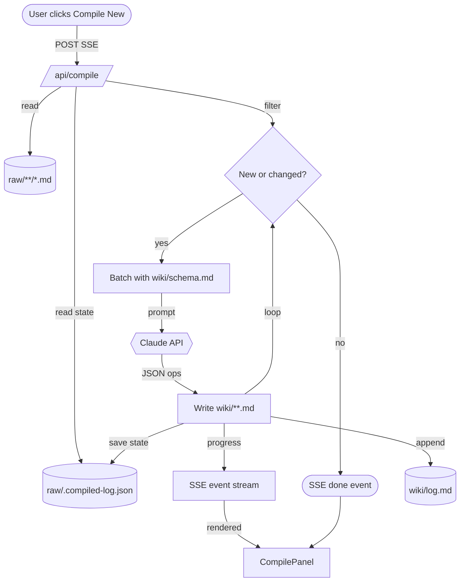

# Incremental Compile Pipeline

## When to Use
Use this pattern when you need to continuously turn a growing corpus of raw, unstructured documents into a structured, cross-referenced knowledge base (a wiki) using an LLM as the compiler — without re-processing everything on every run. It's the core pattern behind the Karpathy LLM-Wiki's `/api/compile` endpoint (referred to in source as "oh-my-mermaid").

## Structure
The pipeline has five stages, orchestrated behind a single API call that streams progress via Server-Sent Events (SSE):

1. **Read raw inputs** — scan `raw/**/*.md` for source documents.
2. **Deduplicate against state** — check each doc against a persisted `raw/.compiled-log.json` to determine if it's new or changed since the last run. Unchanged docs are skipped by default ("incremental by default — full recompile is explicit").
3. **Batch + prompt** — group new/changed docs and send them to the Claude API with a fixed system prompt (`wiki/schema.md`) that defines page schema, naming, and compile rules.
4. **Write structured output** — parse the model's JSON ops response and write/update pages under `wiki/**.md`.
5. **Log and stream** — append a run record to `wiki/log.md`, persist updated state to the compiled-log, and emit SSE progress events consumed live by a UI component (`CompilePanel`).

## Example
A user drops a new raw markdown file into `raw/`. On the next "Compile New" click, the pipeline diffs it against `.compiled-log.json`, finds it's new, batches it with the schema prompt, and Claude returns JSON operations (create/update) for one or more wiki pages. The UI shows live progress per document via SSE, and the run is appended to `wiki/log.md` for auditability — exactly the log this page itself is being written into.

## Trade-offs
- **Pros**: Cheap to run repeatedly (no reprocessing of unchanged docs), auditable via append-only run log, real-time UX via SSE instead of a blocking batch job, schema-as-system-prompt keeps compilation consistent without hardcoding logic per doc type.
- **Cons**: Correctness depends entirely on the LLM correctly applying `wiki/schema.md` rules (e.g. avoiding fragmentation, respecting section placement) — no structural validation is described beyond what the model does. State file (`compiled-log.json`) is a single point of failure for incremental correctness; if it's lost or corrupted, dedup breaks and a full recompile is needed. Batching strategy (size/order of docs sent to Claude per run) isn't specified and could affect quality/context limits.

## Related Patterns
- See [[_meta/compile-log.md]] for the actual run log this pipeline produces.
- See [[candidates.md]] for how candidate pages/proposals feed into or out of a compile run.
- Related orchestration work: [[agents/orchestrators/architecture-agent/profile.md]]

## See Also
- [_meta/compile-log.md](../_meta/compile-log.md)
- [candidates.md](../candidates.md)
- [agents/orchestrators/architecture-agent/profile.md](../agents/orchestrators/architecture-agent/profile.md)
